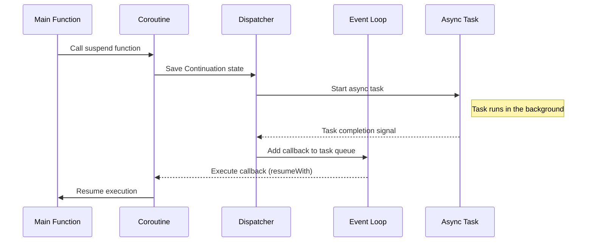

코루틴은 매번 정리하고 까먹고를 반복하는데 이건 내가 제대로 이해하지 못했다는 선명한 반증이다.   
내가 코루틴에 대한 피상적인 이해는 요약하자면 다음과 같다.

- 코루틴은 중단 함수를 만나면 자신의 작업을 중단하고, CPU를 양보한다.
- 코루틴을 실행하던 해당 스레드는 양보 받은 CPU로 다른 작업을 수행한다.
- 그렇기 때문에 일반적인 멀티스레딩 방식에 비해 스레드 블락이 없어 더 나은 성능을 낸다.

몇몇 의문점이 드는 부분이 있어 내부 동작부터 살펴보았다.

## 내부 동작

아래와 같은 코드가 있다고 해보자.

```kotlin
suspend fun doAsyncTask(): String {
  println("Task started")
  delay(2000) // (2)
  println("Task completed") // (3)
  return "Result"
}

fun main() = runBlocking {   // (1)
  println("Calling doAsyncTask")
  val result = doAsyncTask()
  println("Result: $result")
}
```

세세한 동작 과정은 다음과 같다.

1. (1) 에서 `runBlocking` 이 코루틴을 실행시키는데, 현재 스레드인 Main 스레드를 점유하고 코루틴이 끝날때까지 대기한다.
2. (2) 에서 중단 함수`delay`를 만난다. CPU를 양보했고 Main 스레드 역시 블락하지 않았지만, 다른 작업을 수행할 수 없으므로 Main 스레드는 유휴 상태로 대기한다.
3. 대기가 완료되면 (3) 부터 재개된다.

사실 위와 같이 `runBlocking` 을 사용하면 코루틴의 성능을 전혀 누리지 못하는 것이다.
이를 활용하기 위해 2번 과정에서 다른 작업을 수행하도록 하려면 `async` 나 `launch` 같은 코루틴 빌더를 쓰면 된다.

```kotlin
fun main() = runBlocking {
  launch {
    delay(1000)
    println("Task 1 completed")
  }

  launch {
    delay(500)
    println("Task 2 completed")
  }

  println("Main is working")
}
```

위 코드는 main 스레드가 두 개의 `launch` 코루틴을 동시에 실행한다.  
그리고 여기까지는 코루틴의 기본적인 용법에 해당하므로 지금까지 별 탈 없이 잘 써왔다.

## 어떻게 재개하는 것이 가능한가

첫 번째 궁금증이다. 어떻게 재개하는 것이 가능한가? 스택 프레임 캡쳐라도 뜨는 것인가?

그렇지 않다.

중단되었던 코루틴이 다시 재개되었을 때, 코루틴은 `Continuation` 객체에 상태를 저장한다.
Kotlin 코루틴은 일반적인 스택 기반 함수 호출 방식이 아니라 상태 머신 기반으로 동작하는데, 예를 들면 다음과 같다.

```kotlin
suspend fun myFunction() {
  println("Step 1")
  delay(1000)
  println("Step 2")
}
```

위 코드를 컴파일러가 [state machine 디자인 패턴](https://refactoring.guru/design-patterns/state)을 기반으로 아래처럼 바꿔준다.

```kotlin
class MyFunctionContinuation(var state: Int = 0) : Continuation<Unit> {
  override fun resumeWith(result: Result<Unit>) {
    when (state) {
      0 -> {
          println("Step 1")
          state = 1
          delay(1000, this) // 중단 후 재개
      }
      1 -> {
          println("Step 2")
      }
    }
  }
}
```

사실상 재개되었을 때의 경우를 감안한 코드를 `Continuation` 객체로 밀어넣어
Ins 포인터나 스택 포인터를 바꾸지 않고도 단지 state만 바꿔서 함수콜을 하는 방식인 것이다.

그렇다면 로컬 변수가 선언되고 쓰이는 경우는 어떨까?

다른 스레드에게 양보했다가 돌아왔을 때 어떻게 참고하는 것이 가능한 걸까?


`Continuation`이 왜 함수 콜백이 아니라 클래스인지를 이해하면 쉽다. 클래스를 쓰는 이유는 상태를 관리하기 위해서다.

```kotlin
suspend fun myFunction() {
  val x = 42
  println("Step 1: $x")
  delay(1000)
  println("Step 2: $x")
}
```

위 코드가 `Continuation` 객체로 변환된 모습은 다음과 같다.

```kotlin
class MyFunctionContinuation(var state: Int = 0, var x: Int = 0) : Continuation<Unit> {
  override fun resumeWith(result: Result<Unit>) {
    when (state) {
      0 -> {
        x = 42
        println("Step 1: $x")
        state = 1
        delay(1000, this)
      }
      1 -> {
        println("Step 2: $x")
      }
    }
  }
}
```

## 누가 재개하는가

두 번째 궁금증이다. 완료되었음을 어떻게 감지하고, 누가 함수콜을 하는 것인가?

완료되었음을 감지하기 위해, 코루틴은 비동기 작업을 관리하는 디스패처와 이벤트 루프를 사용한다.
이들은 비동기 작업의 완료 여부를 추적하고, 완료되었을 때 디스패처가 `Continuation.resumeWith`를 호출하여 코루틴을 재개하는데 정확한 순서를 따져보면 이렇다.


> 이벤트 루프는 매번 폴링을 통해 task queue를 확인하는 게 아니라, 콜백이 등록되었을 때 실행하도록 동작하기 때문에 리소스의 낭비가 없다.
{: .prompt-info }




1. 코루틴 suspend 
   - 실행 지점과 로컬 변수를 담은 `Continuation` 객체를 생성하고 코루틴은 대기 상태로 전환된다.
2. 비동기 작업 실행
   - 이 작업은 OS 커널, 네트워크 드라이버, I/O 처리기에서 실행 되며 스레드는 블락되지 않는다. 
3. 비동기 작업 완료
   - 디스패처가 시스템(OS, 네트워크 드라이버 등)으로부터 완료 신호를 받는다.
4. 이벤트 큐에 콜백 등록
   - 디스패처가 작업 완료 시점에 적절한 스레드 컨텍스트에서 실행할 수 있는 콜백을 이벤트 큐에 추가합 
5. 이벤트 루프 실행
   - 이벤트 큐는 큐에 새로운 작업이 없으면 유휴 상태로 대기하다가 작업이 추가되면 즉시 실행을 시작한다.
6. 코루틴 resume
   - 콜백안에서 `Continuation.resumeWith`를 호출하여 코루틴을 재개한다.

## 결론

지금까지 알아본 내용을 요약하면 다음과 같다.

- 코루틴은 중단 함수를 만나면 자신의 작업을 중단하고, CPU를 양보한다.
- 코루틴을 실행하던 해당 스레드는 양보 받은 CPU로 다른 작업을 수행한다.
- 그렇기 떄문에 일반적인 멀티스레딩 방식에 비해 스레드 블락이 없어, 더 나은 성능을 낸다.
- 코루틴은 상태 머신 기반으로 동작하며, 중단된 코루틴은 `Continuation` 객체에 상태를 저장한다.
- 비동기 작업의 완료 여부를 추적하기 위해 코루틴은 디스패처와 이벤트 루프를 사용한다.
- 비동기 작업이 완료되면 디스패처가 `Continuation.resumeWith`를 호출하여 코루틴을 재개한다.
- 이벤트 루프는 콜백이 등록되었을 때 실행하도록 동작하기 때문에 리소스의 낭비가 없다.
