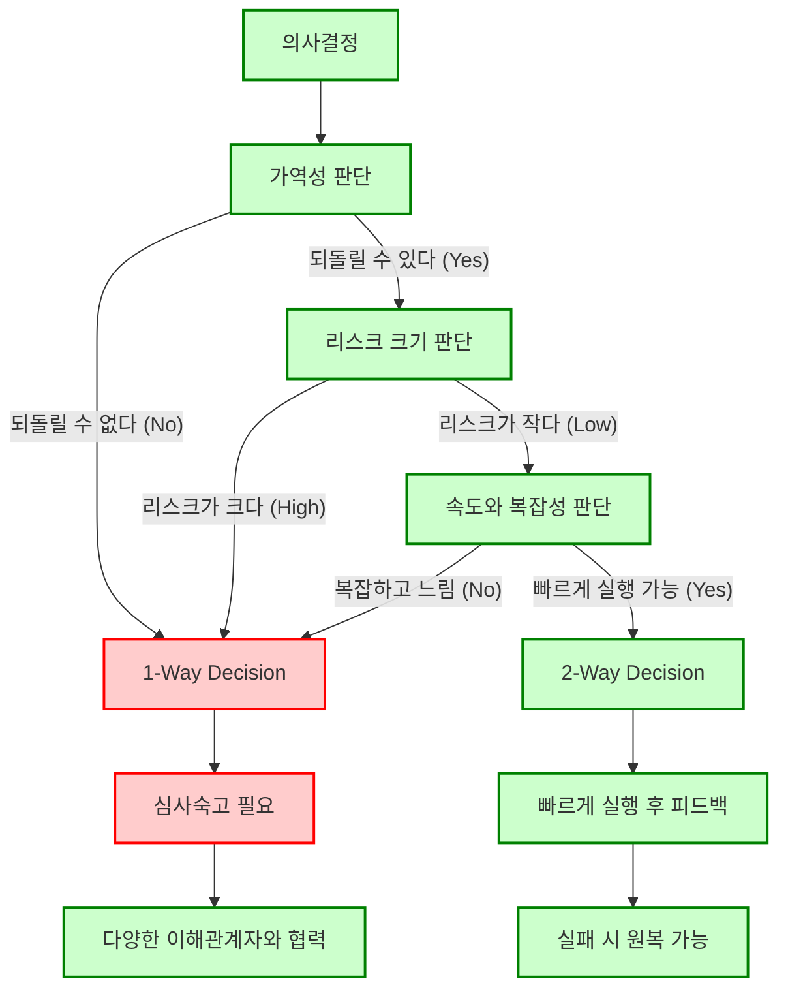

최근 좋은 의사결정을 어떻게 하면 잘 내릴 수 있는 것인가에 대한 고민이 생겨 생각을 정리했다.

좋은 의사결정을 위해서는 구체적 목표 설정, 리스크 평가, 정보 수집 등 고려해볼만한 여러 항목들이 있겠지만,
실무적 상황에서 그런 기초적인 내용들은 어느 정도 챙겼다는 가정하에 개인적인 견해를 덧붙여 담론해 보고자 한다.

> 주의: 개인적 경험은 IT비지니스에 한하기 때문에 이 아이디어는 모든 업계에 통용되진 않을 수 있다.
{: .prompt-warning }

## 빠르지만 틀린 결정 vs 느리지만 올바른 결정

내가 비지니스적인 의사결정을 내릴 수 있는 상황이라고 하자. 그리고 내 앞에 선택지가 주어졌다.

- 빠르지만 틀린 결정
- 느리지만 올바른 결정
 
나는 주저없이 **빠르지만 틀린 결정**을 선택할 것이다.

어차피 비지니스에서 의사 결정할 아젠다는 많다 못해 흘러 넘치고, 항상 옳은 결정을 내리는 건 불가능에 가깝다.
그러므로 설령 결정한 방향이 틀리더라도 실패로 인한 학습 데이터를 계속 쌓고,
축적된 데이터를 기반으로 의사결정을 내린다면 올바른 방향을 찾아갈 확률이 높아질 것이고,
결과적으로 학습을 더 빠르게 할 수 있는 속도가 방향보다 더 중요하다고 생각하기 때문이다.

애자일이나 린스타트업 원칙에서 이야기하는 빠른 실패의 핵심이 여기에 있다고 본다.

> 여담이지만, 재미있게도 기술적인 관점에서는 정반대로 의사결정을 최대한 미룰 수 있어야 좋은 아키텍처, 좋은 설계로 여겨진다.
> 
> 그 까닭은 섣부른 기술적 결정은 미래의 비지니스 선택지를 제한할 수 있을 뿐더러,
크게 제한하지 않더라도 비지니스 요구사항을 실현하는 데 필요한 기술적인 비용을 늘릴 수 있어서다.
기본적으로 기술적 의사결정이 너무 많이 내려진 소프트웨어는 유지보수가 어렵고 확장성이 떨어져 비지니스적인 요구사항을 비지니스 속도에 발맞춰 만족시키기 어렵다.
{: .prompt-tip }

## 결정의 가역성

그러나 최근에 '비지니스 의사결정은 빠르게 내리는 것이 좋다'가 **항상 옳은 것만은 아니다**라는 생각을 하게된 계기가 있다.
아마존의 제프 베조스가 이야기한 결정의 가역성이라는 개념을 접하고서다.

그의 말에 따르면 우리가 내리는 의사 결정에는 2가지 종류가 있고, 각각을 1-Way-Decision과 2-Way-Decision 라 부른다.

### 1 Way Decision

1 Way Decision 이란 **한 번 결정하면 되돌리기 어려운 비가역적 결정**이다.  
마치 문을 열고 나오면 그 문이 없어져버리는 상황이라, 이런 상황에서는 틀린 결정이 매우 크리티컬 하다.

대규모 투자 유치, 새로운 비지니스 모델 도입, 기술적으로 큰 영향을 주는 비지니스 결정 등이 이에 해당된다.
되돌아가려면 너무 많은 비용이 들기 때문에 사실상 스타트업의 자원을 모두 고갈해버리는, 쉽게 말해 뒤가 없는 그런 결정들이다.

### 2 Way Decision

2 Way Decision 은 **쉽게 되돌릴 수 있는 가역적 결정**이다.  
제품의 작은 기능 개선이나, A/B 테스트 등이 여기에 해당된다.

제프 베조스가 전하는 메시지의 핵심은 2가지다.

- 대부분의 의사결정은 2 way decision 에 해당한다.
- 그렇기 때문에 빠르게 실행하고 학습해야 한다.

## 1 Way Decision 과 2 Way Decision 을 가름하기

그렇다면 1 Way Decision 과 2 Way Decision 을 어떻게 하면 잘 구분해 낼 수 있을까?

- 가역성만이 1 Way Decision 과 2 Way Decision 을 구분하는 기준일까?
- 의사 결정을 하고 나서 돌아오는 동안 잃어버린 시간과 기회비용이 있을 텐데 그런 때에도 되돌아왔다고 말할 수 있을까?

이런 고민을 하다 사실 모든 기준은 조직의 관점에서 세우고 그것을 기준으로 판단하면 된다는 것을 깨닫고 정리된 생각을 그래프 프레임워크로 표현해보았다.
이렇게 만들어진 프레임워크는 후일 빠른 판단을 내리는 데 분명 도움을 줄 것이다.

저 프레임워크에서 리스크 크기 판단이나, 속도와 복잡성을 판단하는 것은 오로지 조직의 몫이다.  
예를 들어, 리스크 관점에서 다음 중 하나라도 `YES` 라면 '위험하다' 고 판단할 수 있다.

1.	이 결정이 실패하면 조직의 생존에 영향을 줄 가능성이 있는가?
2.	결정 실패가 브랜드와 시장 신뢰에 장기적으로 영향을 미칠 수 있는가?
3.	복구 비용이 감당 불가능하거나 지나치게 큰가?
4.	법적, 규제적 문제로 인해 심각한 운영 차질이 발생할 가능성이 있는가?

1 Way Decision 이 너무 많이 발생하는 것을 막기 위해 심사 숙고 과정에서, 다른 창의적인 방법으로 리스크를 줄일 수 있을지 혹은 복잡도를 낮춰 속도를 얻을 수 있는지를 고민해보면 좋을 것이다.

## 1 Way Decision을 어떻게 올바른 결정으로 만들까

1 Way Decision 과 2 Way Decision 을 잘 구분하는 방법을 알게 되었고,
2 Way Decision 은 그냥 성공하든 말든 빠르게만 실행하면 된다 라고 하니 남은 질문은 하나다.

**1 Way Decision 을 내릴 때 어떻게 올바른 결정을 할 수 있는가?**

여기서부터는 답이나 대안을 제시해주는 사람이나 책은 없었고 오로지 나의 개인적인 경험이다.

당연히 항상 올바른 결정을 100% 할 순 없지만 그럼에도 그 확률을 높이는 방법은,

**최대한 내/외부에 공유하고 제 3자의 의견과 피드백을 경청하는 것**이다.  
단, 여기서의 제3자는 우리가 잘 되기를 바라는 마음을 가지고 있어야 한다는 전제가 따라 붙는다.

외부의 새로운 시각은 우리가 놓쳤던 부분을 다시금 깨닫게 해주는 효과가 있어, 상자 안에 갇혀 있던 비지니스를 꺼내놓고 볼 수 있게 해준다.
전제가 붙는 이유는 그런 사람만이 우리의 이야기를 심사숙고하며 제대로 들어줄 수 있기 때문이다.

## 결론

올바르지 못했던 1 Way Decision을 내렸던 경험을 반추해본다면 아래와 같은 케이스들이 있었다. 

- 어떤 중요한 의사 결정을 내렸을 때 몰랐던 숨겨진 리스크가 있었다.
- 어떤 의사 결정은 잠재적으로 다른 의사 결정 기회를 제한하거나 빼앗았다.

그리고 그것을 깨닫게 해준 것이 무엇이었나를 떠올려 보면 직접적이든, 간접적이든 제 3자의 새로운 시각이 있었다.

덕분에 내가 잘되었으면 하고 진심으로 응원하고 바라는 사람들이 있다는 것은 정말 큰 자산이구나 하는 생각을 또 하며, 반성도 하게 되는 것 같다.
