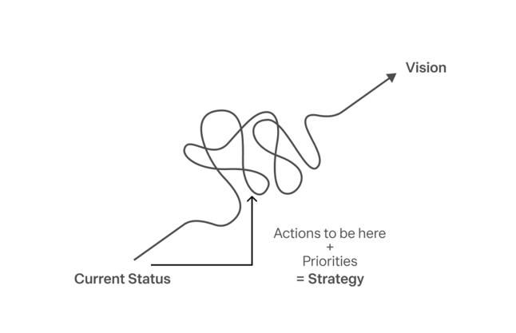

2024년에 한 해를 잔잔히 돌아보며 한 가지 결심이 섰다.

**나는 내가 가진 창의력을 온전히 발휘할 수 있는 일을 하고 싶다.**

## 엔지니어링과 나의 한계

내가 주로 하는 소프트웨어 엔지니어링은 창의력을 마음껏 발휘하기에 좋다고 보기 어렵다.  
기껏해야 주어진 문제 해결을 위해 기가막힌 편법을 찾아내거나, 미래를 상상하며 더 좋은 설계를 고민하는 것 정도가 전부다.
게다가 그 기회조차 소수에 불과하고 대부분의 경우 이미 알려진 해결책을 찾아 적용하는 것이 더 효율적이고 심지어 안전하기까지 하다.

물론 새로운 문제를 매번 맞닥뜨리고 풀어내는 환경에 지속적으로 스스로를 노출하는 것도 현 상황을 타개하는 방법이 될 수 있다.
그런 환경은 매번 창의적인 문제 해결력을 필요로 할 테니 말이다.
그러나 지금 내가 가진 역량보다 더 어렵고 새로운 기술적 문제를 푸는 것은 평생 엔지니어링 하나만을 갈고 닦을 각오 없이는 힘들겠다는 생각이 들었다.

말하자면 나는 큰 각오 없이 적당히 공부하고 싶은 만큼만 공부해서 발휘할 수 있는 엔지니어링 레벨의 마지노선에 와 있는 것이다.
그 마지노선은 어떤 서비스든 0 to 1 으로 만들어내고, 그 서비스가 성장해서 1 to 10 이 되었을 때 기술적으로 커버할 수 있는 정도의 능력이다.
10 to 100 부터는 솔직히 말해 내 역량이 100% 커버하지 못한다고 생각한다.
그 이상의 문제를 풀어내는 것은 더욱 전문적인 지식과 풍부한 경험, 그리고 **순수하게 기술을 좋아할 수 있는 재능**이 뒷받침해주어야 한다.

그것은 내가 원하는 삶이 아니다.  
나는 딥한 엔지니어링 지식에 관심이 없기 때문이다.

여담이지만, 만약 순수하게 기술을 사랑했더라면 평생을 건 각오가 필요하지도 않았을 것이라고 생각한다.

## 내가 원하는 삶

내가 가진 장점을 활용하면서, 내가 원하는 삶을 살 수 있는 방법은 없을까?

먼저 내가 가진, 그리고 앞으로의 인생에 활용하고 싶은 장점들을 정리해보았다.

- 직관력이 뛰어나다. 무언갈 바라볼 때 핵심을 빠르게 파악한다.
- 빠르게 배우고 적용하는 능력이 있다.
- 사람들과 대화하며 어디까지가 생각이 같고 어디서부터 다른지를 가름할 수 있고, 그 과정을 좋아한다.
- 내가 알고 있는 것을 상대방이 알기 쉽게 설명할 수 있다.
- 조직의 비효율을 제거하고 더 빠르게 실행 속도를 내는 시스템을 구축할 수 있다.

이런 장점들을 활용하면서 창의력을 발휘할 수 있는 삶은 '**조직을 이끄는 삶**'이다.  
조직을 이끄는 삶은 다음과 같은 특징을 가진다.

- 사람들에게 비전을 제시하고 모두가 한 마음으로 그것을 갈망하도록 만들어야 한다.
- 엔지니어링과 달리 문제를 정의하는 것에서부터 창의력이 필요하다.
- 조직을 유능하게 만들 책임을 진다.

이 특징들은 상상만으로도 나를 가슴 설레게 하고, 더 나은 내일을 꿈꾸게 한다.  
지금으로서는 내가 간절히 바라는 나의 미래다.

그래서 내 각오를 여기에 걸고 싶다.

## 조직을 이끌려면

조직을 이끌려면 구체적으로 다음과 같은 일들이 필요하다고 생각했고, 생각을 정리하는 데 이 [아티클](https://toss.im/career/article/toss-strategy-session)이 내게 큰 도움을 주었다.

1. 비전을 정의한다.
2. 현재 상태를 정의한다.
3. 현재 상태와 비전 사이의 갭을 인식한다.
4. 갭을 메우기 위한 전략을 세운다.
5. 전략의 우선순위를 판단한다.
6. 실행한다.

### 비전을 정의한다

비전은 **직관적**이어야 한다.

위 글에 따르면 높은 확실성을 가진 복잡한 아이디어보다 불확실하지만 단순하고 솔직한 생각이 훨씬 중요하다.
복잡한 아이디어는 전염되지 않고, 조직을 한 마음으로 모을 수 없기 때문이다.

일론 머스크의 '인류를 화성으로 보낸다'가 좋은 예다. 그 비전은 조직 외부의 사람들까지(거의 전세계가) 알고 있을 정도니까.
만약 일론 머스크가 '로켓의 1단 추진체를 회수해 재사용 하고, 각 부품들을 자체 생산할 수 있는 여력을 갖춘다'고 했다면, 그것은 덜 전염되었을 것이다.

### 현재 상태를 정의한다

현재 상태는 **숫자로 정의**되어야 한다.
비전과 관련된 모든 데이터와 지표를 끌어모아 현재의 상태를 정의할 수 있어야 한다.

일론 머스크는 아마 현재 상태를 정의하기 위해 스페이스엑스가 로켓을 만든다면 그 비용이 어떻게 될 지, 로켓의 성능은 어떨지, 회사의 재무 상태는 어떤지 등을 정의했을 것이다.

### 현재 상태와 비전 사이의 갭을 인식한다

갭은 말하자면 '해결해야 하는 문제'이다.
그 문제가 해결된다면 격차가 메워질 것을 기대할 수 있어야 한다.

이 문제들은 직접 발굴해내야 하고, 주로 다음과 같은 항목들에서 기회를 포착해야 한다.

- 시장 상황의 변화
- 각종 규제의 변화
- 신기술의 등장
- 조직 내의 기발한 아이디어
- 데이터 분석

### 갭을 메우기 위한 전략을 세운다.

전략은 위에서 발견한 문제를 해결하기 위한 최적의 방법이다.
아티클을 인용하자면 전략은 다음과 같은 특징을 지녀야 하고, 먼저 쓰여진 순서대로 중요하다.

- 더 이상 구체적이지 못할 만큼 구체적이어야 한다.
- 대범해야 한다. 고정관념을 가차없이 부술 정도로.
- 구성원들이 동기부여될 수 있어야 한다.
- 개연성이 있어야 한다.

### 전략의 우선순위를 판단한다

전략에도 우선 순위가 있다. 예상되는 임팩트와 얼마나 급한지를 두고 다음 4분면으로 나눌 수 있을 것이다.

1. 중요하고, 급한 일
2. 중요하지 않지만 급한 일
3. 중요하지만 급하지 않은 일
4. 중요하지도 급하지도 않은 일

지금까지 일을 해왔던 경험에서, 1번을 제일 먼저 하지 않는 사람이나 4번을 제일 마지막에 하지 않는 사람은 보지 못했다.
이 둘은 구별해내기 쉽기 때문이다.

2번과 3번은 사람들이 많이들 헷갈려 한다.
보통 3번은 중요하지만 급하지는 않기 때문에, 사람들이 2번을 먼저 하게 되는 경우가 많다.

그러나 조직을 잘 이끄려면, 2번보다는 3번을 할 수 있도록 도와야 한다.
3번은 머지 않아 1번이 될 것이기 때문이다. 중요한 일이 계속 쌓이면 완성도가 떨어지거나 놓치게 되고 이것은 리스크를 가져온다.
건강한 조직은 3번을 곧잘하는 조직이다.

### 실행한다

**실행하는 것이 가장 중요하다.**

아무리 멋진 데이터 분석과 탄탄하고 통찰력있는 전략이 있더라도 결국 실행하지 않으면 아무 소용이 없다.

실행을 위해서는 인간 공학(Human Factors)의 개입이 매우 크기 때문에,
Technical Skill 보다 Soft Skill 이 실행을 만들어 내는 데 있어서 더 중요하다는 인사이트는 인상적이다.
이런 역설적인 통찰을 지니려면 대체 어떤 경험들이 있어야 하는 걸까. 글 하나로 배울 수 있다는 사실이 감사할 정도다.

말하자면 이 소프트 스킬은, 사람들로 하여금 '해야만 한다고 생각한 것'을 바꿔버리는 능력이다.

실행력은 조직의 속도를 결정한다. 방향이 틀리더라도 괜찮다.
다음 걸음에서 다시 현재 상황을 파악하고, 갭을 인지하며 전략을 다시 세워 방향을 바꾸면 그만이기 때문이다.

조직 관점에서 속도는 방향보다 중요하다.

## 뛰어난 조직이란

뛰어난 조직은 어느 누가 되었든 한 구성원을 붙잡고 물어보면 모두가 망설임 없이 (자신이 있는 팀을 넘어)조직의 비전에 대해 답할 수 있을 것이다.
평범한 조직은 구성원 모두가 비전에 대해 각기 다른 대답을 할 것이고,
무능한 조직은 구성원이 비전에는 관심이 없을 뿐만 아니라 리더 자체에게도 무관심하거나 신뢰하지 않을 것이다.

10명 이하의 팀과 1,000명이 넘어가는 팀은 여전히 같은 원리가 관통할 것이라고 본다.
다만 그 난이도의 차이는 상상을 초월할 것이다.

예를 들어, 작은 조직에서는 개개인과 면담하며 비전을 공유하고 강하게 동기부여 할 수 있지만, 1,000명이 넘어가면 이것은 전혀 다른 문제가 된다.
1개 팀의 전략을 구체적으로 세우고 우선 순위를 파악하는 것은 어렵지 않지만, 100개 팀의 전략을 구체적으로 세우고 우선 순위를 파악하는 것 역시 완전히 다른 문제다.

## 결론

2024년을 훑어 생각을 정리하며 나의 현재 상태와 내가 꿈꾸는 이상과의 갭을 인식할 수 있었다.

결국 핵심은 2가지로 좁혀진다. 조직의 실행과 장기적인 동기부여를 이끌어내는 능력이다. 이 두가지가 있다면 조직은 지속적으로 속도를 낼 수 있다.

- 조직의 실행
  - 문제의 본질까지 파고들어 탐구하고 재정의하는 창의력
  - 단순하고 직관적인 전략을 세우는 능력 (장기적 동기부여의 핵심)
  - 우선 순위로 정렬된 아주 구체적인 액션 아이템들을 수립하는 능력
  - 상황이 확실하지 않더라도, 방향을 명확히 제시하는 의사결정력
- 장기적인 동기 부여
  - 인간 본능에 대한 깊은 탐구
    - 장기적인 동기부여를 위해서는 믿음, 팀워크, 원칙, 낙관적 분위기와 같은 감정적, 철학적 요소를 활용해야 한다.
  - 팀원들의 전략적 사고와 행동을 이끌어내고 방향성에 대해 모두가 공감하고 헌신하도록 만든다
  - 대중 연설 능력
  - 전략에 대한 자신감을 심어주고 조직 내에 믿음을 형성한다

각각의 소항목들은 그것을 주제로 한 책이 각각 있을 만큼 방대하고 깊은 주제이다.  
그래서 더욱 기대가 되고 설렌다. 많이 발전하는 2025년이 되길 바라면서 글을 마친다.
