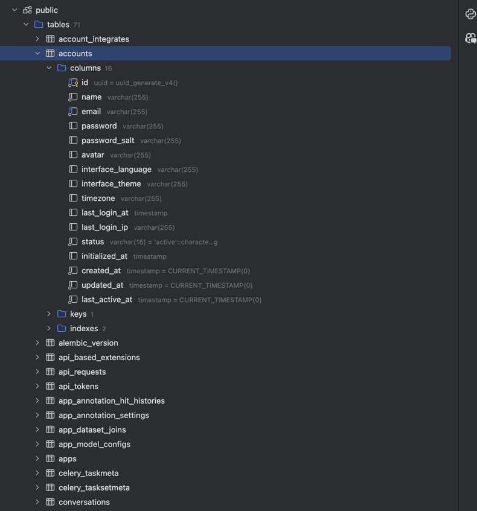

[Dify](https://github.com/langgenius/dify) 를 셀프 호스팅하기 위해 낱낱이 파헤쳐야 할 일이 생겼다.

## 분석에 도움이 될 만한 문서들 확보하기

제일 먼저 파악에 도움이 될 수 있는 실행에 필요한 부분과 환경 변수들을 설명하는 다큐먼트를 찾아봤다.

빠른 파악에 도움이 될 만한 문서들
- [docker-compose 설명](https://docs.dify.ai/getting-started/install-self-hosted/docker-compose)
- [faq 설명](https://docs.dify.ai/learn-more/faq/install-faq)

환경 변수와 그에 대한 설명
- [환경 변수 예제](https://github.com/langgenius/dify/blob/main/docker/.env.example)
- [환경 변수 설명](https://docs.dify.ai/getting-started/install-self-hosted/environments)

환경 변수는 뭐가 많아서 나중에 구조가 눈에 들어오면 다시 보기로 하고 스킵.

그래도 대충 코드 안에서 도메인 용어들이 등장하는지 알 수 있었다.

- 콘솔 API, WEB: 여기서 API는 콘솔 요청 받는 친구
- 서비스 API - Dify 에서 제공하는 API 서버. 이걸 확장성 있게 설계하는 것이 중요함.
- 앱 API, WEB: 여기서 API는 웹앱 요청 받아주는 친구
- front-end 가 각각 콘솔과 웹앱으로 나뉘는 것 같은데, 콘솔과 웹앱은 무슨 차이지?

## 폴더 구조 먼저 살펴보기

기본적으로 모노레포로 구성되어 있고, 각 컴포넌트마다 README 가 상세하게 적혀 있다.
하지만 지금 README 읽어봤자 100% 이해는 못한다. 그냥 감만 잡는다는 느낌으로 읽는다.

폴더 구조도 복잡하지 않아서 대략 파악한 바로는:
```bash
❯ tree -L 1 -d
.
├── api // Dify backend 담당. console, webapp, service API 들이 모여 있을 것으로 기대됨.
├── dev // 개발 편의를 위한 폴더인 듯. 안 중요.
├── docker // 도커 파일에 대한 설정 및 설명.
├── docker-legacy // 아마 안 중요..?
├── images // 안에 든 게 별로 없음. 안 중요.
├── sdks // Dify service API를 호출하기 위한 SDK 집합인 듯. 안 중요.
└── web // Dify frontend 담당. 아마 console, webapp 이 여기 같이 있으려나?
```

## 로컬에서 실행하기

가장 빠르게 파악할 수 있는 방법 중 하나는 직접 로컬에서 실행하는 거라고 생각한다. README에 적힌대로
docker 로 옮겨서 기본 설정 카피하고(.env) docker-compose 로 실행시켜 보면 컨테이너가 9개가 뜬다.

```bash
❯ docker compose up -d
[+] Running 9/0
 ✔ Container docker-web-1         Running  // 웹앱 <- 아까 파악한 친구
 ✔ Container docker-weaviate-1    Running  // 벡터 서치 엔진 (RAG 가져올 때 쓰이려나)
 ✔ Container docker-redis-1       Running  // 캐싱 및 redis pub sub 을 위해 설정된 듯. 
 ✔ Container docker-ssrf_proxy-1  Running  // 보안 미들웨어 정도로 추정
 ✔ Container docker-sandbox-1     Running  // ??
 ✔ Container docker-db-1          Running  // API에서 호출할 DB
 ✔ Container docker-api-1         Running  // API <- 아까 파악한 친구 = console, service, web app API 전부 포함.
 ✔ Container docker-worker-1      Running  // 분산 큐 작업을 위한 워커
 ✔ Container docker-nginx-1       Running  // nginx 서버 
```

각각이 어떤 서비스인지 docker 폴더 안을 헤집으면서 보고 있었는데,
아주 친절하게도 [구조도](https://github.com/langgenius/dify/blob/main/docker/docker-compose.png)까지 그려져 있는 걸 발견했다.


이런 건 너무 고맙다. 없으면 내가 그려야 하기 때문이다.
구조도를 보고 알 수 있었던 건:

- nginx 에서 80번 포트로 들어오는 트래픽을 각각 web, api 로 라우팅 해줌 
- api, worker 는 의존하는 부분이 똑같음, storage, redis, db
- api 가 redis 로 pub 하면 worker 가 sub 해서 처리하는 구조 같다
- weaviate 는 뭔가 했는데 벡터 저장소였음 연결선이 없이. 동떨어져있는 이유는 nginx를 타지 않기 때문인가? 싶었음.

그리고 들었던 의문점...

sandbox 는 뭘까? 이 친구가 뭘하는 건지 도무지 파악을 할 수 없었다.
구조도에도 sandbox는 없다.

docker-compose.yml 설정에서 `CODE_EXECUTION_ENDPOINT` 하는 환경 변수가 있는 걸 보니 코드 실행을 격리하기 위한 환경인 듯. 정확히는 뭔지 모르겠음.

나중에 찾아보니 dify 내에서 코드를 실행할 수 있다 보니 런타임을 보호하기 위한 설정이었다.
Dify 내부에서 코드 실행을 열어주다보니 보안 문제가 발생할 수 있어서 코드 실행과 관련된 부분들은 [격리된 환경](https://docs.dify.ai/guides/workflow/node/code#local-deployment)을 만들어둔 것이었다.

실제 코드에서 사용되는 부분은 [여기](https://github.com/langgenius/dify/blob/main/api/.env.example#L362)다.

## api 파악

제일 중요하다고 생각했던 건 api 디렉토리다. Dify 의 핵심이기 때문이다.
api/Dockerfile 을 들여다 보고 console, service API를 통합해서 제공하는 것을 알았고, controllers 를 열어보니 다음과 같이 나눠져 있었다.

```bash
❯ tree -L 1 -d
.
├── configs // .env 여기서 다 불러옴
├── constants // 상수들 정의된 곳. 별로 안중요
├── contexts // 뭔지 모르겠지만 일단 넘어감 ㅋㅋ
├── controllers // API 목록들을 여기서 찾을 수 있음
├── core // 핵심 로직 담겨 있음
├── docker // 워커를 실행시키기 위한 엔트리포인트
├── events // pub/sub 하기 위한 이벤트가 정의된 곳
├── extensions // storage 같은 외부 의존성들과 관련된 코드들이 있는 곳
├── factories // 팩토리들 있겠지 하고 넘어감.
├── fields // 뭔지 잘 모르겠는데 web의 필드들이 정의된 곳인 듯
├── libs // 공용 라이브러리 같은 건가 봄. passport 나 helper 같은 거 있음. 어노테이션도 있음.
├── migrations // 안중요해보여서 스킵.
├── models // 도메인 모델들 정의된 곳.
├── schedule // 셀러리 스케줄 테스크들 있음
├── services // 실제 어플리케이션 로직들 있는 곳. controllers -> services -> models 순으로 호출됨.
├── tasks // 셀러리 테스크들 정의된 곳.
├── templates // html 템플릿들 있음. 안중요.
└── tests // 테스트 코드는 걍 무시
```

코드를 들어가서 조금씩 살펴보다 보니 생각했던 것과 달리 service 와 console의 역할이 반대였다.
dify 들어가면 바로 보이는 게 service 인 줄 알았는데, console이 그 역할을 하는 것이었다.

`controllers`에서 아무 API나 타고 들어가서 Database 와 만나는 부분을 찾아봤다.
Database는 PostgreSql 로 model 에 정의되어 있었고, 접속해보고 싶어졌음.
그러려면 연결 정보를 찾아야 했다. `api/models/engine.py` 가 그 역할을 하는 것 같았고,
코드를 보니 `SQLALCHEMY_DATABASE_URI` 로 설정하고 있는 것 같아서 보니 `api/configs` 에 그 설정 정보들이 있었다.

DB 접속 주소 알고 싶어서 print 문 하나 걸고 실행시키니 `$postgresql://postgres:@localhost:5432/dify` 이렇게 나왔다.
.env 에서 그대로 가져오는 거 확인하고 docker-compose 수정해서 호스트에서 DB 포트 오픈해주었다. 접속 잘 됨.



대략 어떤 식으로 굴러가는 지 감을 잡았고,
celery 를 이용해 비동기 작업들을 redis pub/sub 으로 `tasks` 안에 적용해둔 것도 확인했다.

모델들은 `api/core/model_runtime` 에서 관리되고 있다. 그리고 여기에 `model_providers` 부터 시작해서 Dify 토폴로지를 돌리는 어마어마한 핵심 코드들이 있다.

더 이상 세세하게 볼 필요는 없는 것 같아서 빠져나옴. 나중에 버그 직접 고칠 때나 더 들여다 볼 것 같다.

나중에 docker 폴더 들여다 보다가 알게 된 거지만, worker 랑 api 는 같은 코드로 돌린다.

## .env 살펴보기

`api` 를 대략적으로 훑어 보니 위 구조도에 대한 이해가 좀 더 된 것 같아서, `.env` 를 각각 살펴보고 어떻게 연관되는지 살펴보기로 했다.

- SECRET_KEY: 엔터프라이즈 레벨에서 보안을 위해 헤더에 전달하는 키다. 쿠키 세션 사이닝할 때 쓰임.
- CONSOLE_API_URL=http://127.0.0.1:5001 // 콘솔(dify 들어가자마자 보이는 화면) API URL
- CONSOLE_WEB_URL=http://127.0.0.1:3000 // 콘솔 웹
- SERVICE_API_URL=http://127.0.0.1:5001 // 콘솔에서 API 를 열었을 때 나오는 URL
- APP_WEB_URL=http://127.0.0.1:3000 // 파일 미리보기 & 멀티 모달
- FILES_URL=http://127.0.0.1:5001 // 파일 미리보기 or 다운로드 URL prefix
- FILES_ACCESS_TIMEOUT=300 // 파일 엑세스 타임아웃
- ACCESS_TOKEN_EXPIRE_MINUTES=60 // 콘솔 액세스 토큰 만료 시간
- CELERY_BROKER_URL=redis://:difyai123456@localhost:6379/1 // 셀러리 브로커 URL 유저 파일 업로드 같은 비동기 작업 처리용
- redis 설정들, redis sentinel, redis cluster
- DB 설정 - 콘솔 앱은 기본적으로 postgresql 을 사용하고 있음.
- 파일 업로드할 스토리지 설정, OPENDAL_SCHEME=fs 이런 식으로 설정하면 file system 쓰는 듯. private key나 유저가 업로드한 파일 저장하는 데 쓰임
- s3 설정들. 언제 쓰이나 봤더니 tts 파일 저장하는 데 쓰인다
- 기타 등등.... 뭐 많은데 대충 이 정도면 된 거 같다.

## 본래 목적

여기까지 개략적인 구조를 파악해보았다.

확장성 있는 구조로 셀프 호스팅을 하는 것이 목적이었기 때문에 구조도에 대한 이해가 가장 중요했다.

나머지는 docker-compose 파일 찢어서 직접 각 컴포넌트 셀프 호스팅하면서 더 자세히 알게 될 것 같다.

README 부터 보려고 마음 먹어도 코드를 보지 않고는 이해가 안되는 부분도 있고,
코드를 보고 이해가 안가는 부분은 이해가 안됐던 README 보고 다시 이해가 가기도 하고 그랬던 것 같다.

만약 처음부터 다시 분석을 한다면 중요해보이는 file tree 구조를 먼저 잡고, 각 README 를 좀 더 꼼꼼하게 읽어 봤을 것 같다.
사실 나중에 보니 docker 폴더가 핵심이었는데, 구조가 머릿속에 안잡히다 보니 api 코드까지 들여다 보게 된 듯 하다. 
