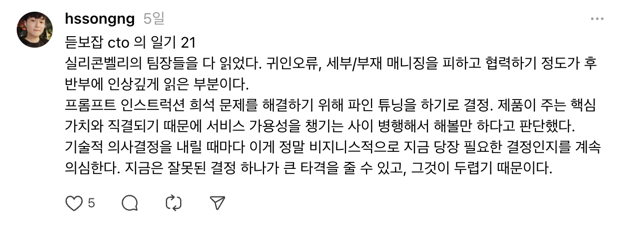

메타적인 인지 없는 반복 업무는 몸만 상하게 할 뿐이라는 걸 꽤나 늦게 깨달았다.

아니... 사실 거짓말이다. 나는 그 사실을 늦게 깨달을 정도로 멍청하지 않다.  
그냥 안주하고 싶었을 뿐이다. 이렇게 살아도 어련히 괜찮을 거라고.  
밤 늦게까지 야근하고 주말에도 일하면 뭔가 열심히 사는 기분까지도 들었다.

하지만 새로운 도전을 하기로 마음 먹은 뒤에서야 성장의 필요성을 뼈저리게 느끼기 시작했다.  
그리고 그 성장에 대한 압박이 거대한 벽처럼 앞을 가로막으니 눈물이 날 정도로 두렵고 불안했다.  
기술적인 성장, 인간적인 성장, 리더로서의 성장.  
모든 역량이 어림도 없이 부족해보였고 그제서야 성장이 없던 지난 3년이 뒤늦게 안타까웠다. 

조급한 마음을 뒤로 한 채 2025년은 잘해야 하는 한 해가 아닌, **성장을 하는 한 해**로 쓰기로 마음 먹었다.  
빠른 성장을 위한 방법을 찾다 스스로 성장을 하고 있다는 안도감이라도 느끼기 위해 일기를 쓰기 시작했다.  
그리고 이것은 꽤 효과가 좋았다. 아직 1월만 진행하긴 했지만.

일기라고 해서 대단치도 않다. 그저 3문장 정도 생각을 적었을 뿐이다.  
하지만 체감되는 그 효과는 하루에 3분 정도 투자한 것이 무색할 정도로 내게 큰 변화를 가져다 주는 것 같다.

서론이 길었는데, 1월의 일기들을 되짚어보며 KPT 비스무리한 나만의 방식으로 회고 글을 적어본다. 

## 1월에 해낸 것들

- 일기를 쓰겠노라 마음 먹은 뒤로 한 번도 놓치지 않았다. 설 명절에도 쓰려고 노력했다.
- TIL 을 오랜만에 다시 시작했다. 예전과 다른 것이 있다면 이젠 동료들에게 공유하고 의견을 교환한다.
- 그리고 곧바로 올리는 게 아닌, 슬랙 리마인드를 이용해 다음날 정도로 걸어둔다. 이렇게 하니 다시 보게 되는 효과가 있는 것 같다.
- Dify 라는 오픈소스를 분석하고 셀프 호스팅까지 했다. 부끄럽지만 오픈 소스 분석은 많이 해본 적이 없었어서 뿌듯했다.
- terraform + ecs 를 처음으로 사용해보았다.
- 책 '실리콘밸리의 팀장들'을 읽고 든 생각을 일기에 녹여냈다.
- 관리해야 하는 대상은 스트레스가 아닌 내 감정이라는 걸 깨달았다.
- Key metric 을 어떻게 결정해야 하며, 비전과 어떻게 얼라인 시킬 것인지에 대한 감을 잡았다.
- 몸무게를 7 kg 정도 감량했다.

## 1월에 아쉬웠던 것들

- Dify Self hosting 을 2주만에 해낸다는 것은 챌린징한 경험이었지만, 실제론 큰 임팩트가 없었다.
- 최근에 변경된 정책을 잊어버린 채 변경사항이 누락된 줄 알고 다시 반영했고, 그 결과 문제가 더 커졌었다.
- TIL이 비는 날들이 있었다.
- 귀인 오류를 자꾸만 범하게 되는 것 같다. 물론 내색하진 않지만... 나중에 생각을 고쳐먹는 일이 반복된다.

## 1월을 돌아보며 배운 것들

어떤 기술적 의사결정을 내리기 전에 문제 파악을 제대로 하지 못한다는 느낌이 있었다.
큰 문제를 파악할 때는 5 why 프레임워크를 써보자. 그만큼 근본적인 원인까지 파고들지 못하면 1월 처럼 잘못된 의사결정을 내리게 된다.
그리고 이런 큰 의사결정은 반드시 문서로 남겨야 한다.

TIL이 비는 날들을 최소화하기 위해, 아무리 작은 내용이라도 일단 올리고 보는 게 중요하다는 생각을 했다.
사소한 내용까지도 올려야 동료들이 글을 같이 올려줄 허들이 낮아지고, 나도 뭔가를 배웠다는 안도감을 느낀다.

기술적인 것에만 얽매이지 않고 비지니스나 휴먼/펀딩 리소스 관련된 것들도 관심을 가져야 겠다.
