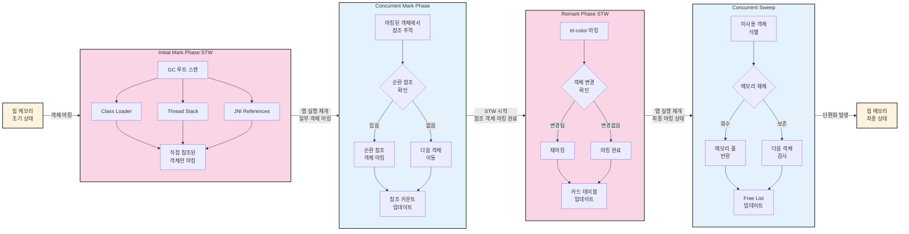

## CMS GC의 이해와 한계

CMS(Concurrent Mark-Sweep) GC는 애플리케이션의 응답 시간을 개선하기 위해 Stop-The-World(STW) 시간을 최소화하는 데 중점을 둔 가비지 컬렉터다.
STW는 가비지 컬렉션을 수행하기 위해 JVM이 애플리케이션의 실행을 잠시 멈추는 현상을 말한다.

### CMS GC 프로세스

STW 가 발생하는 단계는 붉은색으로 표기했다.

### CMS GC의 작동 방식
CMS는 다음과 같은 주요 단계를 거쳐 동작한다:

1. Initial Mark (STW 발생)
2. Concurrent Mark
3. Remark (STW 발생)
4. Concurrent Sweep

이 중에서 Initial Mark와 Remark 단계에서만 STW가 발생하며, 객체를 정리하는 Sweep 작업은 애플리케이션 실행과 동시에 수행된다. 이것이 "Concurrent" Mark-Sweep이라는 이름의 유래다.

### CMS GC의 한계점

CMS GC는 다음과 같은 주요 한계점을 가진다:

1. 메모리 단편화(Memory Fragmentation): 단순히 객체를 제거만 하고 끝내기 때문에, 메모리에 불연속적인 빈 공간이 생성되어 새로운 객체 할당이 실패할 수 있다.
2. 힙 압축 부재: 메모리 단편화를 해결하기 위한 힙 압축(Compaction) 과정이 없다.
3. 리소스 사용: Concurrent Sweep 과정에서 전체 힙을 탐색하며 CPU 리소스를 많이 사용하므로, 고부하 환경에서 성능 저하를 일으킬 수 있다.
4. 예측 불가능한 STW: STW 시간을 예측하거나 조정하기 어렵다.

## G1 GC: CMS의 대안
G1(Garbage First) GC는 CMS의 한계를 극복하기 위해 설계된 새로운 가비지 컬렉터다.

### G1 GC의 주요 특징
G1 GC는 힙 메모리를 다음과 같은 고정 크기의 Region으로 분할하여 관리한다:

1. Young Region: 새롭게 생성된 객체들이 위치
2. Old Region: 오랫동안 살아남은 객체들이 위치
3. Humongous Region: 큰 크기의 객체들을 위한 특별한 영역

G1 GC의 이름은 가장 많은 가비지를 포함한 Region부터 우선적으로 수집한다는 의미의 "Garbage First"에서 유래했다. 이러한 방식으로 최소한의 CPU 리소스로 최대의 메모리를 회수할 수 있다.

## Humongous Allocation 이해하기
Humongous 객체는 G1 GC에서 특별한 관리가 필요한 대상이다. Region 크기의 50%를 초과하는 객체를 Humongous 객체라고 정의하며, 이러한 객체들은 다음과 같은 특징을 가진다:

1. 할당 방식: 단일 Region에 담을 수 없어 여러 연속된 Humongous Region에 저장된다.
2. 성능 영향: Humongous Allocation이 실패할 경우, STW를 동반한 Full GC를 발생시킬 수 있다.
3. 메모리 낭비: 여러 Region에 걸쳐 관리되면서 마지막 Region의 메모리가 낭비될 수 있다.

### Humongous Allocation 문제 해결 방안
Humongous Allocation 문제를 해결하기 위한 방법들:

1. 객체 크기 관리: 큰 배열이나 컬렉션을 더 작은 단위로 분할하여 관리한다.
2. Region 크기 조정: `-XX:G1HeapRegionSize=<size>` 옵션을 사용하여 Region 크기를 조절할 수 있다.

## 결론
G1 GC는 CMS GC의 한계를 극복하기 위한 훌륭한 대안이지만, Humongous Allocation 관리에 있어서는 여전히 주의가 필요하다. 애플리케이션의 특성에 맞게 적절한 튜닝과 객체 크기 관리가 중요하다.
