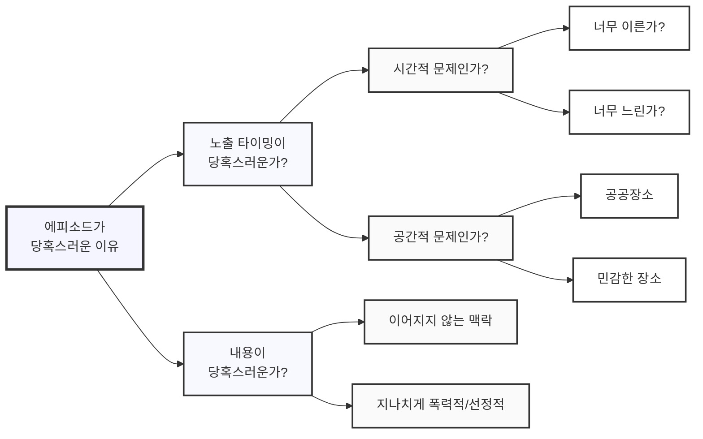

## 우주에서는 고장나는 볼펜

'문제 정의' 하면 떠오르는 우주 펜에 관한 이야기는 이미 유명하다.

> 중력이 없는 우주정거장에 지구에서 가져온 볼펜이 제대로 나오지 않자,
> 미국은 이를 해결하기 위해 오랜 시간과 백만달러를 들여 우주에서도 고장나지 않는 space pen 을 개발했다.  
> 후에 미국 우주인이 소련 우주인에게 '너네는 뭐 쓰냐?' 고 물었더니 '연필!' 이라 답했다는 이야기.
{: .prompt-tip }

무엇이 이렇게 큰 차이를 만들었을까?

- 미국은 문제를 "무중력 상태에서 제대로 동작하는 볼펜이 없다"고 정의했다.
- 소련은 문제를 "무중력 상태에서 필기를 할 수 없다"고 정의했다. 

물론 이 이야기의 세세한 내막은 세간에 알려진 것과 다르긴 하지만, 문제를 잘 정의하는 것이 얼마나 중요한 지를 깨닫게 해주는 데엔 충분하다.
문제를 어떻게 정의하느냐에 따라 솔루션이 달라지는 건 일상 생활에서도 종종 겪게 되는 일이기도 하니까.

## 문제는 주어지는 것이 아니라 정의하는 것

앞서 살펴 보았듯 똑같은 상황을 경험하더라도 같은 문제가 주어지진 않는다. 문제란 결국 **해결하고자 하는 사람이 정의하는 것**이기 때문이다.
그렇다면 문제를 어떻게 하면 잘 정의할 수 있을까? 를 살펴보기 앞서 '문제'란 무엇인가부터 살펴보자.

지금까지 내가 봐왔던 '문제'에 관한 가장 명쾌한 정의는 아래와 같다.

> '문제' 라고 함은, **현재의 상태(Current State)**와 **원하는 상태(Desired State)** 사이의 **갭(Gap)**이다.
{: .prompt-info }

즉, 문제를 제대로 파악하기 위해서는:

1. 현재의 상태를 정확히 파악하고
2. 원하는 상태를 명확히 한 후
3. 그 사이의 갭을 인식해야 한다.

하나 간단한 예시를 들어보자.

> '집에 전구가 깜빡거리네, 어떡하지?'

여기서 현재의 상태는 *'전구가 깜빡임'* , 원하는 상태는 *'전구가 깜빡이지 않음'* 이다.  
그 갭이자 해결책은 *'새 전구로 갈아끼는 것'* 이다. 문제를 해결하면 원하는 상태가 되기 때문이다.

이렇듯 갭을 우리가 명확히 인지하고 있는 상황이라면 그것은 더 이상 '문제'가 아니라, 단순히 할 '일'이다.

뒤집어 생각해보면, '문제'라는 것은 **갭을 정확히 인지하지 못하고 있는 상황에서 발생**한다.

그러므로 문제를 정의(및 해결)하기 위한 첫 출발로는 핵심적인 질문(Key Question)을 떠올려 보는 것이 좋다.  
내가 뭘 모르는 지 알기 위해서.

## Key Question

질문은 여러가지가 도출될 수 있고, 나쁜 질문도 있고, 좋은 질문도 있을 것이다.  
문제를 정의하는 것에 대한 정답이 없는 것과 마찬가지로, Key Question 을 뽑는 것 역시 정답은 없다.

다만 좋은 Key Question 을 도출하기 위해 나침반으로 삼으면 좋을 지침이 있다.

1. 현재 상태는 무엇인가?
2. 원하는 상태는 무엇인가?
3. 갭을 측정할 수 있는 기준이 있는가? 
4. 갭이 발생하는 근본 원인은 무엇인가?
5. 검증되지 않은 숨은 전제가 있는가? (적을수록 좋음)
6. 바꿀 수 없는 조건이나 확실한 전제가 있는가? (많을수록 좋음)

연습삼아 한 번 문제 현상을 떠올려 보자.

> '이번에 우리가 새롭게 기획한 에피소드를 경험한 사용자들이 당혹스럽다는 피드백을 해요. 어떡하죠?'

1. 현재 상태는 무엇인가? - *'사용자들이 당혹스러워 한다.'*
2. 원하는 상태는 무엇인가? - *'사용자들이 당혹스러워 하지 않는다.'*
3. 갭을 측정할 수 있는 기준이 있는가? - *'에피소드 경험 유무에 따른 서비스 이탈율 차이'*
4. 갭이 발생하는 근본 원인은 무엇인가? - *'신규 기획한 에피소드가 런칭됨'*
5. 검증되지 않은 숨은 전제가 있는가? - *'당혹스러워하는 사용자들이 많다'*
6. 바꿀 수 없는 조건이나 확실한 전제가 있는가? - *'에피소드는 서비스 핵심가치이므로 없앨 수 없음'*

Key Question 은 다음과 같이 뽑아볼 수 있다.

- '에피소드가 당혹스러운 이유는 무엇인가?'
- '당혹스러움을 느낀 사용자의 수를 어떻게 집계할 수 있는가?'

## Issue Tree 

Key Question 이 문제 해결을 위해 내가 뭘 모르고 있는지를 알기 위함이라면,
Issue Tree는 더 깊게 파고들어 문제의 근본 원인을 찾기 위한 도구이고 마인드 멥을 떠올리면 쉽다.

예를 들어, '채팅 앱에 노출되는 케릭터 에피소드가 당혹스러운 이유'를 Issue Tree로 나누어 본다면 이렇다.

Issue Tree 역시 좋은 나침반이 있다.

1. 정량적 기준을 정성적 기준보다 우선한다
2. MECE(Mutually Exclusive, Collectively Exhaustive)하게 나눈다 (중복 없음, 누락 없음)
3. 여러 기준으로 나눌 수 있을 때, 문제와 관련이 없는 부분을 최대한 많이 덜어낼 수 있는 기준이 좋다

이를 통해 체계적인 구조적 사고를 하게 되고, 더 나은 의사결정을 하는 데 도움을 받을 수 있다.
