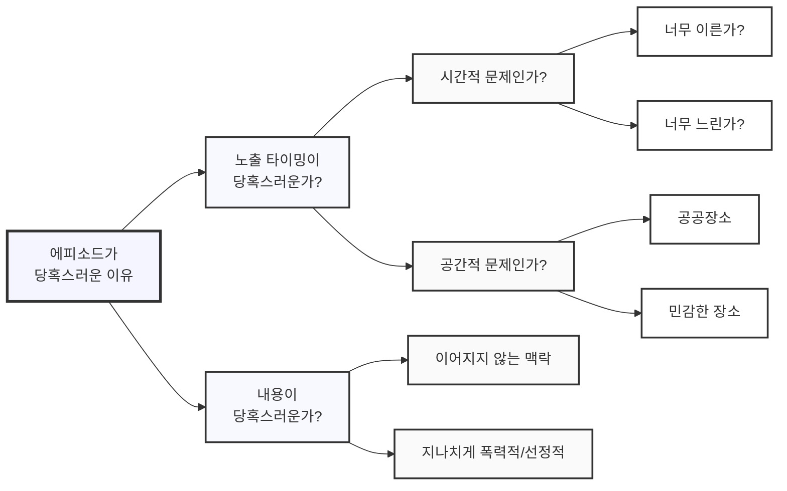

## 우주에서는 고장나는 볼펜

'문제 정의' 하면 떠오르는 우주 펜에 관한 이야기는 이미 유명하다.

> 중력이 없는 우주정거장에 지구에서 가져온 볼펜이 제대로 나오지 않자,
> 미국은 이를 해결하기 위해 오랜 시간과 백만달러를 들여 우주에서도 고장나지 않는 space pen 을 개발했다.  
> 후에 미국 우주인이 소련 우주인에게 '너네는 뭐 쓰냐?' 고 물었더니 '연필!' 이라 답했다는 이야기.
{: .prompt-tip }

무엇이 이렇게 큰 차이를 만들었을까?

- 미국은 "무중력 상태에서는 볼펜이 고장난다"고 문제를 정의했다.
- 소련은 "무중력 상태에서는 볼펜으로 필기를 할 수 없다"고 문제를 정의했다. 

물론 이 이야기의 세세한 내막은 세간에 알려진 것과 다르긴 하지만, 문제를 잘 정의하는 것이 얼마나 중요한 지를 깨닫게 해주는 데엔 충분하다.
문제를 어떻게 정의하느냐에 따라 솔루션이 달라지는 건 일상 생활에서도 종종 겪게 되는 일이기도 하니까.

## 문제는 주어지는 것이 아니라 정의하는 것

앞서 살펴 보았듯 똑같은 상황을 경험하더라도 같은 문제가 도출되진 않는다. 문제란 결국 주어지는 것이 아니라 해결하고자 하는 사람이 나름의 관점에서 **정의하는 것**이기 때문이다.
그렇다면 수백만 달러와 시간을 쓰는 미련함을 피하기 위해 문제를 어떻게 하면 잘 정의할 수 있을까? 를 살펴보기 앞서 '문제'란 무엇인가부터 살펴보자.

지금까지 내가 봐왔던 '문제'에 관한 가장 명쾌한 정의는 아래와 같다.

> '문제' 라고 함은, **현재의 상태(Current State)**와 **원하는 상태(Desired State)** 사이의 **갭(Gap)**이다.
{: .prompt-info }

즉, 문제를 제대로 파악하기 위해서는:

1. 현재의 상태를 정확히 파악하고
2. 원하는 상태를 명확히 한 후
3. 그 사이의 갭을 인식해야 한다.

하나 간단한 예시를 들어보자.

> '집에 전구가 깜빡거리네, 어떡하지?'

여기서 현재의 상태는 *'전구가 깜빡임'* , 원하는 상태는 *'전구가 깜빡이지 않음'* 이다.  
당연하게도, 그 갭을 극복하는 방법은 *'새 전구로 갈아끼는 것'* 이다.

이렇듯 갭을 우리가 명확히 인지하고 있는 상황이라면 그것은 더 이상 '문제'가 아니라, 단순히 '할 일'에 불과하다.

이것을 뒤집어 생각해보면, '문제'라는 것은 **갭을 정확히 인지하지 못하거나, 극복할 수 있는 방법을 모르는 상황에서 발생**한다.

그러므로 문제를 정의(및 해결)하기 위한 첫 출발로는 핵심적인 질문(Key Question)을 떠올려 보는 것이 좋다.  

내가 뭘 모르는 지 알고 문제를 정확하게 정의한 뒤, 나아가 해결책을 도출해내기 위해서.

## Key Question

질문은 여러가지가 도출될 수 있고, 나쁜 질문도 있고, 좋은 질문도 있을 것이다.  
문제를 정의하는 것에 대한 정답이 없는 것과 마찬가지로, Key Question 을 뽑는 것 역시 정답은 없다.

다만 좋은 Key Question 을 도출하기 위해 나침반으로 삼으면 좋을 지침이 있다.

1. 현재 상태는 무엇인가?
2. 원하는 상태는 무엇인가?
3. 갭을 측정할 수 있는 기준이 있는가? 
4. 갭이 발생하는 근본 원인은 무엇인가?
5. 검증되지 않은 숨은 전제가 있는가? (적을수록 좋음)
6. 바꿀 수 없는 조건이나 확실한 전제가 있는가? (많을수록 좋음)

연습삼아 한 번 문제 현상을 떠올려 보자.

> '이번에 우리가 새롭게 기획한 에피소드를 경험한 사용자들이 당혹스럽다는 피드백을 해요. 어떡하죠?'

1. 현재 상태는 무엇인가? - *'사용자들이 당혹스러워 한다.'*
2. 원하는 상태는 무엇인가? - *'사용자들이 당혹스러워 하지 않는다.'*
3. 갭을 측정할 수 있는 기준이 있는가? - *'에피소드 경험 유무에 따른 서비스 이탈율 차이'*
4. 갭이 발생하는 근본 원인은 무엇인가? - *'신규 기획한 에피소드가 런칭됨'*
5. 검증되지 않은 숨은 전제가 있는가? - *'당혹스러워하는 사용자들이 (소수가 아닌) 대다수다'*
6. 바꿀 수 없는 조건이나 확실한 전제가 있는가? - *'에피소드는 서비스 핵심가치이므로 없앨 수 없음'*

Key Question 은 다음과 같이 뽑아볼 수 있다.

- '에피소드가 당혹스러운 이유는 무엇인가?'
- '당혹스러움을 느낀 사용자의 수를 어떻게 집계할 수 있는가?'

## Issue Tree 

Key Question 이 문제 해결을 위해 내가 뭘 모르고 있는지를 알기 위함이라면, Issue Tree는 더 깊게 파고들어 문제의 근본 원인과 해결책을 찾기 위한 도구이다.
흔히 이야기하는 피라미드 / 마인드 멥을 떠올리면 쉽다. 단, 가장 Root 가 되는 지점이 바로 Key Question 이다.

예를 들어, '채팅 앱에 노출되는 케릭터 에피소드가 당혹스러운 이유'를 Issue Tree로 나누어 본다면 이렇다.

Issue Tree 를 뽑을 때 **딱 한 가지 주의할 점**이 있다.

- 브랜치는 MECE(Mutually Exclusive, Collectively Exhaustive)하게 나눈다 (중복 없음, 누락 없음)

예를 들어, 우리의 제품 고객군을 '학생'과 '직장인'이라고 나눈다면 '학생이면서 직장인'인 일부 고객이 중복이 발생한다. 또한, '학생도 직장인도 아니지만 우리 서비스를 쓰는 사람'은 누락된다.
즉, 이 기준은 MECE 하다고 볼 수 없는 것이다.

이런 구멍들이 생기면 결과적으로 문제를 엉뚱한 곳에서 찾게되어 시간을 낭비하는 원인이 되므로 이슈 트리 브랜치는 반드시 MECE 하게 쪼개져야 한다.

### Issue Tree 의 나침반

Key Question 이 딱 하나만 도출되는 것이 아닌 것처럼, **이슈 트리 역시 한 번에 딱 하나만 나오는 것이 아니다**.
같은 현상을 해석하더라도 다양한 관점에서 해석을 해볼 수 있기 때문이다.

예를 들어 '매출이 왜 떨어질까?' 라는 Key Question 으로 이슈 트리를 나누어 볼 때,
연령대별 순으로 나눌 수도 있고, 성별로 나눌 수도 있고, 지역으로 나눌 수 있고, 제품 카테고리 별로도 나눌 수 있고, 구매 시간대 별로도 나눌 수 있다.

너무 많은 기준으로 나뉠 수 있어 혼란스럽다면, Issue Tree 역시 따라가기 좋은 나침반이 있다.

1. 정량적 기준을 정성적 기준보다 우선한다
2. 여러 기준으로 나눌 수 있을 때, 문제와 관련이 없는 부분을 최대한 많이 덜어낼 수 있는 기준이 좋다

예를 들어, 연령대 별로 보았을 때 매출은 전 연령에서 고루 떨어졌다면 연령대 별로 나누는 것은 큰 의미가 없다.
하지만 성별로 나누었을 때 여성 고객들의 매출이 눈에 띄게 떨어진다면, 남성 고객을 고려하지 않을 수 있게 되어 문제 범위를 좁힐 수 있으므로 더 나은 해석 관점이라고 볼 수 있다.

한 걸음 더 나아가, 복합적으로 들여다 볼 수도 있다. 처음에 성별로 나누고, 그 다음에 나이대로 나누는 것이다.
단순히 성별로만 봤을 때보다, 성별과 연령대를 함께 고려해보았더니 30-40 여성 고객군 에서 매출이 크게 떨어졌더라와 같은 식으로 인사이트를 얻으며 가지를 뻗는 것이다.

### 유량 데이터와 저량 데이터

이슈 트리를 나누어 보기 위해 보아야할 데이터의 종류에는 크게 2가지 종류가 있다. 유량(flow) 데이터와 저량(stock) 데이터이다.

유량 데이터라 함은 시계열 기반으로 변동이 있는 데이터를 의미(매출과 같은)하고, 저량 데이터는 특정 시점에서의 정적인 데이터를 의미한다.
앞서 이슈 트리에서 나누는 관점을 고를 때 최대한 문제 범위를 좁힐 수 있는 기준이 좋다고 했는데, 유량/저량을 나누고 다음 기준을 적용하면 도움이 된다.

- 유량 데이터의 경우는 변동성이 큰 기준을 고르면 좋다 (앞서 소개한 매출이 왜 떨어졌을까?)
- 저량 데이터의 경우는 직관을 가장 배신하는 것을 고르면 좋다 (방문 빈도가 높은 사용자가 왜 낮은 사용자보다 구매율이 낮을까?)

## 가설을 도출하는 것은 쉽다. 검증이 어렵지

문제를 정확하게 정의했고, 이슈 트리를 이리 뜯어보고 저리 뜯어보고 하면서 문제 범위를 좁혔다면, 그 문제를 해결할 수 있는 솔루션(=가설)을 도출해내는 것이 마지막 단계이다.
그러나 경험적으로 솔루션을 떠올리는 것은 현재 상태/원하는 상태를 정의하는 것보다 훨씬 쉽다. 어차피 뇌피셜로 쏟아내기만 하면 되기 때문이다.

> '이렇게 하면 될 것 같은데요?'  
> '아니면 이렇게 해보는 건 어때요?'  
> '다른 팀에서 이렇게 해봤는데 결과가 좋았다고 하더라구요.'  
>   
> 사람들은 어차피 회의실에서 하고 싶은 말이 많다.
> 이 중에서 그럴 듯 한 것을 고르고 실행하면 된다.
{: .prompt-tip }

그럼에도 정말 중요한 것은, '이 솔루션을 적용하면 문제가 해결될꺼야'라는 가설을 도출해내는 데 치열하게 머리를 굴렸던 만큼,
**검증에도 신경을 많이 써야 한다는 것**이다. 이것은 많은 팀들이 저지르는 안타까운 실수 가운데 하나이기도 하다.
아이데이션 할 때는 신나서 이야기하다가, 막상 가설을 검증할 시점이 되면 바쁘다며 시큰둥한 것이다.

검증을 하지 않으면 문제를 해결에 관한 피드백을 받을 수 없기 때문에 팀의 문제 해결력 향상에 어떤 도움을 받지 못한다.
문제가 정말로 해결되었는지, 해결되었다면 그것은 솔루션 때문이 맞는지, 그 과정에서 고객에 대해 더 알게 된 건 없는지, 더 빠르게/효과적으로 문제를 해결할 순 없었는지 등을 되돌아보는 회고 과정이 반드시 필요하다. 
