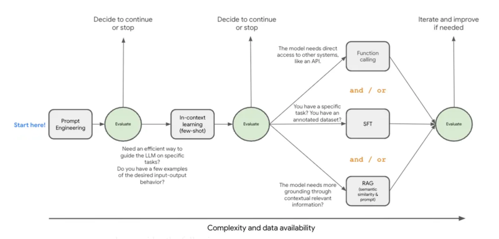

## 파인튜닝

파인튜닝에는 2가지 종류가 있다.

- Full fine-tuning: 모델의 모든 파라미터를 업데이트하는 방법
- Parameter-Efficient fine-tuning(PEFT): 모델의 일부 파라미터만 업데이트하는 방법

Full fine-tuning은 모델의 모든 파라미터를 업데이트하기 때문에 학습 속도가 느리고 엄청난 컴퓨팅 파워와 비용을 필요로 한다.
반면 PEFT는 모델의 일부 파라미터만 업데이트하기 때문에 학습 속도가 빠르고 한정된 자원 내에서도 효율적으로 학습할 수 있다.

PEFT는 Adapter -> LoRA -> QLoRA 순으로 발전 과정을 거치게 되었는데, 핵심 아이디어는 다음과 같다.

1. 기존 모델의 가중치 행렬 W(w x k)를 동결시킴
2. 파인튜닝된 결과인 가중치 행렬을 W'이라고 할 때, 동결한 행렬 W의 차이인 델타 W를 B*A 형태의 저차원 행렬로 분해
3. B는 w x r, A는 r x k 형태의 행렬이다. 여기서 r 은 adapter size 라고 부르는데, 작을 수록 더 빨리 학습하지만 표현력은 줄어듦
4. 결과적으로 W에서 w x k 의 파라미터 업데이트가 필요하던 게, r x (k + w) 의 파라미터 업데이트로 줄어든다.
5. 파인튜닝된 모델에 인풋이 들어오면 동결된 W에 델타 W를 더하여서 응답을 생성함

따라서 LoRA의 어댑터는 모듈화 되어 재사용이 가능하다. 물론 파인튜닝을 거쳐야 하지만 말이다.

QLoRA는 이런 LoRA 를 더 적은 메모리로 파인튜닝을 하기 위해 양자화한 버전이다. 실제로 QLoRA는 성능 손실은 미미하다고 한다.

## 언제 파인튜닝을 해야 하는가

개선하고자 하는 모델의 특정 작업과 그에 따라 문제-정답 데이터셋이 준비되어 있다고 해서 무조건 파인튜닝을 할 수 있는 것은 아니다.
파인튜닝이 빛을 발하는 영역은 정해져 있다.

- 도메인 전문성이 요구되는 경우: 법학, 의학 등
- 출력을 준수해야 하는 경우: Json 으로 output 뱉기
- 일관된 작업의 성능을 올리고자 하는 경우: 요약
- 모델의 행동을 컨트롤하고자 하는 경우: 상세하게 대답하기 vs 간단하게 대답하기

파인튜닝은 모델의 가중치를 수정해 모델 응답으로 하여금 특정 패턴을 따르는 경향성을 부여하는 것이고,
그렇기 때문에 데이터셋에 없는 케이스가 계속해서 동적으로 생기는 경우에 대해서는 적합하지 않다.
쉽게 말해 창의력이 필요한 영역일 수록 파인튜닝은 더 어려워진다.

따라서 정말 파인튜닝이 필요한 지 결정을 내리기 전에 더 비용이 적고 쉬운 방법부터 시도하는 게 낫다.
아래 그림에선 그 방법을 잘 설명하고 있다.


[이미지 출처](https://cloud.google.com/blog/products/ai-machine-learning/supervised-fine-tuning-for-gemini-llm?e=48754805?utm_source%3Dcloud_sfdc&hl=en)


## 데이터 준비

파인튜닝을 하기로 결정했다면, 다음 기준을 반드시 준수해야 한다.

- 중복 데이터가 없어야 함
- 최대한 다양한 사례를 담은 데이터셋 + 특정 케이스나 응답 유형에 치우치지 않아야 함
- 일관된 데이터 - 보통 불필요한 공백(whitespace)은 모두 제거하고 lowercasing 함
- 토큰 길이의 다양성을 확보해야 함

일관된 데이터를 만들기 위해 LLM 파인 튜닝에선 보통 [Jsonl](https://jsonlines.org/) 파일을 사용한다.
별로 특별할 것은 없고, json 객체를 1 줄에 표현한 뒤, 줄바꿈으로 구분하는 형태이다.

```json
{"question": "What is the capital of France?", "answer": "Paris"}
{"question": "What is the capital of Germany?", "answer": "Berlin"}
```

LLM 별로 정의된 데이터셋 포맷이 있는데, Gemini의 경우 [여기](https://cloud.google.com/vertex-ai/generative-ai/docs/models/gemini-supervised-tuning-prepare#about-datasets)에 자세히 나와있다.
어떤 형식으로 데이터셋을 정의해야 하는지 궁금할 땐 반드시 위 문장에 나와 있는 다음 문장을 기억해야 한다.

> The examples in your datasets should match your expected production traffic.

## 기준 세우기

데이터가 준비되었다면 성능을 측정할 기준을 세워야 한다. 몇 가지 대표적으로 쓰이는 기준들은 다음과 같다.

- EM(Exact Match): 정답과 모델의 출력이 완전히 일치하는 비율
- F1 Score: Precision과 Recall의 조화평균

이 [notebook](https://github.com/GoogleCloudPlatform/generative-ai/blob/main/gemini/tuning/gen_ai_sdk_supervised_finetuning_using_gemini_qa.ipynb)에 나와 있는 것처럼,
EM은 exact wording 이 중요한 경우에 좋고, F1 Score는 전반적인 이해도나 시멘틱한 정확도를 볼 때 좋다. 두 메트릭은 복합 평가를 하기 위해 함께 사용되는 경우가 많다.

더 많은 파인튜닝 모델의 평가 기준은 [여기서](https://cloud.google.com/vertex-ai/docs/evaluation/introduction#classification_2) 찾아볼 수 있다.

## 성능 평가하기

- Total Loss: 모델의 예측 확률 분포와 정답 분포간의 차이를 측정, 로스가 감소한다는 건 모델이 계속 학습하고 있다는 뜻
- Fraction of correct next step predictions: 다음 토큰의 예측이 얼마나 성공하는지를 봄. 시간이 지날 수록 1에 가까줘져야 함.

Total Loss 가 계속 줄어든다고 해서 항상 좋은 것은 아니고, Validation Loss 를 같이 봐야 한다.
Total Loss는 계속 줄어들지만 정답 셋에 주지 않은 validation set 의 Loss 가 늘어난다면 과적합을 시사하기 때문이다.
