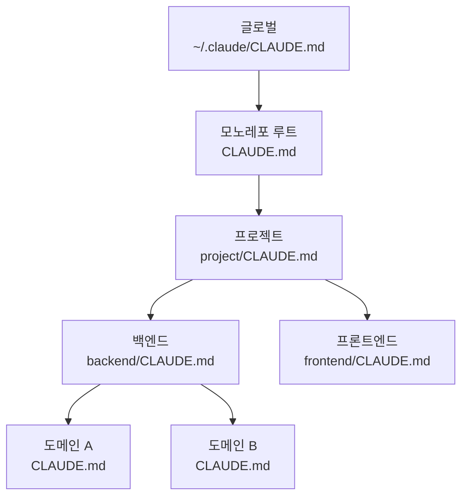

AI 시대의 도구는 유통기한이 무척이나 짧다. 어제까지 정석이라 믿었던 최선의 세팅이 오늘 아침이면 구식이 되어버리곤 한다.

지난 글에서 Claude Code 활용법을 남겨보겠다고 했으나, 그 사이에도 내 세팅은 또 바뀌었다. 이 글을 쓰는 지금도 언제든 바뀔 수 있다는 점을 감안하고 읽어주길 바란다.

## 맥락의 경제학: MCP의 변화

이전에는 MCP(Model Context Protocol)를 가급적 최소한으로 사용하는 쪽이었다. 연결된 모든 MCP가 곧 컨텍스트 비용으로 직결되었기 때문이다. 하지만 최근 **온디맨드(On-demand) 컨텍스트 로딩** 방식으로 세팅이 바뀌면서, 이제는 필요한 MCP를 다 연결해두어도 무방해졌다.

필요할 때만 컨텍스트를 불러오니 예전처럼 매번 연결을 해제하거나 관리하는 번거로움이 줄었다. 덕분에 도구가 주는 편의를 비용 걱정 없이 온전히 누릴 수 있게 된 셈이다.

이 변화 이후로 나는 코드 탐색용(Serena), 브라우저 검증용(Playwright), 문서 참조용(Context7) 등 용도별 MCP를 거리낌 없이 붙여두고 있다. 예전 같았으면 "이거 하나 더 붙이면 토큰이 아까운데" 하고 망설였을 텐데, 지금은 필요하면 일단 연결해두고 쓸 때만 불러오면 그만이다. 플러그인도 마찬가지로, 글로벌 설정에서 공통으로 켜두고 프로젝트별로 필요한 것만 추가하는 식으로 운용 중이다.

## CLAUDE.md 계층 구조: 맥락을 쌓아올리는 방법

Claude Code를 쓰다 보면 어느 순간 `CLAUDE.md`가 점점 비대해지는 시점이 온다. 프로젝트 규칙, 코딩 컨벤션, 도메인 지식까지 한 파일에 담으려 하면 금세 수천 줄이 되고, 정작 지금 필요한 맥락이 묻혀버리곤 한다.

내가 찾은 해결책은 **계층화**였다. `CLAUDE.md`를 디렉토리 구조에 따라 여러 층으로 나누는 것이다.

원리는 단순하다. Claude는 작업 중인 디렉토리에서 상위로 올라가며 `CLAUDE.md`를 수집하기 때문에, 각 층에 해당 스코프에 맞는 지시사항만 적어두면 자연스럽게 필요한 맥락만 적재된다. 백엔드를 고칠 때 프론트엔드 컨벤션이 끼어들 이유가 없고, 특정 도메인을 다룰 때 다른 도메인의 규칙이 섞일 일도 없다.

실제로 내 프로젝트에서는 글로벌(공통 플러그인 설정) → 모노레포(프로젝트 개요) → 프로젝트(워크플로우, Git 규칙) → 도메인(아키텍처 컨벤션, 디자인 시스템) → 서브도메인(특정 모듈 규칙)까지 다섯 단계로 나뉘어 있다. 과하다 싶을 수도 있지만, 각 층이 담당하는 범위가 명확하기에 오히려 관리가 편하다.

> **팁**: `CLAUDE.md`가 길어지기 시작했다면, "이 규칙은 어느 디렉토리에서 작업할 때 필요한가?"를 자문해보자. 특정 하위 디렉토리에서만 필요한 규칙이라면 그 위치에 별도의 `CLAUDE.md`를 두는 게 낫다.

## 에이전트 오케스트레이션: 토큰을 지키는 법

_oh-my-claudecode 플러그인을 통한 효율적인 에이전트 활용_

Claude Code를 오래 쓰다 보면 한 가지 피할 수 없는 벽에 부딪히게 된다. 바로 **컴팩션(Compaction)**이다. 세션이 길어지면 과거 맥락이 압축되고, 앞서 파악해둔 코드 구조나 결정 사항이 유실된다. 특히 복잡한 프로젝트에서 코드 구조를 훑는 것만으로 상당한 토큰이 소비되기에, 메인 세션이 직접 모든 걸 하려 하면 정작 중요한 작업을 시작하기도 전에 토큰이 바닥나는 경우가 있다.

이 문제를 해결하는 데 **oh-my-claudecode(OMC)** 플러그인이 꽤 효과적이었다. OMC는 코드 탐색이나 분석 같은 작업을 메인 세션이 아닌 별도의 서브 에이전트에게 위임한다. 서브 에이전트가 소비하는 토큰은 메인 세션의 컨텍스트에 영향을 주지 않으므로, 결과적으로 메인 세션은 핵심 작업에 집중할 수 있게 된다.

> **팁**: 구조 파악, 코드 리뷰, 테스트 검증처럼 "읽기 위주"의 작업은 서브 에이전트에게 맡기고, 메인 세션은 그 결과를 받아 판단하고 실행하는 식으로 역할을 나누면 세션 수명이 눈에 띄게 늘어난다.

## 워크플로우를 CLAUDE.md에 적는다는 것

AI 에이전트에게 "이 버그 고쳐"라고만 하면, 십중팔구 증상만 덮는 수정이 돌아온다. 근본 원인을 파고들지 않고, 테스트를 돌려 초록불이 뜨면 끝이라고 보고하는 식이다.

이런 패턴이 반복되자, 이슈 해결 과정 자체를 `CLAUDE.md`에 정형화해두었다. 핵심만 추리면 이렇다: **원인 분석 → 맥락 확인 → 구현 → 수동 검증 → 코드 리뷰 → 테스트 → 자기 성찰**. 여기서 내가 특히 신경 쓴 부분이 두 가지 있다.

하나는 **원인 분석 단계에서의 5 Whys**다. "왜 이 값이 null인가?"에서 멈추지 않고, "왜 null이 가능한 구조인가?"까지 파고들도록 유도한다. 코드 레벨의 패치가 아니라 설계 레벨의 결정에 도달해야 같은 유형의 버그가 재발하지 않는다고 보기 때문이다.

다른 하나는 **수동 검증을 테스트보다 앞에 둔 것**이다. 자동화된 테스트가 통과해도 실제 브라우저나 API에서 깨지는 경우가 생각보다 잦았다. 그래서 테스트는 push 직전 최종 관문으로만 쓰고, 그 전에는 실제 동작을 눈으로 확인하는 단계를 반드시 거치게 해두었다.

> **팁**: Claude Code의 커스텀 스킬(Custom Skill)을 활용하면 이런 워크플로우를 한 번의 명령으로 실행할 수 있다. 반복되는 복잡한 절차 — 이를테면 최적화 루프, 검증 체크리스트, 테스트 작성 가이드 — 를 스킬로 만들어두면 매번 같은 지시를 반복할 필요가 없어진다.

## 자기 성찰 루프: 실수가 규칙이 되는 구조

내 워크플로우에서 가장 독특한 부분이 있다면 아마 이 **자기 성찰 루프**일 것이다.

이슈를 해결한 뒤 마지막 단계로 `/self-reflect`라는 커맨드를 실행한다. 이 커맨드는 방금 작업에서 겪은 마찰과 교훈을 추출하여, 해당 레벨의 `CLAUDE.md`에 규칙으로 기록한다. 단순한 회고 메모가 아니라 다음번에 같은 실수를 구조적으로 차단하기 위한 장치다.

이런 규칙들이 하나둘 쌓이면서 `CLAUDE.md`는 점점 프로젝트의 '면역 체계'처럼 기능하게 된다. 한 번 겪은 버그 패턴은 규칙화되어, 이후에 Claude가 같은 실수를 저지르려 할 때 사전에 차단된다. 돌이켜보면 지금 내 `CLAUDE.md`에서 가장 가치 있는 부분은 처음부터 의도적으로 작성한 규칙들이 아니라, 실패를 겪고 나서 덧붙여진 규칙들이었다.

이 패턴이 특히 중요해지는 지점이 있다. 바로 **AI가 맥락의 무게를 스스로 판단하기 어려운 영역**이다. 예컨대 내 프로젝트에는 실제 자금이 오가는 라이브 트레이딩 로직이 포함되어 있는데, 초기에 리팩토링 중 라이브 세션이 의도치 않게 영향받은 적이 있었다. 이 경험이 지금은 `CLAUDE.md`의 "절대 규칙" 섹션으로 남아 있다. AI는 코드의 의미는 이해하지만, 그 코드에 얼마만큼의 현실적 무게가 실려 있는지까지는 스스로 가늠하기 어렵다. "이건 건드리면 안 돼"라는 경계는 결국 사람이 명시적으로 알려줘야 하는 영역이라고 본다.

> **팁**: 프로덕션 데이터베이스, 결제 로직, 인증 토큰처럼 실수의 비용이 큰 영역이 있다면, `CLAUDE.md`에 별도 섹션을 두어 금기 사항을 명확히 적어두는 것이 좋다. AI가 아무리 똑똑해도 "이건 절대 하지 마"라는 맥락은 선제적으로 심어두는 편이 안전하다.

## 나만의 칸반 시스템: VIBAN

여기에 덧대어, 나는 최근 **VIBAN**이라는 이름의 로컬 태스크 관리 TUI를 만들어 워크플로우에 통합했다. `CLAUDE.md` 내에 이 칸반에서 이슈를 할당받고, 처리하고, 테스트하는 일련의 과정을 정의해두었다. 이슈가 해결됨에 따라 자동으로 칸반에 상태가 반영되는 식이다.

_직접 개발한 로컬 칸반 TUI, VIBAN의 실제 구동 화면_

흥미로운 점은 **워크트리(Worktree)** 방식에 대한 고민이다. 많은 AI 에이전트 기반 칸반 시스템들이 작업 간 간섭을 피하기 위해 워크트리를 하드하게 사용한다. 나 역시 이를 시도해보았으나, 여러 작업이 병렬로 완료되었을 때 수행하는 QA나 휴먼 리뷰(Human Review)의 피로도가 너무 높았다.

결국 지금은 워크트리 방식 대신 단일 작업 트리를 고수하고 있다. feature branch도 쓰지 않는다. main에서 직접 작업하고, 직접 push한다. AI가 제안하는 '효율적'인 방식보다, 내가 온전히 통제하고 검토할 수 있는 단순한 방식이 아직은 더 좋은 생산성을 내고 있다.

---

돌이켜보면, 이 모든 세팅의 공통점은 결국 **AI에게 맥락을 심는 행위**라는 한 줄로 수렴한다. 계층화된 `CLAUDE.md`는 "이 프로젝트에서는 이렇게 해"라는 맥락을, 정형화된 워크플로우는 "이 순서대로 해"라는 절차를, 자기 성찰 루프는 "이 실수는 다시 하지 마"라는 기억을 심어준다. 이 세 가지가 결합되면서 AI 에이전트는 범용 도구에서 점점 '내 프로젝트를 아는 동료'에 가까워지는 것이 아닌가 싶다.

도구는 계속해서 변하고, 더 영리해질 것이다. VIBAN 역시 언젠가 플러그인의 형태로 다듬어볼 생각이다. 하지만 결국 중요한 건 도구 그 자체보다, 그 안에 얼마나 두꺼운 맥락이 쌓여 있느냐가 아닐까 싶다.