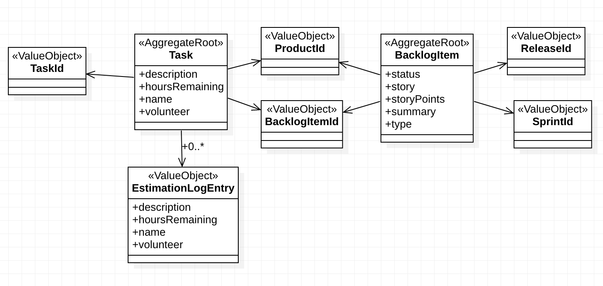

# 10장. 에그리게잇

먼저 오른쪽에서 목차부터 살펴보자. 다 말해주고 있다.

## 스크럼 핵심 도메인에서 애그리게잇 사용하기

팀이 다음과 같은 고민을 하고 있다.

* 제품은 백로그 아이템과 릴리즈, 스프린트를 포함한다.
* 새로운 제품 백로그 아이템을 계획한다.
* 새로운 제품 릴리즈를 계획한다.
* 새로운 제품 스프린트의 일정을 수립한다.
* 계획된 백로그 아이템에 관한 릴리즈 일정을 수립할 수 있다.
* 일정이 잡힌 백로그 아이템은 스프린트로 커밋할 수 있다.

### 첫 번째 시도: 큰 클러스터의 애그리게잇

하나의 큰 애그리게잇으로 묶어버림.

```java
public class Product extends ConcurrencySafeEntity {
  private Set<BacklogItem> backlogItems;
  private String description;
  private String name;
  private ProductId productId;
  private Set<Release> releases;
  private Set<Sprint> sprints;
  private TenantId tenantId;
  ...
}
```

그럴싸해보이지만 다수의 사용자 환경에서 트랜잭션이 주기적으로 실패한다.
  * 사용자 A와 B가 버전 1로 표시된 같은 `Product`에 작업을 시작했다.
  * 사용자 A가 `BacklogItem`을 계획하고 커밋해서 버전이 2로 증가했다.
  * 사용자 B가 `Release` 일정을 설정해 저장하려 했지만 커밋이 버전 1에 기반하고 있어서 실패했다.

### 두 번째 시도: 디수의 애그리게잇

위의 큰 애그리게잇을 4개로 쪼갰다.

```java
public class Product ... {
  ...
  public BacklogItem planBacklogItem(String aSummary, String aCategory, BacklogItemType aType, StoryPoints aStoryPoints) {
    ...
  }
  
  public Release scheduleRelease(String aName, String aDescription, Date aBegins, Date anEnds) {
    ...
  }
  
  public Release scheduleSprint(String aName, String aGoals, Date aBegins, Date anEnds) {
    ...
  }
}
```

트랜잭션 실패 문제를 어떻게 피했을까? 애플리케이션계층에 있는 `ProductBacklogItemService`를 살펴보자.

```java
public class ProductBacklogItemService ...{
  ...
  @Transactional
  public void planBacklogItem(
    String aTenantId,
    String aProductId,
    String aSummary,
    String aCategory,
    String aBacklogItemType,
    String aStoryPoints
  ) {
    Product product = productRepository.productOfId(new TenantId(aTenantId), new ProductId(aProductId));
    
    BacklogItem plannedBacklogItem = product.planBacklogItem(
        aSummary,
        aCategory,
        BacklogItemType.valueOf(aBacklogItemType),
        StoryPoints.valueOf(aStoryPoints)
    );
    
    backlogItemRepository.add(plannedBacklogItem);
  }
}
```

단순히 모델을 밖으로 빼낸 것 만으로 트랜잭션 범위가 격리되기 때문에 동시적으로 안전하게 인스턴스들이 생성될 수 있게 했다.
트랜잭션 문제라면 optimistic lock을 풀어 트랜잭션 실패가 전파되는 걸 막는 방법도 있지 않았을까?

## 규칙: 진짜 고정자를 일관성 경계 안에 모델링하라

바운디드 컨텍스트 안에서 애그리게잇을 찾으려면 모델의 진짜 고정자(invariant)를 이해해야 한다. 고정자란 언제나 일관성을 유지해야만 한다는 비즈니스 규칙이다.
여기서 말하는 일관성은 Eventual consistency 가 아니라 Transactional consistency다.

다음과 같은 고정자가 있다고 하자.

c = a + b

이 고정자가 일관성을 유지할 수 있도록 경계를 설정한다.

```java
AggregateType1 {
  int a;
  int b;
  int c;
  
  operations ... 
}
```

이 일관성 경계는 어떤 오퍼레이션이 수행되든 상관없이 경계 안의 모든 대상이 특정 비즈니스 고정자 규칙 집합을 준수하도록 논리적으로 보장해준다.
이 경계밖의 일관성은 애그리게잇과 무관하다. 즉, 애그리게잇 = 트랜잭션적 일관성 경계 이다.

실제에선 고정자가 훨씬 복잡하지만, 그렇다 하더라도 전형적으로 고정자는 작은 애그리게잇으로 설계하는 편이 더 수월하다. 

## 규칙: 작은 애그리게잇으로 설계하라

큰 클러스터로 이루어진 애그리게잇이 트랜잭션이 모든 상황에서 모조리 성공한다고 하더라도, 여전히 성능과 확장성의 문제가 있다.
영속성 메커니즘이 지연 로딩을 지원한다고 하더라도 애그리게잇 안의 컬렉션에 단 하나의 항목을 추가하기 위해 수천 개의 다른 항목들을 메모리에 로드할 지 모른다.

> 애그리게잇 당 하나의 레포지토리라고 알고 있었는데, 이대로면 수많은 테이블이 생기지 않나? 그럼 레포지토리당 하나의 영속성 저장소는 아니란 건가?

그렇다면 얼마나 작아야 할까? 일관성 규칙에 묶여 같이 다니는 녀석들을 묶는 최소 범위여야 한다. 이를테면 `name`과 `description`은 보통 동시에 수정되므로 엥간해선 같이 다닌다.

보통은 VO 하나 정도를 포함한 애그리게잇이 만들어진다고 한다. 거기서 많아봤자 2, 3개의 엔티티가 더 추가된다. 

### 유스케이스를 전부 믿지는 말라

특정 유스케이스 때문에 여러 애그리게잇 인스턴스를 여럿 수정해야 하는 문제가 종종 발생한다. 그럴 땐 먼저 유스케이스가 여러 영속성 트랜잭션에 걸쳐져도 되는 것인지
아니면 반드시 하나의 트랜잭션 안에서 이뤄져야 하는지 먼저 판단해본다. 후자라면 고정자를 놓치고 있는 경우일 수도 있어, 더 깊은 도메인에 대한 이해로 이어질 수도 있다.

결국 새로운 유스케이스는 애그리게잇을 리모델링해야 한다는 사실로 이어질 수 있지만, eventual consistency로 해결할 수 있을지 모른다는 비판적 시각을 항상
견착해야 한다.

## 규칙: ID로 다른 애그리게잇을 참조하라

1. 참조하는 애그리게잇과 참조된 애그리게잇이 같은 트랜잭션 안에서 수정되선 안된다. 하나의 트랜잭션에선 하나의 애그리게잇만 수정되어야 한다.
2. 하나의 트랜잭션에서 여러 인스턴스를 수정하고 있다면 일관성 경계가 잘못됐다는 신호다.
3. 2번을 리펙토링 해야 한다면 eventual consistency 를 고려하자.

이걸 어떻게 달성할까?

### 애그리게잇이 ID 참조를 통해 서로 함께 동작하도록 해보자

ID로 다른 애그리게잇을 참조하도록 하자.

```java
public class BacklogItem extends ConcurrencySafeEntity {
  ...
  private ProductId productId;
  ...
}
```

인스턴스를 가져올 때 더 짧은 시간, 더 적은 메모리를 소모한다.

### 모델 탐색

그럼 애그리게잇안에 ID로 연관된 외부 애그리게잇은 어떻게 가져올까? 애그리게잇의 행동을 호출하기에 앞서 리포지토리나 도메인 서비스를 통해 조회하는 방법이 있다.

애플리케이션 서비스가 의존성을 풀어내게 되면 애그리게잇은 리포지토리나 도메인 서비스에 의지할 필요가 없어진다. 하지만 매우 복잡한 도메인 별 의존성을 해결하기 위해선
도메인 서비스를 애그리게잇의 커맨드 메소드로 전달하는 방법이 최선일 수 있다. 그러면 애그리게잇은 참조를 엮어주기 위해 이중 디스패치를 수행한다.

ID 만으로 참조하게 되면 유스케이스 응답을 내리기가 너무 힘들어질 수도 있는데, 이 때 CQRS나 세타 조인(theta join)을 고려한다. 이 둘 마저 고려할 수 없는 상황이라면
추론 객체 참조과 직접 객체 참조 사이에서 균형을 잡아야 한다.

### 확장성과 분산

애그리게잇은 ID로 다른 애그리게잇을 참조하기 때문에 애그리게잇 데이터 저장소의 연속적 재파티셔닝(repartitioning)을 통해 무한에 가까운 확장성을 달성하게 된다.

분산은 저장소의 경계를 넘어서까지 연장된다. 분산된 시스템에 걸쳐진 트랜잭션은 원자적이지 않고 여러 애그리게잇이 eventual consistency를 달성하도록 한다.

> 여기 무슨 말인지 모르겠다...

## 규칙: 경계의 밖에선 결과적 일관성을 사용하라

DDD 모델 내에서 결과적 일관성을 지원하는 방법은 커맨드 메소드에서 하나 이상의 비동기 구독자에게 제때 전달되는 도메인 이벤트를 발행하는 것이다.

```java
public class BacklogItem extends ConcurrencySafeEntity {
  ...
  public void commitTo(Sprint aSprint) {
    ...
    DomainEventPublisher
        .instance()
        .publish(new BacklogItmCommitted(this.tenantId(), this.backlogItemId(), this.sprintId()));
  }
  ...
}
```

각 구독자는 각자 필요한 애그리게잇을 격리된 트랜잭션 내에서 수행할 수 있게 된다.

그런데 이 때 만약 구독자끼리 동시성 경합을 겪어서 수정에 실패하면 어떻게 될까? 구독자가 메시징 메커니즘을 통해 수정 성공을 알리지 않으면
수정을 재시도 할 수 있다. 메시지가 재전달되고 새로운 트랜잭션이 시작되며, 필요한 커맨드를 실행하려는 시도를 새롭게 시작하고 그에 따른 커밋이 이뤄진다.

### 누가 해야 하는 일인지 확인하자

데이터의 일관성을 보장하는 주체가 유스케이스를 수행하는 사용자의 일인가?

* 만약 그렇다면 다른 애그리게잇 규칙들은 고수하면서 트랜잭션 일관성을 보장하자.
* 만약 아니라면(다른 시스템이나 다른 사용자가 해야할 일이라면) 결과적 일관성을 선택하자.

## 규칙을 어겨야 하는 이유

하나의 트랜잭션에 하나의 애그리게잇만 수정하라는 규칙을 어겨야만 할 때가 있을까?

### 첫 번째 이유: 사용자 인터페이스의 편의

만약 애그리게잇 인스턴스 배치를 한 번에 생성하는 방식과 반복적으로 하나씩 생성하는 방식 사이에 차이점이 없다면 편의를 위해 규칙을 깨도 된다. 

### 두 번째 이유: 기술적 메커니즘의 부족

메시징이나 타이머, 백그라운드 스레드 같은 메커니즘이 전혀 제공되지 않는 상황이라면 규칙을 깨도 된다. 물론 일반적인 상황은 아니다.

설계를 변경할 수 없는 상황에선 한 명의 사용자가 오직 하나의 애그리게잇 인스턴스에만 집중해야 하는 워크플로우인지 살펴보자.
낙관적 동시성을 통해 여러 애그리게잇을 수정하더라도 동시성 경합으로부터 애그리게잇을 보호해 줄 수 있다.

### 세 번째 이유: 글로벌 트랜잭션

글로벌한 2단계 커밋 트랜잭션을 엄격히 지켜 사용해야 할 때가 있을 수 있다(레거시에 발이 묶여서).

그러나 글로벌 트랜잭션을 사용한다고 해도 한 번에 다수 애그리게잇을 수정할 필요는 없다.

> 2단계 커밋
> 
> Prepare commit 단계: 트랜잭션에 참여하는 모든 노드에 prepare commit 프로토콜을 전송하여 준비 완료 응답을 받는다.  
> Commit 단계: Commit을 수행함과 동시에 모든 노드로부터 Commit되었다는 응답을 받는다.

### 네 번째 이유: 쿼리 성능

리포지토리 쿼리 성능 문제를 해결하기 위해 다른 애그리게잇으로의 직접 참조를 유지하는 편이 최선일 때가 있다.

### 규칙을 지키기

경험에만 의존해서 애그리게잇 규칙을 지키지 않아야할 변명을 찾지 않아야 한다. 규칙을 지켜야 필요한 곳에서 일관성을 유지하며 최적의 성능과 높은 확장성의
시스템을 구축할 수 있다.

## 발견을 통해 통찰 얻기

1 트랜잭션 1 애그리게잇 수정 규칙을 지키려고 노력하다보면 새로운 통찰로 이어진다. 

### 설계를 다시 한 번 생각해보자

`BacklogItem`(Aggregate Root) 이 `Task`(Entity) 와 1:n 관계에 있도록 설계하였다.
`Task`는 `EstimationLogEntry`(Value Object) 와 1:n 관계에 있도록 설계하였다.

주어진 고정자는 다음과 같다.

* 백로그 항목의 테스크에 진전이 있다면, 팀원은 테스크 수행의 남은 시간을 에측한다.
* 팀원이 특정 태스크의 남은 시간을 0시라고 예측했다면, 백로그 항목은 남은 시간이 있는지 모든 테스크를 확인한다. 모든 테스트킈 남은 시간이 0이라면, 백로그 항목의 상태가 자동으로 완료로 변경된다.
* 팀원이 특정 테스크에 한 시간 이상이 남아 있다고 예측했지만 백로그 항목이 이미 완료 상태라면, 상태가 자동으로 복구된다. 

둘은 겉보기에 일관성 규칙을 적용해야 하는 것처럼 보이는데, 이 둘을 2개의 개별 애그리게잇으로 쪼갤 수는 없을까?

### 애그리게잇 비용의 예측

`Task`가 `BacklogItem` 하나당 12개가 있고, `EstimationLogEntry`가 `Task` 하나당 12개가 있다면, `BacklogItem`하나당 `EstimationLogEntry`는 144개가 있는 꼴이다.
모든 예측 요청을 처리할 때마다 메모리에 적재하기에는 부담스런 크기이다. 

### 일반적인 사용 시나리오

시나리오 분석을 해보자

* 한 사용자가 144개의 모든 객체를 메모리로 한 번에 로드하도록 요청하는 일이 자주 있을까?
* 그럴 일이 없다면 최대 몇 개만 요청이 가능해야 할까?
* 여러 클라이언트가 `BacklogItem`에 동시성 경합을 일으킬만한 경우가 있을까?

### 메모리 소비

`Task`와 `EstimationLogEntry`에 지연 로딩을 사용한다면 요청마다 12 + 12 만큼의 수집된 객체를 갖게 된다.

그러나 2번의 지연 로딩은 여러 번의 가져오기 동작에서 성능적으로 오버헤드가 발생할 수 있다.

### 또 다른 설계 대안 살펴보기

`Task`를 애그리게잇으로 격상시켰다.



### 결과적 일관성의 구현

먼저 `Task`가 `estimationHoursRemaining()` 커맨드를 처리할 때 해당하는 도메인 이벤트가 발행된다.

```java
public class TaskHoursRemainingEstimated implements DomainEvent {
  private Date occurredOn;
  private TenantId tenantId;
  private BacklogItemId backlogItemId;
  private TaskId taskId;
  private int hoursRemaining;
  ...
}
```

구독자는 도메인 서비스로 처리를 위임하는데, 다음과 같은 동작을 수행한다.

* `BacklogItemRepository`에서 `BacklogItem` 가져옴
* `BacklogItem` 과 연결된 `Task`를 가져오기 위해 `TaskRepository`를 조회
* 도메인 이벤트의 프로퍼티인 `hoursRemaining` 과 가져온 `Task` 인스턴스를 전달해 `estimationTaskHoursRemaining`이라는 이름의 `BacklogItem` 커맨드를 실행

꼭 `Task`를 다 가져올 필요 없고, DB 쿼리로 `hoursRemaining` 합산해서 가져오도록 하여 메모리를 아낄 수 있다.

결과적 일관성 때문에 UI가 복잡해질 수 있다. 어떻게 새로운 상태를 보여주지? 백그라운드 폴링을 해야 하나?
의외로 단순하게, 스크린상에 시각적 큐를 사용해서 현재 상태가 확실하지 않다고 안내할 수 있다.

### 이는 팀원이 할 일인가

`BacklogItem`의 상태와 남아있는 `Task`의 시간 사이의 일관성을 유지하는 일은 누가 해야 할까?

언제든지 일관성을 유지해야 한다면, 외부 애그리게잇은 ID로만 참조한다는 규칙을 어겨도 좋지 않을까? 객체를 직접 참조하고 ORM을 선언해서 지연 로딩이 가능하도록 하는 편이 좋지 않을까?

### 결정의 시간

`Task`를 애그리게잇으로 격상시키느냐 vs 그대로 남기고 직접 참조를 하느냐. 지금까지 분석을 바탕으로 결정해야 한다.

결국 그대로 남기는 대신 지연 로딩 전략을 사용하기로 예제에 등장하는 팀은 결정을 내렸다.

결정을 내리기 위해 찾아가는 시간을 부끄럽게 피하지 말고 부딪히자. 30분이면 충분하다. 이 시간은 핵심 도메인에 관해 더 깊은 통찰을 얻을 수 있기 때문에 충분히 가치있는 시간이다.

## 구현

팀은 구현을 어떻게 했을까?

### 고유 ID와 루트 엔티티를 생성하라

```java
public class Product extends ConcurrencySafeEntity {
  private Set<ProductBacklogItem> backlogItems;
  private String description;
  private String name;
  private ProductDiscussion productDiscussion;
  private ProductId productId;
  private TenantId tenantId;
  ...
}
```

`ConcurrencySafeEntity`는 대리 식별자와 낙관적 동시성 버전을 관리하기 위해 사용한 계층 슈퍼타입이다.

```java
public class HibernateProductRepository implements ProductRepository {
  ...
  public ProductId nextIdentity() {
    return new ProductId(UUID.randomUUID().toString().toUpperCase());
  }
  ...
}
```

`ProductId`는 `nextIdentity()`를 통해 얻어올 수 있도록 한다.

```java
public class ProductService ... {
  ...
  @Transactional
  public String newProduct(String aTenantId, aProductName, aProductDescription) {
    Product product = new Product(
        new TenantId(aTenantId),
        this.productRepository.nextIdentity(),
        "My Product",
        "This is the description of my product",
        new ProductDiscussion(
            new DiscussionDescriptor(DiscussionDescriptor.UNDEFINED_ID), DiscussionAvailability.NOT_REQUESTED
        )
    );

    this.productRepository.add(product);

    return product.productId().id();
  }
}
```

루트 엔티티를 위와 같이 생성한다.

### 값 객체 파트를 선호하라

가능하다면 포함된 애그리게잇 파트를 엔티티보다는 값 객체로서 모델링하자. 모델이나 인프라에서 의미 있는 오버헤드를 야기하는 것이 아니라면, 완전히
대체할 수 있는 VO가 최선의 선택지다.

### 디미터 법칙과 묻지 말고 시켜라를 사용하기

* [디미터 법칙](../../methodology/clean-code/the-law-of-demeter)
* 묻지 말고 시켜라: 객체 에게 할 일을 알려줘야 한다. 클라 객체는 자신이 갖고 있는 상태에 기반해 서버에게 무엇을 할 지 시켜야 하지, 서버 객체의 정보를 요구해선 안된다.

위 두 가지 원칙을 애그리게잇에 반드시 지키려고 노력하자.

### 낙관적 동시성

낙관적 동시성 `version` 을 어디에 위치시켜야 할까?

> 이 부분 잘 모르겠다. 너무 Hibernate에 집중한 설명이다.

### 의존성 주입을 피하라

애그리게잇으로 리포지토리나 도메인 서비스를 주입하자 말아라.
