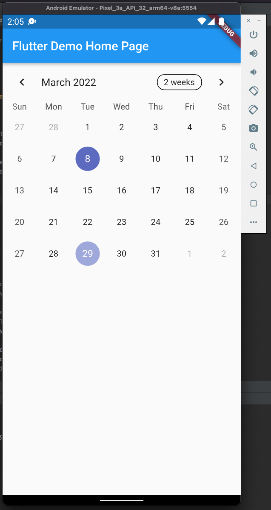
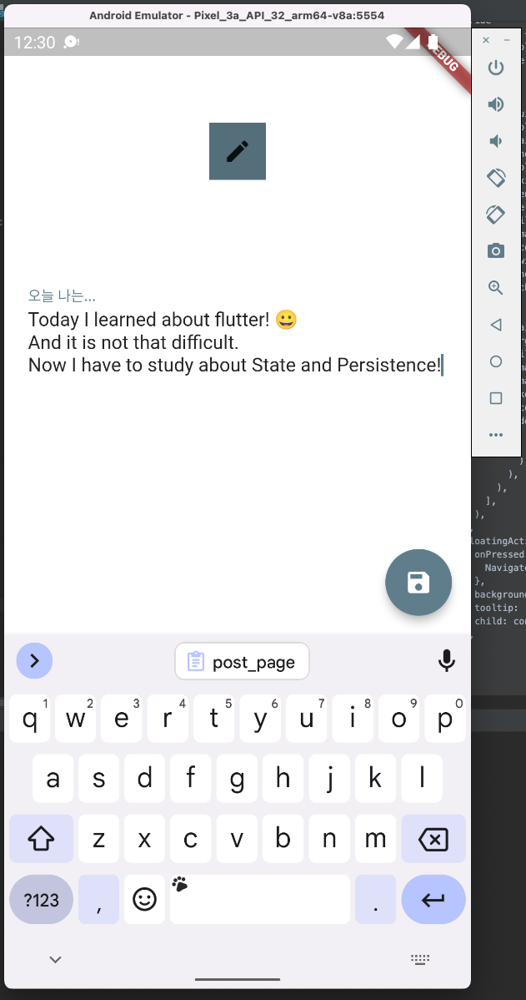

이 글은 시리즈 글입니다.

1. [플러터(Flutter)로 앱개발 시작하기](./hello-world/)
2. [플러터(Flutter)로 캘린더 기반 메모앱 만들기](./calendar-memo/)
3. [플러터(Flutter)의 상태와 영속성](./state-and-persistence/)
4. [플러터(Flutter) Splash 화면 만들기](./splash)

## 쓸만한 라이브러리를 찾아서

지난 글에서 캘린더 기반 메모앱을 만들겠다고 했습니다. 플러터에 대해 잘 모르지만 일단 기초따윈 그냥 무시하고, 라이브러리부터 찾아봅시다.
필요한 개념이 생기면 그때부터 공부하면 될 거란 마인드입니다. 어차피 공부해도 까먹기도 하고요.

구글에 검색하자마자 바로 나오는 좋은 [캘린더 라이브러리](https://pub.dev/packages/table_calendar)를 찾았습니다. 웃기게도, 라이브러리 코드는 어떻게 동작할 지 한 치 앞을 예상할 수 없기 때문에 좀 자세히 읽어보는 편입니다.
[문서화](https://pub.dev/documentation/table_calendar/latest/)가 잘되어 있어서 보기 편하므로 github에 스타도 하나 눌러줍니다.

## 라이브러리 의존성 추가하기

문서를 보면 `pubspec.yaml` 에 라이브러리를 추가하라고 나옵니다. `pubspec.yaml` 파일을 열어보면 꽤 자세하게 설명이 되어 있는 것이 보입니다.
필요한 내용들을 읽어내려가며 의존성을 추가해 주었습니다.

추가한 의존성을 내려받기 위해서는 `flutter pub get` 를 해주어야 하네요.

```bash
❯ flutter pub get     
Running "flutter pub get" in demo...                             2,209ms
```

## Main.dart 한 번 훑어보기

`main.dart`에도 친절한 설명글들이 과할 정도로 잔뜩 써있네요. 지금은 기초를 모르는 상황이니 하나씩 읽어보면서 모르는 부분을 찾아봤습니다.
이미 본 주석은 보기 흉하니 삭제합니다.

```js:title=main.dart {2}
class MyApp extends StatelessWidget {
  const MyApp({Key? key}) : super(key: key);

  @override
  Widget build(BuildContext context) {
    return MaterialApp(
      title: 'Flutter Demo',
      theme: ThemeData(
        primarySwatch: Colors.blue,
      ),
      home: const MyHomePage(title: 'Flutter Demo Home Page'),
    );
  }
}
```

다른 데선 흔히 볼 수 없는(?) 좀 신기한 부분이 있네요. `const MyApp({Key? key}) : super(key: key)` 여기서 `Key`가 뭐지? 싶어서 코드 따라 들어가보니 위젯의 ID 라고 합니다.
'같은 부모 아래의 위젯(UI 컴포넌트가 플러터에서는 widget 이라고 부르나 봅니다)들에서는 `Key`가 고유해야 하고 새 위젯은 해당 키가 요소와 연결된 현재 위젯의 키와 동일한 경우에만 기존 요소를 업데이트하는 데 사용됩니다' 라는 설명이 보입니다.
무슨 말인지 잘 모르겠으나 지금 당장 필요해보이지 않습니다. 여기까지 판단이 섰다면 미련없이 그냥 넘어갑니다.

플러터 앱을 생성하면 기본으로 제공되는 예제에 있는 FloatingActionButton 예시를 통해 위젯의 state를 어떻게 업데이트하는지도 알았습니다.
`State` 클래스를 상속받은 위젯의 `_MyHomePageState` 클래스의 `build`가 state의 업데이트가 있을 때(`setState`가 실행될 때)마다 위젯을 업데이트 해주는 군요.
Center, Column(수직 축 기준), Row(수평 축 기준) 같은 Align 을 위한 위젯을 통해 편하게 UI를 배치할 수 있다는 것도 알았습니다. 지금 수준에선 이 정도로 충분해 보입니다.

## Calendar 위젯 추가하기

필요없는 부분들을 다 삭제하고 `_MyHomePageState`를 다음과 같이 수정했습니다.

```js:title=main.dart {11-13}
class _MyHomePageState extends State<MyHomePage> {
  @override
  Widget build(BuildContext context) {
    return Scaffold(
      appBar: AppBar(
        title: Text(widget.title),
      ),
      body: Center(
        child: Column(
          mainAxisAlignment: MainAxisAlignment.start,
          children: const <Widget>[
            Calendar(),
          ],
        ),
      ),
    );
  }
}
```

[예제](https://github.com/aleksanderwozniak/table_calendar/blob/master/example/lib/pages/basics_example.dart)를 참고해 `calendar.dart` 도 추가해줍니다.

```js:title=calendar.dart
import 'package:flutter/material.dart';
import 'package:table_calendar/table_calendar.dart';

class Calendar extends StatefulWidget {
  const Calendar({Key? key}) : super(key: key);

  @override
  _CalendarState createState() => _CalendarState();
}

final kToday = DateTime.now();
final kFirstDay = DateTime(kToday.year, kToday.month - 3, kToday.day);
final kLastDay = DateTime(kToday.year, kToday.month + 3, kToday.day);

class _CalendarState extends State<Calendar> {
  CalendarFormat _calendarFormat = CalendarFormat.month;
  DateTime _focusedDay = DateTime.now();
  DateTime? _selectedDay;

  @override
  Widget build(BuildContext context) {
    return TableCalendar(
      firstDay: kFirstDay,
      lastDay: kLastDay,
      focusedDay: _focusedDay,
      calendarFormat: _calendarFormat,
      selectedDayPredicate: (day) {
      },
      onDaySelected: (selectedDay, focusedDay) {
        if (!isSameDay(_selectedDay, selectedDay)) {
          setState(() {
            _selectedDay = selectedDay;
            _focusedDay = focusedDay;
          });
        }
      },
      onFormatChanged: (format) {
        if (_calendarFormat != format) {
          setState(() {
            _calendarFormat = format;
          });
        }
      },
      onPageChanged: (focusedDay) {
        _focusedDay = focusedDay;
      },
    );
  }
}
```

그냥 실행시켜보니 벌써 그럴듯한 화면이 나왔습니다.



## 메모를 추가할 수 있는 화면 구성하기

Floating 버튼을 추가해서 Navigate 되도록 설정한 후 `post_page.dart` 를 만들었습니다.

```js:title=post_page.dart
class PostPage extends StatefulWidget {
  const PostPage({Key? key}) : super(key: key);

  @override
  _PostPageState createState() => _PostPageState();
}

class _PostPageState extends State<PostPage> {
  final contentController = TextEditingController();

  @override
  void dispose() {
    contentController.dispose();
    super.dispose();
  }

  @override
  Widget build(BuildContext context) {
    return Scaffold(
      body: Container(
        color: Theme.of(context).backgroundColor,
        child: Column(
          crossAxisAlignment: CrossAxisAlignment.stretch,
          children: [
            Center(
              child: Container(
                margin: const EdgeInsets.all(80.0),
                color: Colors.blueGrey[600],
                width: 48.0,
                height: 48.0,
                child: const Icon(Icons.mode_edit),
              ),
            ),
            Container(
              margin: const EdgeInsets.symmetric(horizontal: 20.0),
              child: TextField(
                maxLength: null,
                maxLines: null,
                keyboardType: TextInputType.multiline,
                controller: contentController,
                decoration: const InputDecoration(
                  labelText: '오늘 나는...',
                  border: InputBorder.none,
                ),
              ),
            ),
          ],
        ),
      ),
      floatingActionButton: FloatingActionButton(
        onPressed: () {
          Navigator.pop(context);
        },
        backgroundColor: Colors.blueGrey,
        tooltip: '저장',
        child: const Icon(Icons.save),
      ),
    );
  }
}
```

역시 그럴듯한 화면이 쉽게 만들어 졌습니다. 당연히 내가 쓴 글이 저장되거나 하는 기능은 아직 없습니다. 대신 `Navigator.pop(context)`가 있기 때문에
캘린더 페이지 화면으로 돌아가긴 합니다. 참고로 맨 위 푸르딩딩한 `AppBar`는 별로 안 이쁜 것 같아서 아예 없애버렸습니다.



다음 글에서는 위젯의 전역적인 상태 관리와 영속화를 어떻게 시킬 수 있을지에 대해 다뤄볼 생각입니다.
