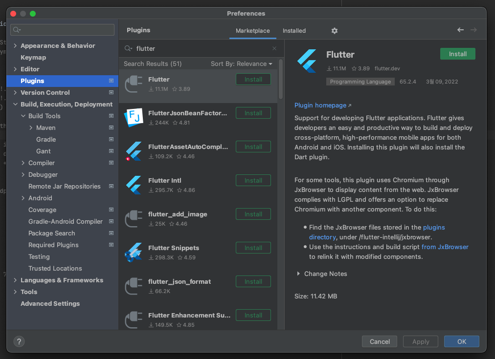
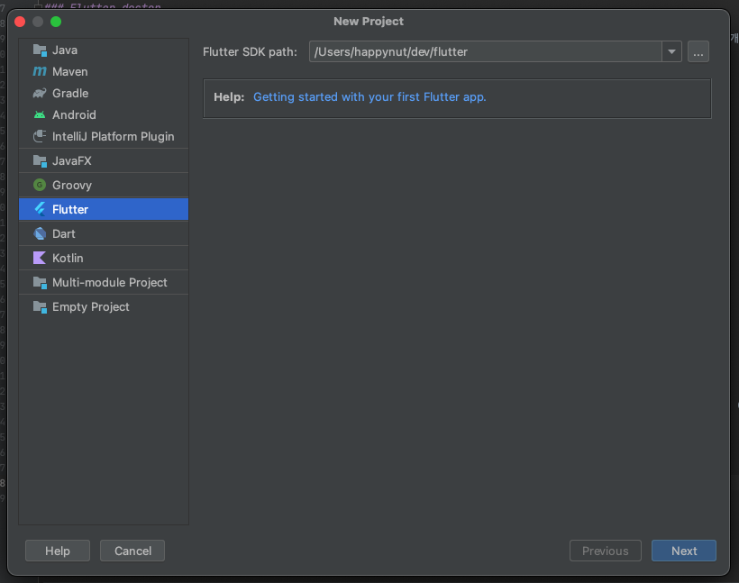
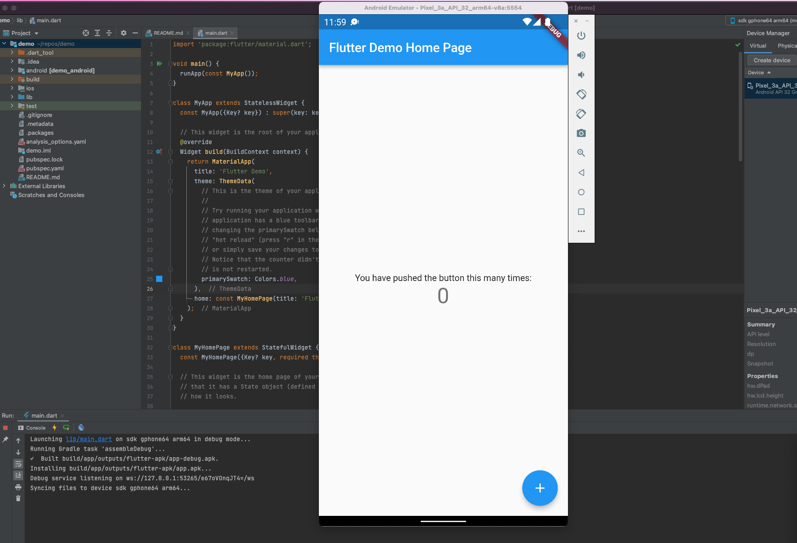

이 글은 시리즈 글입니다.

1. [플러터(Flutter)로 앱개발 시작하기](./flutter-hello-world.md)
2. [플러터(Flutter)로 캘린더 기반 메모앱 만들기](./flutter-calendar-memo.md)

## 플러로 앱개발 시작하기

새로운 앱 서비스를 만들어 보려고 하는데, iOS, Android 모두 한꺼번에 마켓에 출시하는 것이 목표라 [Flutter](https://flutter.dev/) 를 사용해보기로 마음 먹었습니다.
예전에 잠깐 애니메이션 구현 튜토리얼 정도 따라해본 경험만 있어서 공부하면서 개발을 병행할 생각입니다. 개발하려는 서비스의 난이도도 그리 높지 않기도 하고요.   

## 개발환경 구축

Flutter 는 개발 환경 구축을 위해 여러가지로 설치할 게 많아 시간이 좀 들어가는 편입니다.

### Flutter doctor

Flutter 는 [`flutter doctor`](https://docs.flutter.dev/get-started/install/macos#run-flutter-doctor)를 통해 개발환경을 쉽게 설치하고 검사해볼 수 있습니다.
아래처럼 터미널에서 실행시켜보고 문제가 없음이 확인되면 다음 단계로 넘어가면 됩니다. 

```
❯ flutter doctor
Doctor summary (to see all details, run flutter doctor -v):
[✓] Flutter (Channel stable, 2.10.3, on macOS 12.3 21E230 darwin-arm, locale ko-KR)
[✓] Android toolchain - develop for Android devices (Android SDK version 32.1.0-rc1)
[✓] Xcode - develop for iOS and macOS (Xcode 13.3)
[✓] Chrome - develop for the web
[✓] Android Studio (version 2021.1)
[✓] IntelliJ IDEA Community Edition (version 2021.1)
[✓] Connected device (1 available)
[✓] HTTP Host Availability
```

### Flutter 플러그인 설치

저는 jetbrain 계열의 IDE가 익숙한 사람이기 때문에, Vscode 대신 Android studio 를 이용해 개발할 생각입니다.
어렴풋이 에뮬레이터로 앱을 돌려보려면 어차피 설정 변경 때문에 Android studio나 Xcode를 열었어야 했던 게 생각나기도 했고요.
설치는 설정에서 플러그인 메뉴에서 아주 쉽게 할 수 있습니다. Flutter 플러그인을 설치하면 알아서 Dart 플러그인까지 설치해줍니다.
만약 Dart플러그인이 제대로 설치되지 않았따면 Marketplace 에서 검색하여 다시 설치하시면 됩니다. 



[홈페이지](https://docs.flutter.dev/development/tools/devtools/overview#what-can-i-do-with-devtools)를 찾아보면 이 플러그인에 포함된 Dev tools를 통해 무엇을 확인할 수 있는지 알 수 있습니다.
이 중 몇몇은 정말 편리해 보이네요.

## 새 프로젝트 만들기

개발 환경이 정상적으로 구축이 되었다면, 새 프로젝트를 만드려고 할 때 다음과 같이 왼쪽에 Flutter 메뉴가 보여야 합니다. (아래는 Intellij 화면이지만 Android studio도 크게 다르지 않습니다)



저는 프로젝트 이름을 `demo` 로 하여 하나 만들어 보았습니다. 손쉽게 실행까지 완료되는 모습입니다.



[다음 포스팅](./flutter-calendar-memo.md)에선 캘린더 기반의 메모 앱을 만들어 보겠습니다.
