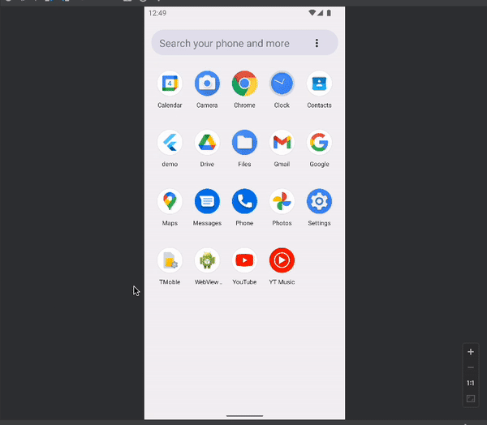

이 글은 시리즈 글입니다.

1. [플러터(Flutter)로 앱개발 시작하기](./hello-world/)
2. [플러터(Flutter)로 캘린더 기반 메모앱 만들기](./calendar-memo/)
3. [플러터(Flutter)의 상태와 영속성](./state-and-persistence/)
4. [플러터(Flutter) Splash 화면 만들기](./splash)

## 또 다시 쓸만한 라이브러리를 찾아서

이쯤되면 라이브러리를 덕지덕지 바르는 시리즈 글이 아닌가 싶습니다.
그러나 이번에도 라이브러리 배포를 해준 개발자들에게 감사의 기도(github start)를 올릴 준비를 하며 스플래쉬 화면을 쉽게 구현할 수 있도록 만들어줄 라이브러리를 찾아봅니다.
왜냐하면 [공식 문서](https://docs.flutter.dev/development/ui/advanced/splash-screen)에 있는 방법은 세상 귀찮아 보이거든요.

## flutter_native_splash

역시... 금방 [flutter_native_splash](https://pub.dev/packages/flutter_native_splash) 라는 친구를 찾았습니다.
기다릴 필요 없이 바로 splash 화면을 만들어 봅시다.

### 라이브러리 의존성 추가하기

다음과 같이 의존성을 추가하고 `flutter pub get` 으로 의존성들을 내려 받았습니다.

```yaml:title=pubspec.yaml {4-5}
dependencies:
  ...

  # Splash.
  flutter_native_splash: ^2.1.2+1
```

그리고 나서 `flutter_native_splash.yaml`을 프로젝트 루트 경로에다가 생성해줍니다. 파일이 너무 크니 여기다 첨부는 하지 않겠습니다.
Base template은 [여기서](https://github.com/jonbhanson/flutter_native_splash) 찾아볼 수 있습니다. 안에 설명도 친절하게 다 되어 있습니다.
차근차근 읽어보니 와우, 다크모드 대응까지 할 수 있는데다 Android 12 대응까지 되어 있습니다. 예술이네요.

파일까지 추가한 후, 문서에 나와있는 대로 `flutter pub run flutter_native_splash:create`를 실행시켜 줍니다. 이 명령어는 `flutter_native_splash.yaml`을 **변경할 때마다 해주어야 합니다**.

### 실행 화면

처음 실행시켜보면 다음과 같은 실행화면이 나옵니다.



`flutter_native_splash.yaml` 에서 여러가지 설정을 바꿔보면서 Splash 화면을 만들어보면 되겠습니다. 
