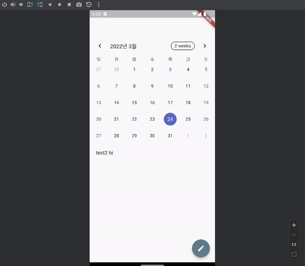

이 글은 시리즈 글입니다.

1. [플러터(Flutter)로 앱개발 시작하기](./hello-world/)
2. [플러터(Flutter)로 캘린더 기반 메모앱 만들기](./calendar-memo/)
3. [플러터(Flutter)의 상태와 영속성](./state-and-persistence/)
4. [플러터(Flutter) Splash 화면 만들기](./splash)

## 또 다시 쓸만한 라이브러리를 찾아서

지난 글에서 캘린더 메모앱의 UI를 거의 다 만들었지만 실제로 동작하는 기능은 하나도 없었습니다.
이제 날짜를 선택하고, 그 날의 메모를 적어넣는 기능을 만들어 보려 합니다.
`State` 로 이런 내용들을 관리했다간 앱을 껐다가 켤 때마다 메모들이 몽땅 날아갈 것이기 떄문에 영속성을 보장하는 저장소를 이용할 생각입니다.
Cloud Firestore 같은 걸 써볼 수도 있겠지만, 뭐 나중에 쓰게 되더라도 앱 안에선 영속화된 로컬 저장소를 쓰고,
나중에 백업이 필요하면 저장소를 덤프해서 클라우드에 저장하면 되지 않나 싶습니다.
합리화일수도 있겠지만 네트워크가 연결된 상황이 아니더라도 계속 서비스를 이용할 수 있다는 장점도 하나 챙겨가겠네요.

### Hive vs sqflite

[sqflite](https://pub.dev/packages/sqflite) 와 [hive](https://pub.dev/packages/hive) 사이에서 고민을 좀 했습니다.
가장 두드러지는 차이점은 `hive`는 NoSQL 이고, `sqflite` 는 RDB라는 점입니다.
결국 선택한 것은 `hive` 인데, `hive`가 더 좋아서라기보단 `sqflite`는 RDB다 보니 테이블 스키마도 확장성을 신경써서 설계해야 하고,
변경될 때마다 migration에 계속 신경을 써주어야 하는 게 부담스러웠기 때문입니다.

## 라이브러리 의존성 추가하기

다음과 같이 `hive` 의존성을 추가하고 `flutter pub get` 으로 의존성들을 내려 받았습니다.

```yaml:title=pubspec.yaml {5-7,15-17}
dependencies:
  flutter:
    sdk: flutter

  # hive database.
  hive: ^2.0.3
  hive_flutter: ^1.0.0
  
...

dev_dependencies:
  flutter_test:
    sdk: flutter

  # hive database generators.
  build_runner: ^1.12.2
  hive_generator: ^1.0.1
```

그리고 나서 `main()`함수를 다음과 같이 수정해 줍니다. 

```js:title=main.dart {1,2-3}
Future main() async {
  WidgetsFlutterBinding.ensureInitialized();
  await Hive.initFlutter();
  initializeDateFormatting().then((_) => runApp(const MyApp()));
}
```

## Memo Model 도입하기

[문서](https://pub.dev/packages/hive/example)를 참고해 아주 간단한 `Memo`라는 모델을 만들었습니다.
메모를 특정할 수 있는 ID는 날짜가 될 것 같아서 `createKey`라는 static 함수도 같이 추가했습니다.

```js:title=memo.dart
@HiveType(typeId: 0)
class Memo extends HiveObject {
  @HiveField(0)
  late String title;

  @HiveField(1)
  late String content;

  @HiveField(2)
  late DateTime date;

  @HiveField(3)
  late DateTime createdAt;

  static Memo createNew(DateTime targetDate) {
    return Memo()
      ..title = DateFormat('yyyy-MM-dd').format(targetDate)
      ..content = ''
      ..date = targetDate
      ..createdAt = DateTime.now();
  }

  static String createKey(DateTime targetDate) {
    return DateFormat('yyyy-MM-dd').format(targetDate);
  }
}
```

모델을 선언한 뒤에는 프로젝트 루트 경로로 가서 `flutter packages pub run build_runner build` 를 실행시켜 줍니다.
그러면 우리가 앞서 설치한 `build_runner`가 `memo.dart`파일과 같은 위치에 `part` 로 선언한 `memo.g.dart`가 생성 해주고, 그 안에 `MemoAdapter`를 선언합니다.
선언된 adapter는 `Hive`에 다음과 같이 등록해주어야 합니다.

```js:title=main.dart {5-6}
Future main() async {
  WidgetsFlutterBinding.ensureInitialized();
  await Hive.initFlutter();

  Hive.registerAdapter(MemoAdapter());
  await Hive.openBox<Memo>('memos');

  initializeDateFormatting().then((_) => runApp(const MyApp()));
}
```

## Hive 로 읽고 쓰기

우선 `Hive.box`는 코드를 따라가보니 이미 인스턴스가 생성되어 있다면 재활용하도록 되어 있었기 때문에 간편하게 Singleton으로 만들면 좋겠다는 생각이 들었습니다.
아래처럼 `Boxes`라는 클래스를 선언해줍니다.

```js:title=boxes.dart
class Boxes {
  static Box<Memo> memos() => Hive.box<Memo>('memos');

  static void closeMemos() => Hive.box<Memo>('memos').close();

  static Memo getMemo(DateTime targetDate) =>
      memos().get(Memo.createKey(targetDate),
          defaultValue: Memo.createNew(targetDate))!;

  static void addMemo(Memo memo) =>
      Boxes.memos().put(Memo.createKey(memo.date), memo);
}
```

`PostPage`가 파라미터로 메모 객체와 콜백을 받도록 해 메모가 업데이트되면 부모 위젯인 `HomePage`가 알 수 있도록 했고,
`HomePage`는 변경된 메모를 저장하고 캘린더에서 날짜 선택이 이루어질 때마다 화면에 보여지도록 했습니다.

```js:title=home_page.dart
class _HomePageState extends State<HomePage> {
  Memo _currentMemo = Boxes.getMemo(DateTime.now());

  @override
  void dispose() {
    // 문서에서 하라는 대로 더 이상 memo를 안쓸 것 같으면 close 해줍니다.
    Boxes.closeMemos();
    super.dispose();
  }

  void onDateTargeted(DateTime targetDate) {
    setState(() {
      // 날짜가 선택되면 Box에서 새로 가져옵니다.
      _currentMemo = Boxes.getMemo(targetDate);
    });
  }

  void onSaved(Memo memo) {
    // PostPage 에서 Save를 눌렀다면 Box에 저장합니다.
    Boxes.addMemo(memo);
    setState(() {
      // 현재 보여지는 화면에서 변경된 메모를 바로 보여주기 위해 setState에서 업데이트 해줍니다.
      _currentMemo = memo;
    });
  }

  @override
  Widget build(BuildContext context) {
    return Scaffold(
      appBar: AppBar(
        backgroundColor: Colors.transparent,
        shadowColor: Colors.transparent,
      ),
      body: Center(
        child: Column(
          mainAxisAlignment: MainAxisAlignment.start,
          children: <Widget>[
            Calendar(
              onDateSelected: onDateTargeted,
            ),
            Expanded(
              child: SingleChildScrollView(
                scrollDirection: Axis.vertical,
                child: Container(
                    margin: const EdgeInsets.all(20.0),
                    child: Row(
                      children: [
                        Text(
                          _currentMemo.content,
                          style: const TextStyle(height: 1, fontSize: 16),
                        ),
                      ],
                    )),
              ),
            )
          ],
        ),
      ),
      floatingActionButton: FloatingActionButton(
        onPressed: () {
          Navigator.push(
              context,
              MaterialPageRoute(
                  builder: (context) =>
                      PostPage(memo: _currentMemo, onSaved: onSaved)));
        },
        backgroundColor: Colors.blueGrey,
        child: const Icon(Icons.mode_edit),
      ),
    );
  }
}
```

실행 결과 입니다.


