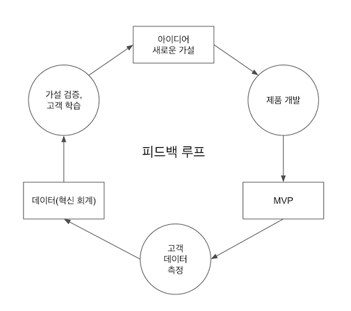

## 1부 비전

스타트업은 **극심한 불확실성** 속에서 신규 제품이나 서비스를 만드려는 조직이며, '세상을 바꿀 만한 사업을 일으킨다'는 **비전**을 가지고 있습니다.
모든 스타트업은 그 비전을 바탕으로 잘 굴러가는 사업을 구축하는 방법을 발견하고 싶어 합니다.

그러나 극심한 불확실성 때문에, **자원을 낭비하는 스타트업은 비전을 달성할 수 없습니다**. 이것은 이 책의 1장이 말하는 아주 중요한 핵심입니다.
낭비는 스타트업 존속 여부에 매우 치명적이기 때문입니다.

아무리 멋진 제품을 만들고 많은 시간과 노력을 들여서 제품을 출시해도 고객이 원하지 않는다면 회사는 그 시간에 전 직원에게 유급 휴가를 주어 해변에서 놀게하는 것만도 못한 효과를 얻습니다.
돈을 못 버는 것은 똑같으니까요. 모두가 알다시피, 돈 못 버는 스타트업이 망하는 것은 시간 문제입니다.

그럼 낭비는 어떻게 피할 수 있을까요?

답은 간단합니다. **고객이 무엇을 원하는지 알아내면 됩니다.** 무엇을 원하는 지 알아내려면 실험을 해야 하고, 실험을 하기 위해선 가설과 (실제 고객 데이터를 통한)검증이 필요합니다.
그러나 가설을 검증하는 것 뿐만 아니라 가설을 제대로 세우는 것 자체부터 매우 어렵습니다.
또, 가설을 세우고 검증하는 과정에서도 낭비는 아주 쉽게 발생할 수 있습니다. 가설이 잘못된 실험은 전부 낭비가 되기 때문입니다.

책의 저자가 소개하는 경험담이 왜 이것이 어려운가를 잘 말해줍니다.

저자는 초기 고객들이 이미 잘 쓰고 있는 메신저가 있으니 새로운 메신저를 만들어 내기보단,
'기존 메신저에 (플러그인처럼)부가 기능으로 아바타 채팅기능을 만들면 더 접근하기가 편하다고 생각할 것이다' 라는 가설을 세웠습니다.  
실제로 메신저 부가기능으로 아바타를 쓸 수 있는 서비스를 만들었는데, 고객들에게 소개하니 이것을 메신저로 친구들에게 공유하길 껄끄러워 했고, 혼자 쓰고 싶어 했습니다.
저자는 가설을 바꿉니다. '고객들은 싱글 플레이어 모드로 아바타 서비스를 사용하길 원할 것이다'.
그래서 싱글 용 아바타 기능을 만들었더니 이번에는 고객들이 멋져진 아바타를 통해 새로운 사람을 만날 수 있는 독립된 메신저로 쓰고 싶어 했습니다.
결국 '모르는 사람과 아바타를 통해 친해질 수 있는 신규 메신저'가 고객들이 정말로 원하는 것이었고, 그것을 알아내기까지 수천 줄의 코드와 6개월의 시간이 낭비되었습니다.

## 2부 조종

다음 그림에서 린 스타트업 모형의 핵심이 등장합니다. 동그라미 안에는 사람들이 들이는 노력이, 네모 안에는 앞 단계의 결과물이 쓰여 있습니다.
이 싸이클을 통틀어 **피드백 루프**라고 하며, 피드백 루프가 빠르게 돌아갈수록 스타트업은 기민해지고 이는 곧 낭비를 점점 더 많이 줄일 수 있음을 의미합니다.

위 그림에서 결과물(네모)을 제외해놓고 동그라미만 놓고 보면, 결국 사람들은 **만들고**, **측정**하고, **학습**합니다. 이러한 
한 루프가 끝나면 고객에 대해서 새로이 학습한 지식을 통해 새로운 아이디어를 발굴하고, 
그 아이디어를 검증할 수 있는 가설을 세우고, 가설을 검증하기 위한 제품을 만들면서 피드백 루프(이터레이션)를 다시 반복합니다.
이 패턴을 **엔진 튜닝**이라고 부르는데, 각 단계에 대해 자세히 알아봅시다.

### 제품 개발 - 만들기

제품 개발에 있어서 무조건 지켜야 하는 한 가지 절대원칙이 있습니다. **가설 검증, 즉 고객에 대한 학습에 직접 기여하지 않는 기능, 과정, 노력은 모조리 제거**해야 합니다.
안 그러면 낭비가 발생하기 때문입니다. 제품 모양새가 구리거나, 심지어는 아예 존재하지 않아도 가설을 검증할 수만 있다면 상관없습니다. 
다시 말해, 가설을 검증할 수 있는 방법 중에 가장 빠르게 만들 수 있는 결과물을 만들어야하고, 이것을 책에서는 **MVP(Minimum Valuable Product)** 라고 부릅니다.

dropbox의 사례를 봅시다.  
클라우드에 스토리지가 동기화가 되는 개념은 현대 사람들에게 아주 익숙하지만, dropbox 창업 초기 그 개념을 아는 사람은 거의 없었습니다.
dropbox의 창업자는 기술적 난이도가 매우 높은 이 제품의 첫 버전을 시장에 내려면 매우 많은 시간과 노력이 들어갈 것이라고 생각했습니다. 스타트업에 그런 비용은 매우 부담스러웠고,
결국 제품이 마치 실제로 개발이 다 된 것처럼 보이는 3분짜리 dropbox 데모 영상을 커뮤니티에 올려 시장 반응을 살펴보기로 했습니다.
하루 만에 75,000명이 사전 예약을 신청한 사실을 확인한 덕분에 dropbox팀은 확신을 가지고 신나게 제품을 만들 수 있었습니다.

이와 반대로, 가설 검증을 하지 않고 제품을 처음부터 커다란 스펙으로 만들었다가 망하는 케이스는 비일 비재하죠. 그러나 품질에 신경을 하나도 쓰지 않고 제품을 개발하라는 것은 아닙니다.
**절대원칙을 지키는 한에서는 품질에 신경을 써야 합니다**. 품질이 너무 낮아 제품에 결함이라도 발생한다면 피드백 루프에 지연을 초래하기 때문입니다.
스모크 테스트(Smoke test)와 같이, 제품의 주요 기능만을 테스트하는 방법론이 너무 낮은 품질을 방지하는 데 도움이 됩니다.

### 고객 데이터 측정 - 측정하기

MVP가 가설을 검증할 수 있는 최소 스펙의 제품이기 때문에, 사실 검증 방법은 MVP를 만들기 전 이미 고민이 되어 있어야 합니다.
그 고민은 **고객으로부터 얻는 데이터 중 무엇을 보아야 가설이 옳다고 판단할 수 있는가?** 입니다.
MAU(Monthly Active User), Retention rate 등 전통적으로 중요하다고 여겨지는 지표라고 해서 반드시 가설을 검증하는 데 쓰여야 할 지표는 아닙니다.
가설을 검증해주는 핵심지표는 가설마다 다를 수 있습니다.

저자가 들어주는 예시를 봅시다.  
저자의 회사인 IMVU팀은 사용자들이 유료 고객으로 전환되길 기대하면서 7개월 동안 고객과 1:1 인터뷰도 많이 하고, 요구사항을 들어주며 신규 기능을 추가하고 개선했습니다.
그리고 '이러한 제품의 개선들이 신규 고객들의 유료 전환율을 기존보다 훨씬 더 높게 끌어올려 줄 것'이라 생각했죠.
IMVU는 초창기 큰 성공을 거둔 직후였기 때문에, 서비스 전체 사용자 수는 J 커브를 그리며 날마다 증가하고 있었습니다.
그러나 그동안 축적된 데이터에서 매월 신규 가입자만 따로 분리하여 전환율을 집계했을 때, 7개월 동안의 수고가 낭비였음을 깨닫고 좌절했습니다.
전환율이 기간 내내 1% 미만에 머물러 있었기 때문입니다.

사례의 마지막에서 쓰인 것과 같이, 특정 사용자 그룹의 결과를 집계하여 보는 것을 **코호트 분석(cohort analysis)**이라고 합니다.
이와 반대되는 누적된 지표(사례에서의 전체 사용자 수)는 마치 제품이 성공가도를 달리는 듯한 환상을 사람들에게 심어주어 판단력이 흐려지게 만듭니다.
그래서 책에서는 후자를 **허무지표**라고 부르고, 전자(**실행지표**라고 부릅니다)를 이용해 의사 결정을 해나가는 과정을 **혁신 회계**라고 부릅니다. 

### 가설 검증, 고객 학습 - 학습하기

핵심 지표가 회사가 스스로 생각하는 이상향으로 잘 나아가고 있다면 **방향 전환(pivot)**을 할 필요가 없습니다.
제품을 최적화하기 위한 가설을 세우고 계속 엔진을 튜닝해 나가면 됩니다.

그러나 측정 결과가 기대한 바에 미치지 못한다면 pivot을 한다/안 한다의 까다로운 의사결정의 순간이 오게 됩니다.
이것이 두려워서(비전을 증명할 진짜 기회를 얻지도 못했는데 비전이 잘못된 것처럼 여겨지게 될까봐) pivot 하지 않게 되면, 시간이 지나면서 낭비로 인해 자금이 바닥나게 되고, 더욱 방향 전환이 어려워지는 악순환을 초래합니다.
차라이 이 기회로 **고객에 대해 학습한 것을 축하하며 pivot 하는 편이 훨씬 생산적**입니다. 그로 인해 비전을 증명할 기회를 다시 얻을 수도 있으니까요.

그렇다면 방향 전환은 어떻게 하라는 것일까요? 린 스타트업에서 제안하는 pivot 의 방법에는 여러가지가 있습니다.

| 
Pivot
    |      설명      |
|:---------:|:-------------|
| 줌인 전환    |  제품의 일부라고 생각했던 것을 전체 제품이라고 생각하고 집중합니다. e.g. [보티즌](https://en.wikipedia.org/wiki/Votizen): 소셜 네트워크 서비스를 제품의 일부 기능이었던 투표자 연락 서비스로 전환했습니다. |
| 줌아웃 전환     |    전체 제품이라고 생각했던 것을 더 큰 제품의 한 부분 기능으로 보도록 전환합니다.   |
| 고객군 전환     | 제품 가설이 부분적으로 확인되어서, 이제는 다른 고객(일반적으로 더 넓은 풀의)을 대상으로 전환합니다. |
| 고객 필요 전환 | 회사가 해결할 수 있는 문제를 예측한 것과 다른 곳에서 발견한 경우에 전환합니다.  e.g. [폿벨리 샌드위치 숍](https://en.wikipedia.org/wiki/Potbelly_Sandwich_Shop): 1977년 골동품 가게로 시작했으나, 사람들을 끌어 모으고자 샌드위치를 팔았는데 이게 너무 잘되어서 오늘날 200개가 넘는 샌드위치 점포를 거느린 프랜차이즈가 되었습니다. |
| 플랫폼 전환 | 애플리케이션에서 플랫폼 혹은 그 반대로의 전환입니다. |
| 사업 구조 전환 | 고이윤-소규모에서 저이윤-대규모 구조로 혹은 그 반대로의 전환입니다. |
| 가치 획득 전환 | 수익 모델을 바꾸는 전환입니다. |
| 성장 엔진 전환 | 바이럴 성장, 재방문에 의한 성장, 유료 성장 모델 등 성장 전략을 바꾸는 전환입니다. |
| 채널 전환 | 제품을 유통하는 채널을 전환합니다. |
| 기술 전환 | 신기술을 도입해 제품의 우수한 성능이나 가치를 얻을 수 있다면 기술을 전환합니다. |

## 3부 가속

스타트업의 역량은 2부에서 소개했던 피드백 루프의 순환이 얼마나 빠른가로 정해집니다.
소프트웨어 산업의 지속적 배포(CD, Continuous Deployment)가 좋은 예시인데요,
저자의 회사는 하루에 평균 50개의 변경 사항이 서비스에 반영되어 배포되었다고 합니다. 즉, 하루에 고객에 대한 가설 검증을 50번을 할 수 있었다는 의미입니다.
한 달에 걸쳐 제품의 새 버전이 출시되는 기업과 비교해 놓고 보았을 때, 어느 쪽이 더 낭비를 덜 할지는 분명해 보입니다.

> 참고: 소프트웨어 산업이 아니더라도, 3D 프린터로 시제품화를 한다던가, 스마트 재고 관리라던가, 임베디드 소프트웨어 등을 통해 피드백 루프의 가속화를 이룰 수 있다고 책에서는 이야기 합니다.

실제로 피드백 루프는 계획할때는 정 반대로 일어나고, 실행할때는 정 방향으로 일어납니다.
고객에 대해 **학습**하고 싶은 가설을 세우자 마자, 제품 개발 팀이 (어떻게 **측정**할 것인가까지 포함한)실험을 설계하고 즉각적으로 실행(MVP **개발**)합니다. 따라서, 스타트업이
하루에 50번이나 테스트 할 수 있는 환경을 만들기 위해서는 오로지 **검증할 가설이 생겼을 때만 트리거 되는 제품 개발 파이프라인을 만들고**, 다른 모든 일은 낭비라고 생각해야 합니다.

### 세 가지 성장 엔진

우리의 제품이 어떤 성장 엔진을 타고 달리고 있는지 알아야 올바른 방향으로 피드백 루프를 이끌 수 있습니다. **성장 엔진이 PMF(Product Market Fit, 시장 적합성)을 결정하기 때문**입니다.  
페이스북이 사업 초기 바이럴 성장 엔진이 아니라 유료 성장 엔진을 튜닝했더라면 어떻게 바뀌었을지 상상해본다면 이해가 쉬울 겁니다. 

| 
성장 엔진
 |      설명      | 성장 전략 |
|:---------:|:---------|:---------|
| 재방문 성장 엔진 | 스타트업의 성장이 고객의 재방문에 의존합니다. 신규 고객 유치율에서 가입 해지율(churn rate)를 뺀 값이 성장 속도를 결정합니다. | 기존 고객에게 더 매력적인 제품을 만들어야 합니다. 혹은, 한정 기간 할인이나 특가품에 대해 메시지를 보내볼 수 있습니다. |
| 바이럴 성장 엔진 | 고객이 제품을 사용하는 부수 효과로 시장에 발생하는 비선택적 전염에 스타트업의 성장이 의존합니다. 바이럴 계수(고객 1명당 몇 명을 데려오는가)가 성장 속도를 결정합니다. | 고객이 자기 친구를 데려오는 과정을 방해하는 어떤 것(e.g. 비용 청구)도 용납하지 않도록 합니다. |
| 유료 성장 엔진 | 스타트업의 성장이 고객이 제품에 지불하는 가격에 의존합니다. LTV(Life Time Value, 고객이 제품에 총 지불하는 금액)에서 CPA(Cost for Acquisition, 신규 고객 획득 단가)를 뺀 값(한계 이윤)이 제품의 성장 속도를 결정합니다. | CPA는 시장 경쟁에 따라 가격이 점점 올라가는 경향이 있으므로, 특정 고객군을 수익모델로 타깃할 수 있는 회사의 역량이 필요합니다. | 

당연한 말이지만 아쉽게도, **엔진은 연료가 무한하지 않습니다**.
초기 수용자가 필요로 하는 것 외에 다른 걸 모두 없앤 MVP로 성장 엔진을 찾았다고 해봅시다. 초기 수용자로는 성장 엔진이 한계에 다다라서,
이 경우 고객군 전환(pivot)으로 주류 고객을 타게팅하는 전략을 생각해볼 수 있습니다. 그러나 보통 이러한 고객군 전환은 어마어마한 추가 작업이 필요합니다.

제품을 개발하는 많은 사람들이 하는 착각 중에 하나는, 자신들이 제품을 개선하는데 들였던 노력이 제품을 성장시켰다고 판단하는 것입니다. 그러나 이는 사실이 아닙니다.
제품의 성장은 성장 엔진이 이끌어 냅니다. 따라서 허무지표에 매몰되어 있다간 제품을 잘 만들고 있다고 착각하기 쉽고, 성장이 느려지만 위기를 맞이합니다.
따라서 성장 엔진을 정밀하게 살피면서 엔진이 연료가 다 떨어질 때를 대비해 새로운 성장 원천을 개발해야 하는데, 이를 위해선 적응하는(adaptive) 조직 문화가 필요합니다.  

### 적응하는 조직문화

저자는 [5 whys](https://en.wikipedia.org/wiki/Five_whys) 와 같은 방법을 통해 서로를 비난하지 않으면서도 정말 고쳐야할 결함을 찾아 해결해 고품질의 제품을 출시하는 방법을 제시하면서,
빠른 이터레이션이 가능하면서도 5 whys 가 가능한 조직문화를 **적응하는 조직문화**라고 이야기 합니다(그리고 어떻게 조직에 적용하면 좋을지도요).
예를 들어, 신입 사원이 근무 첫날 서비스를 망가뜨렸다면 5 whys를 통해 거슬러 올라가 신입 사원을 질책하는 것이 아닌, 그 어떤 신입 사원도 서비스를 망가뜨리지 않을 수 있도록 메뉴얼이나 온보딩을 강화합니다.

만약 적응하는 조직문화가 탄탄히 잡혀 있다면, 엔진 연료가 다 떨어져가는 급박한 상황에서도 무리 없이 새로운 성장 원천을 개발할 수 있습니다.

### 혁신: 새로운 성장 원천 개발하기

스타트업은 다음 세 가지 구조적 속성을 필요로 합니다. 이 구조를 잘못 잡게 되면 거의 확실한 실패에 이릅니다.

* 부족하지만 안전한 자원: 자원이 너무 많거나 너무 적으면, 혹은 자원에 급격한 변화가 생기면 스타트업은 위험해 집니다.
* 자기 사업을 개발할 독립적인 권한: 업무 이관과 승인 절차가 많으면 피드백 루프가 느려집니다.
* 좋은 결과가 나왔을 때 받을 수 있는 보상 체계: 객관적 기준 아래 경제적인 보상이 아니더라도, 팀원들이 혁신을 위해 위험을 무릅쓸 동기(보상)를 만들어 주어야 합니다.

이 세 가지 구조적 특성이 생겼다면 **실험을 위한 기반**을 만들어야 합니다.

회사가 안정이 되더라도 끊임없는 혁신은 필요하나, 몸집이 커진 만큼 기민하게 움직이긴 힘들어 집니다.
핵심 사업의 수익이 떨어지면 해고당할 수도 있기 때문에 각 부서의 관리자들이 방어적으로 나오느라 회의가 길어지고 데이터 중심 의사 결정을 내리기 어려워 지기 때문입니다.
책에서 제안하는 좋은 방법은 바로 매우 작은 사이즈로 '혁신 샌드박스'를 만들어 시작해보는 것입니다.
혁신 샌드박스는 서비스의 일부분에 울타리를 둘러 '이 영역을 혁신하겠다' 라고 선언하는 것으로, 다음과 같이 동작합니다. 참고로, 샌드박스 영역은 특정 페이지가 될 수도 있고
특정 영업지점이 될 수도 있는 등 서비스의 일부 그 자체를 의미합니다.

1. 어느 팀이나 제품을 막론하고 서비스의 샌드박스 부분에 AB 테스트를 할 수 있습니다.
2. 팀은 스타트업처럼 일하며, 전체 실험을 처음부터 끝까지 꿰뚫고 있어야 합니다.
3. 어떤 실험도 특정 기간 이상 오래 가면 안됩니다.
4. 어떤 실험도 특정한 수 이상의 고객에게 영향을 미칠 수 없습니다.
5. 모든 실험은 5~10개 실행지표의 단일 표준 보고서 기반으로 평가되어야 합니다.
6. 샌드박스 안에서 일하는 모든 팀과 만들어지는 모든 제품은 똑같은 지표로 성공을 평가해야 합니다.
7. 실험이 진행되는 동안 팀은 측정 기준과 고객 반응을 모니터링 해야 하고, 큰 사고가 생기면 그만두어야 합니다.

회사의 사업 단계마다 다른 유형의 경영자가 필요하듯, 혁신 샌드박스는 이상적으로 제품을 구체화한 후에 다시 모기업으로 재통합되고 더 크고 전문적인 팀이 관리해야 합니다.
이 때, 직원들은 성향에 맞춰 제품을 따라 큰 팀으로 이동할 수 있고 혁신 샌드박스에 남아 새로운 혁신을 시도할 수 있지만 회사 차원에서 창업가 정신이 있는 이들을 구분하고
계속 혁신할 수 있도록 도와주어야 합니다.

### 마무리

책에서는 린 스타트업을 몇 단계의 행동 강령이나 전술 모음으로 채택하려는 사람은 실패할 것이라고 경고합니다. 그런 사람은 조직 체계를 변경했을 때 흔히 맞이하는
생산성 저하가 전환의 필연적인 부분인지 아닌지, 맞다면 얼마나 적극적으로 관리해야 하는지 모르기 때문입니다. 예컨대 피상적으로 린스타트업 정신을 도입한 많은 조직은
초기에 맞이하는 직원의 반발, 생산성 저하와 같은 위기의 벽을 넘기 못하고 결국 다시 예전 조직체계로 돌아갑니다.
또, 린 스타트업은 틀이지, 반드시 따라야 할 청사진이 아니라고도 이야기 합니다.
다른 회사가 진행한 방식을 그대로 일일이 따라야 할 필요도 없고, 틀 아래에서 회사에 딱 맞는 방식을 찾는 것이 좋다고 말이죠.
