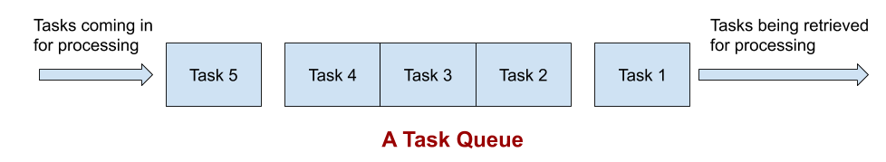

## Overview

메시징 시스템은 기본적으로 송신자와 수신자가 **'서로를 알지 못하게'** 데이터를 전송하는 시스템입니다.
수신자는 송신자가 누구이며 언제 데이터를 전송할 지 모르고, 송신자는 수신자가 누구이며 언제 데이터를 처리할 지 모릅니다.

송신자와 수신자가 서로를 알고 바로바로 데이터를 처리할 수 있게끔하는 전통적인 방식보다 이런 메시징 시스템이
쓰이게 되는 가장 큰 이유는 **디커플링** 때문입니다. 모듈간 의존도가 낮아지면, 개발자로 하여금 데이터의 전달 방식에 대해 고민하기 보다
도메인의 핵심에 집중할 수 있게 만들어 줍니다.

구현 관점에서 조금 더 깊게 들어가면, 시스템의 가동되고 있는 어느 임의의 시점에 리소스 집약적인 작업이 실행되어야 하는 경우에도
Job Queue 를 유용하게 사용할 수 있습니다.

흔히 우리는 이런 시스템을 직접 구현하지 않고 라이브러리를 쓰게 되는데, 대부분 이런 라이브러리들에는 단순히 데이터를 전달하는 것 말고도
다음과 같은 기능을 제공해줘서 결과적으로 서비스의 확장성과 안정성을 높여줍니다.

* 로깅
* 분산 처리
* 흐름 제어 및 복원

## Job Queue

Job queue는 각 `Subject`에 대해 여러 `Topic`이 발행되고, 이 `Topic`을 각각 단 한 명의 `Consumer`가 소비하는 구조입니다.
각 한 명의 소비자만 `Topic`을 소비하게 하기 위해, 각 `Topic`은 `Consumer`에 의해 소비되는 순간 삭제됩니다.

즉, 각 메시지가 단 한 번 처리되는 것이 중요할 때 job queue를 사용합니다. 때문에 급여 시스템같은 곳에 적용하기 좋습니다.
