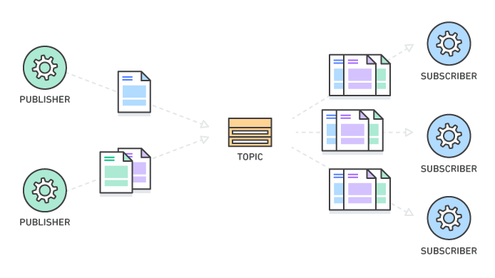

## Overview

pub-sub 역시 마찬가지로 메시징 시스템이기 때문에, [job queue](./job-queue) 에서 소개된 장점을
그대로 가져갑니다. 그러나 job queue 와는 달리 여러 `Consumer` 가 `Subject`의 각 메시지를 수신 할 수 있는 데다,
메시지의 순서를 보장합니다.

## Publish-Subscribe Messaging

앞서 언급했듯 pub-sub은 수신 된 메시지 순서에 관심이 있습니다. 따라서 주식과 같은 어플리케이션에 적용하기 적합합니다.
가격변동 그래프가 순서가 엉킨채로 들어오면 안되기 때문입니다.
