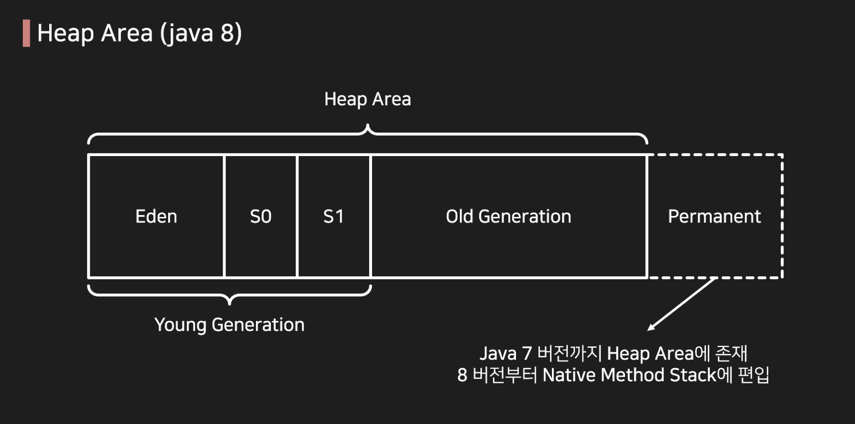
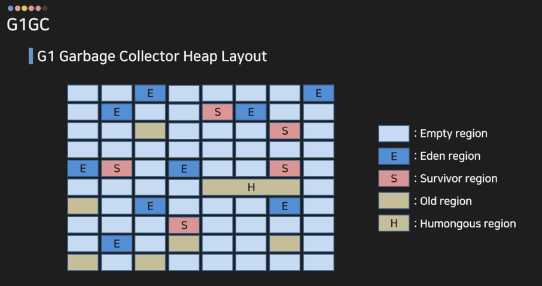

# JVM Garbage Collector

객체가 할당되는 Heap 은 무한한 공간이 아니기 때문에 주기적으로 생성되었다가 더 이상 안쓰게 되는 객체들은 정리를 해야 하는데,
그 역할을 담당하는 친구가 Garbage Collector(GC) 이다.

## CMS (Concurrent Mark-Sweep) GC

예전엔 CMS GC가 가장 많이 사용되었는데, 이제는 G1 GC가 더 많이 사용되고 있어서 굳이 딥하게 들여다볼 필요는 없고
G1에서도 공통적으로 쓰이는 기본적인 원리만 알고 가면 좋다.

### CMS GC의 동작 원리

CMS GC에서는 힙의 영역을 크게 2가지로 나눈다.

- Young Generation: 새로 생성된 객체가 저장되는 영역
- Old Generation: Young Generation에서 살아남은 객체가 저장되는 영역

Java 8 버전 이전에서는 PermGen 영역에 클래스 메타데이터와 상수 풀 등이 저장되었지만, 이 영역은 8 버전 이상부터는 힙 영역을 벗어나 Meta space 로 대체되었다.

#### Young Gen

Young Generation은 새로 생성된 객체가 저장되는 영역으로, 대부분의 객체는 이 영역에서 생성된다.
크게 2가지 영역으로 다시 나뉜다.

- Eden Space: 새로 생성된 객체가 저장되는 영역
- Survivor Space: Eden Space에서 살아남은 객체가 저장되는 영역

Eden Space 가 전부 차게 되면 Minor GC 가 발생한다.
Minor GC가 돌았는데도 살아남은 객체들은 Survivor Space 로 이동되는데,
Survivor Space 는 S0, S1 두 개의 영역으로 나뉘며, GC가 돌 때마다 살아남은 객체는 S0에서 S1로, S1에서 S0로 이동한다.

이렇게 2개로 나누어서 사용되는 이유는 Memory Fragmentation 때문이다.
S0 에서 청소를 하고 난뒤 같은 공간인 S0에서 다시 공간 정리를 하는 것보다, 텅 비어있는 S1 으로 차곡차곡 쌓는 편이 훨씬 간단하고 성능상 이점이 있기 때문이다. 

#### Old Gen

Survivor Space 에서도 계속해서 살아남는 객체들이 있다.
GC가 돌아도 살아남은 객체들은 age 를 하나씩 먹게 되는데, 기본적으로 15살(Minor GC 15번)을 먹으면 Old Generation 으로 이동하게 된다.

15살이 안되어도 Old Gen 으로 이동하는 경우는 딱 2가지인데, Survivor Space 가 가득차버리거나,
Young Generation 에 할당하기엔 너무 큰 객체가 생성되는 경우이다.

Old Gen 도 임계점에 다다르면 청소를 해야 하는 순간이 오는데, Old Gen 은 사이즈가 크기 때문에 GC가 돌면 성능에 문제가 된다. (이 때 도는 GC를 Full GC 라고 한다)
GC 가 돌면서 객체들을 정리하려면 주소를 이동(Memory Compaction)시켜야 하는데, 이 때 CPU가 동작하게 되면 문제가 생기므로 Stop-The-World 로 CPU를 멈추고 청소를 하기 때문이다.

## G1 (Garbage First) GC

CMS GC 에서는 STW 의 시간을 예측할 수 없는 게 큰 문제였고, 이를 보완하기 위해 아래 그림과 같이 바둑판 형태의 Region 으로 heap 을 나누는 것을 고려하게 되었다.
Old 라고 해서 마킹된 전부를 몽땅 청소하는 것이 아니라, 예측할 수 있는 개수의 Region 만 청소하자는 것이 기본 아이디어다.

그래서 `-XX:MaxGCPauseMillis=200`와 같은 옵션을 주게 되면, G1 GC는 200ms 이내로 GC를 끝내도록 청소할 Region 의 개수를 조절한다.
이 때 Region 을 모두 청소하는 것이 아니니 어떤 region 을 청소할 지 선택을 해야 하는데, 내부적으로 garbage 비율을 계산하여 가장 garbage 비율이 높은 Region 을 청소하게 된다.
그래서 이름이 왜 Garbage First 인 것이다. 
