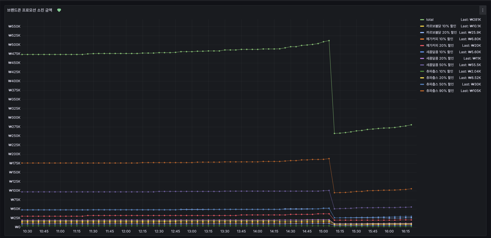
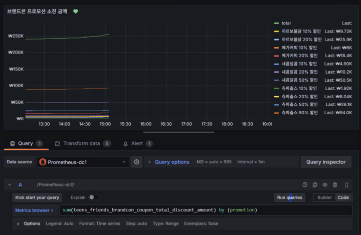
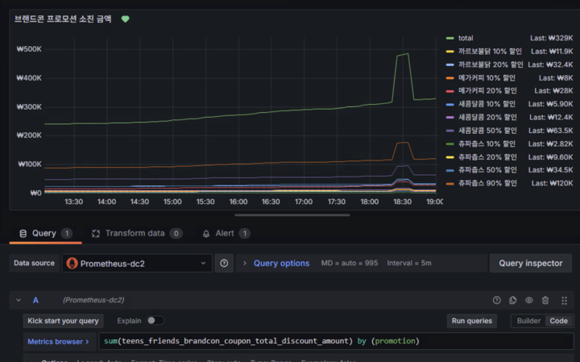
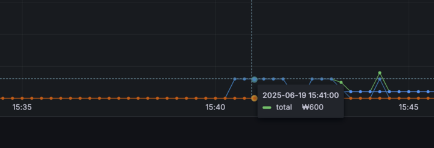
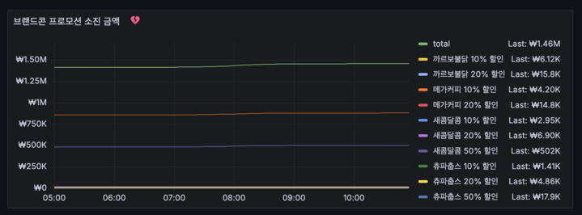

## 증상

Grafana 에서 gauge 가 이상하게 표출되는 현상을 발견

해당 메트릭은 redis 에 품목별 최종 할인 금액을 누계하여 저장하고 있었고, prometheus 에서 수집함.

특이사항:

- 한 순간에 정확히 반토막이 남
- 해당 메트릭은 구매자의 절반이 일제히 결제 취소를 하지 않는 한 메트릭이 저렇게 찍힐 수 없음

## 원인

정확히 반토막이 난 것이 이상해서 트래픽 스케줄을 확인했더니, 해당 시점에 트래픽 전환이 있었음

global-thanos 는 dc1, dc2 두 개의 DC에서 메트릭을 수집하고 있음. 따라서 prometheus-dc1 과 prometheus-dc2 에서 각각 조회하면 다음과 같이 조회됨

### prometheus-dc1

트래픽 전환되고 나서 수집이 끊기니 그래프도 끊긴 모양새.

### prometheus-dc2

즉, 두 개에서 최신 값을 메트릭으로 표시하는 게 아니라, 합한 값을 표시하고 있었음.
완전 초반부터 값이 잘못 찍혔을 것 같아서 확인해보니, 6배 정도의 값이 찍혀 있었음.

원래 찍혀야 할 값에서 인스턴스 수가 곱해진 것.

## 해결

쿼리를 sum 이 아닌 max 를 쓰도록 변경하여 해결함.

## 회고

다음 2가지가 근본적인 원인임.
- dc 가 나뉘어져 있을 때 메트릭 수집이 어떻게 동작하는 지에 대한 이해가 없었던 것
- 초반 그래프에 값이 제대로 찍히는 지 제대로 모니터링 않았던 것
