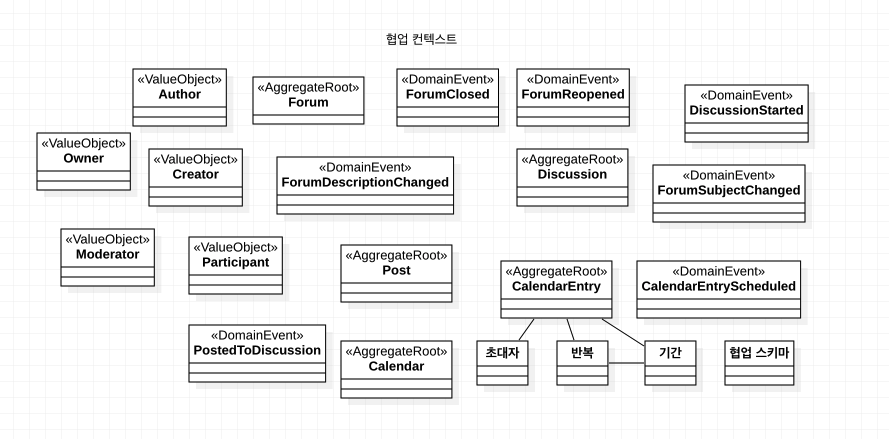
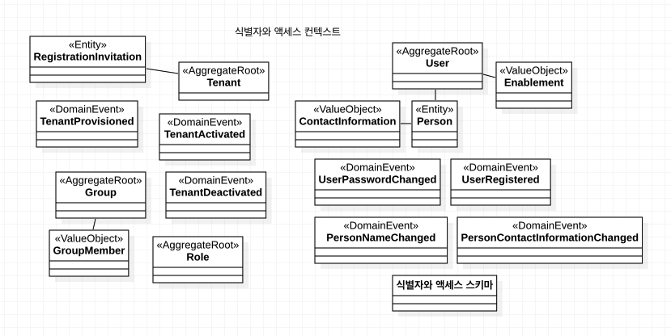
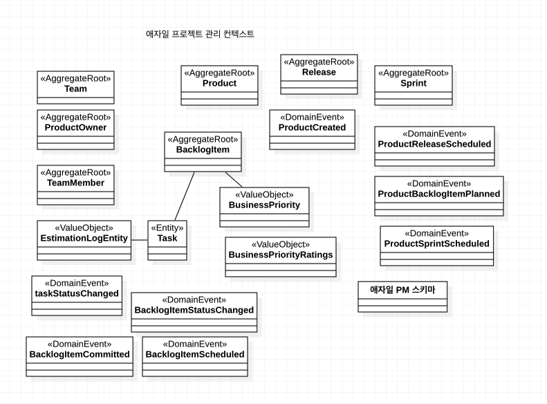
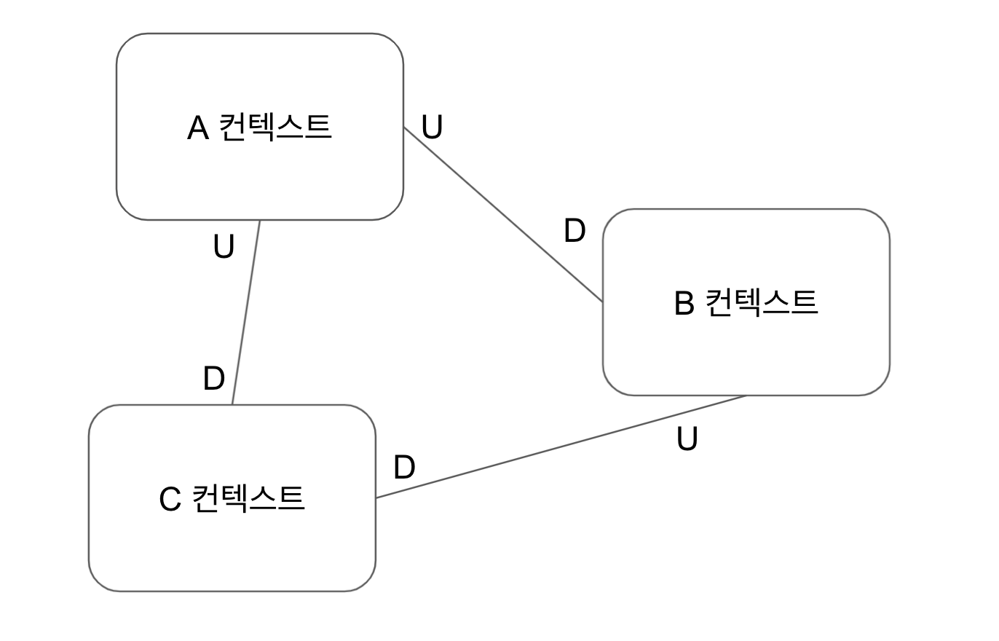
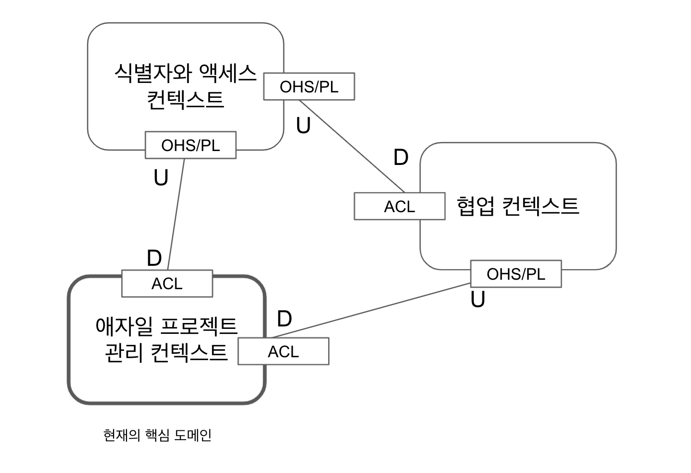
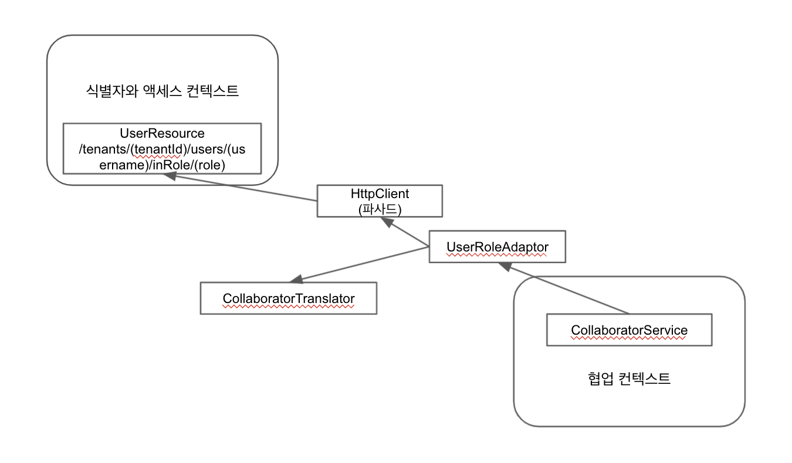
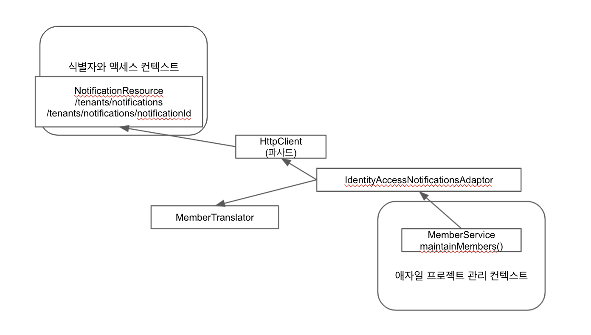
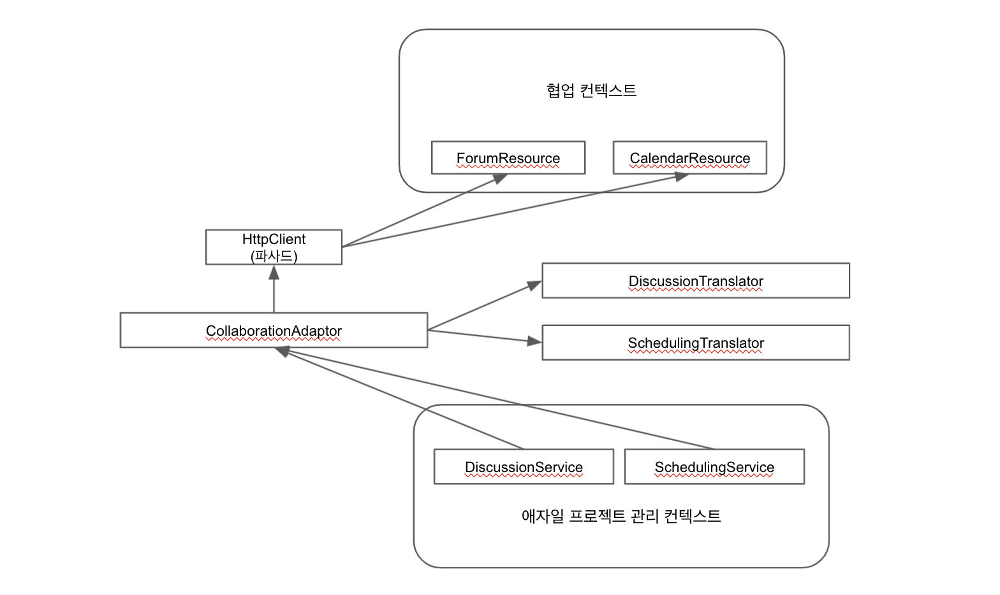

# 1장. DDD를 시작하며

## 나도 DDD를 할 수 있을까

... 대충 할 수 있다는 이야기라 스킵.

도메인 모델은 내가 일하고 있는 아주 구체적인 비즈니스 도메인에 관한 소프트웨어 모델이다. 객체 모델로 종종 구현되는데, 이런 객체는 비즈니스적 의미에
정확히 부합하는 이름을 가진 데이터와 행동을 담고 있다.

## 내가 왜 DDD를 해야 할까

> 비즈니스 관련자도 이해할 수 있다는 말은 비즈니스 리더와 도메인 전문가가 개발자였다면 만들었음직하게 소프트웨어가 만들어져 있다는 말이다.

... 대충 해야 한다는 말이라 스킵.

애너믹(무기력한) 도메인 모델이라는 개념이 등장한다. 고유한 행동 특성이 담기지 않은 약한 도메인 모델을 의미한다. 애너믹 도메인 모델은 개발하면서 높은 비용을 지불하지만
얻는 것은 거의 없기 때문에 나쁘다고 말할 수 있다. 예를 들어, 객체 관계형 임피던스 부조화(객와 관계형 데이터베이스 스키마사이의 부조화)때문에 개발자는 시간과 노력을 들여
객체를 영속성 저장소를 향해, 그리고 저장소 로부터 매핑한다. 이건 도메인 모델이 전혀 아니며, 단순히 데이터베이스 객체로 투영된 데이터 모델일 뿐이다.

유비쿼터스 언어는 팀 내에 공유된 언어이다. 예를 들어 "간호사가 코로나 백신을 표준 용량으로 환자에게 투여한다"와 같은 문구가 모델의 어떤 측면을 설명한다고 한다면
팀원은 모두 그 언어를 사용해야만 한다. 개발자 역시 그래야 하며, 비즈니스에 최적화된 코드를 작성해야 한다.

1. 그냥 냅다 코딩만 한 경우 

```koltin
patient.setShotType(ShotTypes.COVID-19)
patient.setDose(dose)
patient.setNurse(nurse)
```

2. 유비쿼터스 언어를 "환자에게 독감 주사를 놓는다" 라고 이해하고 있는 경우

```kotlin
patient.giveCovid19Shot()
```

3. "간호사가 코로나 백신을 표준 용량으로 환자에게 투여한다"라고 이해하고 있는 경우

```kotlin
val vaccine = Vaccines.STANDARD_COVID_19_DOSE
nurse.administerVaccine(patient, vaccine)
```

그렇다면 유비쿼터스 언어는 어떻게 정확히 담아낼까? 다음은 몇 가지 시도해볼만한 방법들이다:

* 물리적이고 개념적인 도메인 그림을 그리고 이름과 행동을 붙인다.
* 간단한 정의로 된 용어집을 만들어라.
* 소프트웨어의 중요한 개념을 담은 그림을 넣어서 문서로 남기자.
* 팀원들과 리뷰하자.

다음은 유비쿼터스 언어의 특징이다.

* 바운디드 컨텍스트 당 하나의 유비쿼터스 언어가 있다.
* 유비쿼터스 언어는 바운디드 컨텍스트를 격리시키고 그 안에서 프로젝트의 개발 업무를 수행하는 팀 내부에서만 유비쿼터스하다.

DDD를 사용하는 데서 오는 비즈니스적 가치가 있다.

1. 조직이 그 도메인에 유용한 모델을 얻는다.
2. 정교하고 정확하게 비즈니스를 정의하고 이해한다.
3. 도메인 전문가가 소프트웨어 설계에 기여한다.
4. 사용자 경험이 개선된다.
5. 순수한 모델 주변에 명확한 경계가 생긴다.
6. 엔터프라이즈 아키텍처의 구성이 좋아진다.
7. 애자일하고, interative하고 continuous한 모델링이 가능해진다.
8. 전략적인 동시에 전술적인 새로운 도구가 적용된다.

# 2장. 도메인, 서브 도메인, 바운디드 컨텍스트

## 큰 그림

조직의 모든 것을 한꺼번에 포괄하는 모델로 정의하는 것은 대개 불가능하다. 즉, 거의 모든 소프트웨어 도메인에는 다수의 서브도메인이 있다.
그리고 전체 비즈니스 도메인을 고유한 영역으로 적극적으로 분리하고 그 각각의 서브 도메인을 따로 생각하는 편이 우리에게 도움이 된다. 

### 서브도메인과 바운디드 컨텍스트의 활용

전형적으로 DDD를 적용하지 않은 소프트웨어 시스템을 살펴보면 다음과 같이 커다란 시스템 안에 여러 서브도메인이 묶여있다.

* 전체 도메인
    * 전자 상거래 시스템
        * 배송 서브도메인
        * 제품 카탈로그 서브도메인
        * 주문 서브도메인(제품 카탈로그 서브도메인, 배송 서브도메인, 송장 서브도메인, 재고관리 시스템, 외부 예측 시스템과 통합되어 있는 상태)
        * 송장 서브도메인
    * 재고관리 시스템 (주문 서브도메인과 제품 카탈로그 서브도메인과 외부 예측 시스템과 통합되어 있는 상태)
        * 재고관리 서브도메인
    * 외부 예측 시스템 (재고관리 시스템과 주문 서브도메인과 통합되어 있는 상태)

만약 새로운 핵심 도메인을 추가하거나 뽑아내야 하는 상황이라면 비즈니스 영역을 구성하는 논리적 서브도메인과 통합된 요구를 이해하는 것이 큰 도움이 된다.
즉, 위에서 "통합"이 어떻게 이루어져 있는 확인하는 것은 프로젝트 시작 지점에서 파악을 위한 열쇠다.

한 기업의 바운디드 컨텍스트가 완전히 독립적일 수는 없다. 다른 모델과 함께 작용하면서 통합 관계가 필수적이기 때문이다.
이 통합에는 언제나 특정 유형의 관계가 연관되어 있으며, 컨텍스트 맵에서 더 자세히 다루게 된다.

위의 전자 상거래 시스템을 보면 용어와 의미가 충돌할 가능성이 매우 높다. 예를 들어 고객이라는 용어는 충돌을 일으킬텐데, 분명 카탈로그를 살필 때와 주문을 할 때의
고객은 서로 다른 의미를 가지기 때문이다. 카탈로그를 살필 때의 고객은 이전의 구매, 충성도, 가능한 제품, 할인, 배송 옵션 이라는 컨텍스트에서 사용되지만,
주문 시의 고객은 배송지 주소, 청구지 주소, 총 금액, 지불 방법 등의 컨텍스트에서 사용된다.

서브도메인이 항상 큰 크기와 기능을 가진 특별한 모델을 포함하는 건 아니다. 때론 서브 도메인은 고유의 핵심 도메인의 일부가 아닌 일련의 알고리즘과 같은 간단한 형태일 수도 있다.

이렇듯 하나의 바운디드 컨텍스트 안에는 여러 서브도메인, 혹은 단 하나의 서브도메인이 존재할 수 있는데 특정 용어의 충돌 방지나 외부 통합을 원활히 하기 위해서라도
서브도메인과 바운디드 컨텍스트가 활용되어야 한다.

### 핵심 도메인에 집중하기

* 전체 도메인
    * 핵심 도메인
    * 지원 서브 도메인 A
    * 지원 서브 도메인 B
    * 범용 서브도메인

DDD 프로젝트에 투입되는 노력의 대부분은 핵심 도메인에 초점이 맞춰져야 한다. 핵심 도메인의 구현에는 탁월함이 요구되는데, 그 이유는 핵심 도메인이
비즈니스에 분명한 이점을 제공하기 때문이다.

핵심 도메인 말고도, 지원 서브도메인과 범용 서브도메인이라는 두 가지 다른 종류의 서브 도메인이 있다.
때로 바운디드 컨텍스트는 비즈니스를 지원하기 위해 만들어지거나 차용된다.
만약 어느 정도 비즈니스에 필수적이기는 하나 핵심은 아닌 부분을 모델링할 경우, 이를 지원 서브 시스템이라고 한다. 반면 비즈니스적으로 특화된 부분을
찾을 수는 없지만 전체 비즈니스 솔루션에 필요하다면 이는 범용 서브도메인이다. 지원 서브도메인이나 범용 서브도메인이라고 해서 중요하지 않다는 의미는 아니고
단시 핵심 도메인처럼 구현에 탁월함이 있을 필요는 없다는 이야기다.

## 왜 전략적 설계가 엄청나게 필수적인가

전술적 설계에만 집중하게 되면 더 큰 비전을 가려 오히려 설계의 고통을 느끼게 된다. 예를 들어 협업 컨텍스트안에 다음과 같이 모델들이 상호 연관되어 있다고 하자.

* 포럼
* 게시글
* 토론
* 사용자
* 권한
* 일정
* 일정 입력

협업 컨텍스트에서 모델링된 모든 개념은 "협업"과 언어적 연관성을 찾을 수 있어야 하는데, "사용자"와 "권한"은 협업과 아무런 상관이 없다. 오히려,
"관리자"나 "작성자"가 필요할 것이다. 협업 도구는 사용자의 역할에 집중해야 하지, 사용자가 누구이며 수행 권한이 부여된 행동이 무엇인지에 관심이 있어선 안되기 때문이다.
위 구조대로 라면, 사용자 모델이나 권한 구조가 바뀌게 되었을 때 협업 도구에까지 연쇄적인 영향을 미치게 될 것이다.

위와 같은 일을 방지하기 위해서라도 팀은 전략적인 설계를 하겠다는 마인드를 가져야 한다.

## 현실의 도메인과 서브도메인

도메인은 문제점 공간과 해결책 공간을 모두 갖고 있다. 

* 문제점 공간: 전략적 핵심 도메인과 핵심 도메인이 사용하는 서브 도메인의 조합이다. 우리가 풀어야할 전략적 비즈니스 문제점을 생각하게 한다.
* 해결책 공간: 하나 이상의 바운디드 컨텍스트이며 구체적인 소프트웨어 모델의 집합이다. 바운디드 컨텍스트는 해결책을 소프트웨어로 실현시키는 데 활용된다.

현실적으로 항상 가능하다고 볼 순 없지만, 서브도메인을 1:1로 바운디드 컨텍스트와 묶으려는 시도는 바람직한 목표다. 이런 접근이 문제점 공간을 해결책 공간과
잘 융합시키도록 하기 때문이다. 그러나 레거시 시스템에서는 서브도메인이 바운디드 컨텍스트와 중첩되는 경우가 많다.

우리가 해결책을 실행하기 전에 반드시 문제점 공간과 해결책 공간에 대해 평가해야 한다. 우리가 풀어야 하는 문제(문제점 공간)인 핵심 도메인을 겨냥하고 우리가 가진
총알들(해결책 공간)을 장전하기 위함이다.

먼저, 문제점 공간을 평가하기 위해서는 다음 질문에 답할 수 있어야 한다.

* 전략적 핵심 도메인의 이름과 비전은 무엇인가?
* 어떤 개념을 전략적 핵심 도메인의 일부로 고려할 것인가?
* 필요한 지원 서브도메인과 범용 서브도메인은 무엇인가?
* 도메인의 각 분야에선 누가 일하나?
* 올바른 팀이 조직될 수 있는가?

해결책 공간을 평가하기 위해서는 다음 질문에 답할 수 있어야 한다.

* 이미 존재하는 소프트웨어 자산은 무엇이며, 재사용할 수 있는가?
* 새롭게 구하거나 만들어야 하는 자산은 무엇인가?
* 서로 어떻게 연결 또는 통합됐는가?
* 추가적으로 필요한 통합은 무엇인가?
* 기존의 자산과 새로 만들어야 하는 자산들을 고려했을 때, 필요한 노력은 무엇인가?
* 전략적 이니셔티브와 모든 지원 프로젝트는 성공할 확률이 높은가, 아니면 그 중 어떤 하나가 전체 프로그램을 지연시키거나 심지어 실패하도록 만들 수 있는가?
* 완전히 구분되는 유비쿼터스 언어의 용어는 무엇인가?
* 바운디드 컨텍스트 사이에 개념이나 데이터 중복 또는 공유가 일어나는 위치는 어디인가?
* 바운디드 컨텍스트 사이에 공유되는 용어나 중복된 개념이 어떻게 매핑되고 변환되는가?
* 핵심 도메인을 지칭하는 개념을 담고있는 바운디드 컨텍스트는 무엇이고, 모델링을 위해선 어떤 전술적 패턴을 사용해야 하는가?

> 왜 제목이 '현실의 도메인과 서브 도메인'이지? 번역이 진짜 똥같이 된건지 내 머리가 나쁜건지 모르겠다. 

내가 책을 읽으면서 오해했던 것 중 하나는 문제점 공간과 해결책 공간을 칼로 무 자르듯 양단할 수 있다고 생각했다는 점이다. 그러나 둘은 서로 다른 개념이다.
문제점 공간은 "도메인"의 조합이고, 해결책 공간은 "바운디드 컨텍스트"의 조합이다. 하나의 "도메인"이 여러 "바운디드 컨텍스트"를 가져갈 수 있고, 하나의
"바운디드 컨텍스트"는 여러 "도메인"에 걸쳐질 수 있다. 1:1 구조가 가장 이상적이긴 하지만 말이다.

## 바운디드 컨텍스트 이해하기

바운디드 컨텍스트는 그 안에 도메인 모델이 존재하는 명시적 경계이다. 도메인 모델은 소프트웨어 모델로서 유비쿼터스 언어를 표현한다.
바운디드 컨텍스트라는 경계 안에서는 모든 유비쿼터스 언어의 용어와 구문이 구체적인 의미를 갖게 되고, 정확성을 보장하며 언어를 반영한다.

은행 컨텍스트 안에서의 Account(계좌)와 문학 컨텍스트에서 Account(하나 이상의 연관된 사건을 시간에 따라 문학적으로 표현한 집합)는 의미가 서로
완전히 다르지만, 각 바운디드 컨텍스트 안에서 고려해야만 그 사실을 알 수 있다.

좀 더 가까이 있어 보이는 예제로 가보자. 예금 계좌에 해당하는 은행 컨텍스트와 적금 계좌에 해당하는 은행 컨텍스트를 떠올리면서. 이는
하나의 도메인 안에서 예금과 적금에 따라 바운디드 컨텍스트가 구분되는 상황을 전제하고 있기는 하지만, 둘 다 이름을 Account라고 지어도 우리는
각각 예금 계좌와 적금 계좌의 의미를 떠올릴 수 있다. 각 바운디드 컨텍스트 사이에 미묘한 의미 차이가 있기 때문에 같은 이름을 쓰더라도 안전하기 때문이다.

통합이 필요한 순간이라면 바운디드 컨텍스트들 사이의 매핑이 반드시 필요하다. 이는 DDD의 복잡도가 높게 나타나는 측면이며, 그에 상응하는 수준의 관리 노력을 필요로 한다.
우리는 객체 인스턴스를 대상 컨텍스트 밖에서 사용하진 않지만, 여러 컨텍스트 안에서 함께 연관된 객체라면 공통 상태의 일부 하위 집합을 공유할 수도 있다.

같은 사물이라면(이를테면 책) 항상 같은 컨텍스트로 표현해도 될까? 그렇지 않다. 다음 사례를 생각해보자.

책이 출판되려면 다음과 같은 과정을 거친다.

* 책을 개념화 하고 제안함
* 저자와 계약
* 책의 저작권 및 편집 프로세스 관리
* 그림 등 책의 레이아웃 디자인
* 다른 언어로 책을 번역
* 실제 인쇄 / 전자 책 출간
* 마케팅
* 대리점, 소비자에게 책을 판매
* 대리점, 소비자에게 책을 배송

이 Life cycle의 모든 단계를 관장하는 Book 이라는 모델을 설계하려 했다면 많은 혼란이 야기될 것이다. 각 단계마다 책은 다른 정의를 가지기 때문이다.

* 책은 계약할 때가 돼야 임시 책 제목을 가지며, 편집하는 동안 변할 수 있다.
* 저술과 편집 과정에서 초안과 최종 원고를 거쳐간다.
* 인쇄 팀은 페이지 레이아웃과 책 내용이 필요하다.
* 마케팅에 책 전체 내용은 필요 없고, 책 표지와 설명 정도의 정보만 필요하다.
* 배송하는 데는 책의 식별자, 재고 관리 위치, 남은 부수, 사이즈, 무게와 같은 정보만 필요하다.

각 수명주기마다 개별적인 바운디드 컨텍스트를 사용한다면 어떨까? 모든 바운디드 컨텍스트 하나하나는 책의 type을 가지고 있다.
책 객체는 거의 혹은 모든 컨텍스트에 걸쳐 하나의 식별자를 공유하지만, 각 컨텍스트 마다 책의 모델은 서로 다르다. 이를 통해 비즈니스적 요구를 정확히 반영하며
점진적으로 개선되는 소프트웨어를 주기적으로 배포할 수 있다.

### 모델 그 이상을 위해

바운디드 컨텍스트는 도메인 모델만을 포함하진 않는다. 물론 바운디드 컨텍스트는 주로 유비쿼터스 언어와 그에 해당하는 도메인 모델을 캡슐화 하지만,
이는 도메인 모델과의 상호작용과 도메인 모델의 지원을 위해 존재하는 다른 요소를 포함한다.

아키텍처적 고려사항(리포지토리, 에플리케이션 서비스 등등)을 바운디드 컨텍스트 안에서 올바른 자리로 유지하도록 하는 데 주의를 기울이자.

### 바운디드 컨텍스트의 크기

바운디드 컨텍스트는 완전한 유비쿼터스 언어를 표현하기 위해 필요한 크기만큼 커야 한다. 이 때, 진정한 핵심 도메인의 일부가 아닌 외부 개념은 제외되어야 한다.
만약 어떤 개념이 유비쿼터스 언어 안에 들어있지 않다면 애초에 모델에 있어선 안된다. 그러나 진짜 도메인에 속하는 개념을 실수로 제거하지 않도록 해야 한다.
어떤 필수적인 요소도 빠트리지 않고 유비쿼터스 언어가 컨텍스트 안에서 완전한 수준의 풍부함을 갖도록 해야 한다. 컨텍스트 맵 같은 도구들이 기준을 판단하는 데 도움을 줄 수 있을 것이다.

대개 하는 실수로는 아키텍쳐에 매몰되어 언어적이 아니라 기술적으로 바운디드 컨텍스트를 나눈다던가, 개발자 리소스를 할당하기 위해 허위 컨텍스트를 형성하곤 하는데,
그러지 않도록 주의해야 한다.

### 기술적 컴포넌트로 정렬하기

기술적 컴포넌트가 컨텍스트를 정의해주지는 않지만, 이를 구성하고 이용하는 일반적인 방법을 생각해보자.

하나의 바운디드 컨텍스트는 하나의 프로젝트 안에서 머문다. 자바를 사용할 땐 최상위 단계 패키지는 일반적으로 바운디드 컨텍스트의 최상위 모듈 이름을 따라 정의된다. 

```kotlin
com.mycompany.optimalpurchasing

// 이 바운디드 컨텍스트의 소스트리는 아키텍처적 책임에 따라 더 세분화될 수 있다.

com.mycompany.optimalpurchasing.presentation
com.mycompany.optimalpurchasing.application
com.mycompany.optimalpurchasing.domain.model
com.mycompany.optimalpurchasing.infrastructure
```

## 샘플 컨택스트

예시로 완전히 1:1로 도메인과 바운디드 컨텍스트가 정렬된 샘플이 주어진다.

* 도메인
    * 애자일 PM - 애자일 PM 컨텍스트
    * 협업(지원 서브 도메인) - 협업 컨텍스트
    * 식별자와 액세스 (범용 서브 도메인) - 식별자와 액세스 컨텍스트

### 협업 컨텍스트

전략적 설계를 고려하지 않고 전술적 설계만을 고려한 미숙한 팀은 다음과 같은 entity를 협업 컨텍스트에 포함시켰다. 

```java
public class Forum extends Entity {
  ...
  public Discussion startDiscussion(String aUsername, String aSubject) {
    if (this.isClosed()) {
      throw new IllegalStateException("Forum is closed");
    }
    
    User user = userRepository.userFor(this.tenantId(), aUsername);
    if (!user.hasPermissionTo(Permission.Forum.StartDiscussion) {
      throw new IllegalStateException("User may not start forum discussion");
    }
    
    String authorUser = user.username();
    String authorName = user.person().name().asFormattedName();
    String authorEmailAddress = user.person().emailAddress();

    Discussion discussion = new Discussion(
        this.tenant(),
        this.forumId(),
        DomainRegistry.discussionRepository().nextIdentity(),
        authorUser,
        authorName,
        authorEmailAddress,
        aSubject
    );
    return discussion 
  }
  ...
}
```

이건 정말 나쁜 설계다. 리포지토리를 통한 쿼리를 하고 있을 뿐만 아니라 User를 참조할 수 있어서도 안된다. 심지어 Permission과도 떨어져 있어야 한다.
이런 접근이 가능한 이유는 이들이 협업 모델의 일부로서 잘못 설계됐기 때문이다. 이러한 왜곡은 Author라는 값 객체의 존재마저 떠올리지 못하게 만들었다.

어떻게 해야 이 나쁜 설계를 고칠 수 있을까? 몇 가지 대안을 살펴보자.

1. 모델을 책임 계층으로 리펙토링해, 보안과 권한 기능을 현존하는 모델 아래의 논리적 계층으로 내려서 구분한다. -> 핵심 도메인에 속하지 않은 잘못된 개념을
계속 남기려고 하고 있을 뿐만 아니라 책임 계층이라는 것은 본래 큰 규모의 모델에 사용되도록 고안된 것이라 여기에 쓰기엔 부적합하다.
   
2. 분리된 핵심에 맞춰 작업한다. 협업 컨텍스트 내의 모든 보안 및 권한 문제를 완전한 별도의 패키지로 리펙토링 한다. -> 시스템에 중요하면서 크기가 큰 바운디드 컨텍스트가 있지만
그 모델 중 필수적인 부분이 다양한 지원 기능으로 인해 가려졌다면 이를 분리된 핵심으로 잘라내야 한다. 여기서의 지원기능은 보안과 권한이다. 잘라내기를 통해
액세스와 식별자 컨텍스트를 새로 발견하게 되고, 협업 컨텍스트의 범용 서브도메인으로써 지원하게 될 것임을 깨닫게 된다.
   
2번 과정을 통해, 핵심 도메인으로 호출을 보내기에 앞서 애플리케이션 서비스 클라이언트가 보안과 권한을 확인하도록 했다.

```java
public class ForumApplicationService ... {
  ...
  @Transactional
  public Discussion startDiscussion(String aTenantId, String aUsername, String aForumId, String aSubject) {
    Tenant tenant = new Tenant(aTenantId);
    ForumId forumId = new ForumId(aForumId);
    
    Forum forum = this.forum(tenant, forumId);
    
    if (forum == null) {
      throw new IllegalStateException("Forum does not exist.");
    }
    
    Author author = this.collaboratorService.authorFrom(tenant, anAuthorId);
    
    Discussion newDiscussion = forum.startDiscussion(this.forumNavigationService(), author, aSubject);
    
    this.discussionRepository.add(newDiscussion);
    return newDiscussion;
  }
  ...
}
```

핵심 도메인에선 오로지 협업 모델 객체 컴포지션과 행동만을 구현하면 되었다.

```java
public class Forum extends Entity {
  ...
  public Discussion startDiscussionFor(
      ForumNavigationService aForumNavigationService,
      Author anAuthor,
      String aSubject
  ) {
    if (this.isClosed()) {
      throw new IllegalStateException("Forum is closed.");
    }
    
    Duscussion discussion = new Discussion(
        this.tenant(), 
        this.forumId(), 
        aForumNavigationService.nextDiscussionId(), 
        anAuthor, 
        aSubject
    );
    
    DomainEventPublisher
      .instance()
      .publish(new DiscussionStarted(
          discussion.tenant(), 
          discussion.forumId(), 
          discussion.discussionId(), 
          discussion.subject())
      );

    return discussion;  
  }
  ...
}
```

이로써 User와 Permission의 얽힘을 제거하고 모델을 엄격히 협업에만 집중할 수 있게 되었다. 하지만 이는 완전한 결과가 아니며, 이후 바운디드 컨텍스트를
분리하고 통합하며 리펙토링할 수 있도록 팀을 준비시켰을 뿐이다.



### 식별자와 액세스 컨텍스트

협업 컨텍스트에서 살펴본 바, 식별자와 액세스 컨텍스트는 결과적으로 그 자체의 컨텍스트 경계가 있어야 한다. 에플리케이션 보안에 느슨하게 접근하면
사용자와 권한이 각각 개별적 시스템에 만들어지고, 이는 모든 애플리케이션에 사일로 효과를 일으킨다.

사일로 효과: 상호 협력을 하지 않고 중복이 생기고 각각 따로 놀게된다는 의미

그렇게 분리된 실벽자와 액세스 컨텍스트는 다음과 같다.



### 애자일 프로젝트 관리 컨텍스트

협업 컨텍스트는 애자일 프로젝트 관리 컨텍스트의 선택 가능한 애드온 으로써 제공되기 때문에, 협업 컨텍스트는 애자일 프로젝트 관리 컨택스트의 지원 서브 도메인이다. 

제품 소유자와 팀원은 제품 토론, 릴리스, 스프린트 기획, 백로그 항목 토론 등에서 상호 교류하며 일정을 공유하는 등의 기능을 이용한다.

언뜻 비슷해보이는 애자일 프로젝트 관리 모델과 협업 모델을 합치는 길을 큰 실수가 될 것이다. 전략적 설계에 크게 의지해 사고한다면
제품 소유자와 팀원을 고객으로 생각해야 한다. 따라서 애자일 프로젝트 관리 컨텍스트는 아래처럼 보여진다.



# 3장. 컨텍스트 맵

2장에서는 문제점 공간 평가에 관해 초점을 맞추었다면, 여기서는 해결책 공간 평가에 초점을 맞춘다.  

## 컨텍스트 맵이 필수적인 이유

DDD를 위한 노력을 처음 시작할 떄 현재 프로젝트 상황의 시각적 컨텍스트 맵을 먼저 그리자. 컨텍스트 맵은 우리 팀이 성공하기 위해 필요한 해결책 공간의 관점을
제공하기 위한 목적에 초점을 두고 그려져야 한다.



위 그림에서 통합을 나타내는 선 위의 U는 Upstream(상위 위치), D는 Downstream(하위 위치)을 뜻한다.

위와 같이 초기에 컨텍스트 맵을 그리면 우리가 의지하는 모든 다른 프로젝트들과의 관계를 신중히 생각해보도록 강요받게 된다.

### 컨텍스트 맵 그리기

컨텍스트 맵 다이어그램은 복잡할 필요가 없다. 미래를 나타낼 필요도 없다. 너무 많은 세부내용을 추가하는 것은 실질적 도움이 되지 못한다.
다만, 많은 대화를 팀과 해야 한다. 그 대화를 통해 전략적 통찰이 드러나는 순간, 컨텍스트 맵에 반영하면 된다.

경계의 위치, 경계와 팀 사이의 관계, 포함돼있는 통합의 유형, 이들 사이에 필요한 변환이 무엇인지 높은 수준에서 이야기하며 그려야 한다.

### 프로젝트와 조직 관계

바운디드 컨텍스트 통합의 유형은 다음과 같다.

* 파트너십(Partnership): 협업 관계이다. 각 컨텍스트에서는 양측 시스템 모두의 개발 요구를 수용할 수 있는 인터페이스를 만들어 나가기 위해 반드시 협력한다.
상호 의존적인 기능은 반드시 일정을 세워 같은 릴리스에서 완성할 수 있도록 한다.

* 공유 커널(Shared Kernel): 모델에서 공유된 부분과 이에 관련된 코드는 아주 가까운 상호 의존성을 형성한다. 도메인 모델에서 팀이 공유하기로 동의한 부분 집합
일부를 명시적 경계로 지정한다. 커널 모델을 단단하게 유지하고 팀의 유비쿼터스 언어를 정돈해주는 지속적 통합 프로세스를 정의해야 한다.

* 고객-공급자 개발(Customer-Supplier Development): 두 팀이 업스트림과 다운스트림의 관계에 있고 업스트림 팀의 성공이 다운스트림 팀의 운명과 상호의존적이다.
업스트림 계획이 다운 스트림 우선 순위에 영향을 미친다. 협상과 작업 예산 편성을 다운 스트림의 요구사항에 맞춰 진행해서 모든 사람에게 약속과 일정을 이해시켜야 한다.

* 순응주의자(Conformist): 업스트림 팀이 다운스트림 팀의 요구사항을 제공해줄 동기가 전혀 없는 업스트림/다운스트림 관계에서 다운스트림 팀은 속수무책의 상황에 빠진다.
다운스트림 팀은 맹목적으로 업스트림 팀의 모델을 준수해서, 바운디드 컨텍스트 사이에 나타나는 변환의 복잡성을 제거한다.
  
* 부패 방지 계층(Anticorruption Layer, ACL): 변환 계층은 협조적인 팀 사이에서 잘 설계된 바운디드 컨텍스트를 연결할 때 간결하고 우아해질 수 있다.
다운 스트림 클라이언트에는 분리 계층을 만들어서 업스트림 시스템의 기능을 자신이 소유한 도메인 모델의 맥락에 맞춰 제공한다. 이 계층은 기존의 인터페이스를 통해
  다른 시스템과 대화하며, 다른 시스템을 수정할 필요가 거의 없다. 이 계층은 내부적으로 필요에 따라 단방향이나 양방향으로 두 모델 사이에서 변환을 수행한다.
  기술적으로는 리포지토리 인터페이스 뒤에 위치시킬 수도 있다. 다운스트림 ACL은 PL을 로컬 컨텍스트의 도메인 객체로 변환해준다.
  
* 오픈 호스트 서비스(Open Host Service, OHS): 서브시스템에 접근할 수 있도록 해주는 서비스 집합으로서의 프로토콜을 정의한다. 공유된 프로토콜이 단순함과 일관성을 유지하도록 해야 한다.
기술적으로는 REST 기반 리소스나 RPC(Remote Procedure Call) API로 구현할 수 있다. 

* 발행된 언어(Published Language, PL): 두 바운디드 컨텍스트 모델 사이의 변환은 공통 언어를 필요로 한다. 이는 종종 오픈 호스트 서비스와 결합된다.
기술적으로 XML, JSON, Protocol buffer 등을 통해 표현할 수 있다. 또, 도메인 이벤트가 관계된 구독자에게 메시지를 전달하는 이벤트 주도 아키텍쳐에서도 사용될 수 있다.

* 분리된 방법(Seperate Ways): 서로가 완전히 분리된다. 바운디드 컨텍스트가 다른 것과 아무 연관이 없음을 선포해서 작은 범위 내에서 솔루션을 찾아야 한다.

* 큰 진흙공(Big Ball of Mud): 여러 모델이 서로 뒤섞이고 경계는 일정하지 않은 상황에서 시스템을 구성하는 부분들을 찾게 된다. 이런 어지러운 상황 전체를
아우르는 경계를 큰 진흙공으로 선언하고, 이 안에 세련된 모델링을 적용하려 애쓰지 말자. 그 대신 이런 시스템이 다른 컨텍스트 안으로 제멋대로 퍼져나가지 못하도록 해야 한다.
  
### 세 가지 컨텍스트를 매핑하기

세 가지 제품을 개발하고 수정하고 있는 회사의 이야기로 설명한다.

1. 등록된 사용자가 포럼, 공유 일정, 블로그, 위키 등과 같은 인기 있는 웹 기반 도구를 사용해 비즈니스 가치가 있는 콘텐츠를 게시할 수 있도록 한다.

   이는 이 회사의 주력 제품이자, 회사의 첫 번째 핵심 도메인이었다. 이 컨텍스트로부터 2번 제품의 모델을 뽑아낼 수 있었고, 이제 이 협업 컨텍스트는 2번 제품의
   컨텍스트인 식별자와 액세스 도메인을 범용 서브 도메인으로 사용한다. 협업 컨텍스트는 3번 제품인 애자일 프로젝트 관리 도메인의 선택적 에드온이 된다.

2. 재사용 가능한 식별자와 액세스 관리 모델이며, 등록된 사용자를 위한 안전한 역할 기반 액세스 관리를 제공한다. 주요 제품 특징은 여러 테넌트를 지원한다는 점인데,

   식별자와 액세스 도메인은 자신을 사용하는 모델에게 범용 서브도메인의 역할을 제공한다.

3. 애자일 프로젝트 관리 제품은 새로운 핵심 도메인이다. 사용자는 프로젝트 관리 자산을 생성할 수 있을 뿐 아니라 분석과 설계에 따른 산출물도 만들어주며,
   스크럼 기반의 실행 프레임워크를 사용해 진행 상황 추적도 가능하게 한다. 1번 제품과 함께, 3번 제품은 2번 제품을 범용 서브 도메인으로 사용한다.

이 회사의 컨텍스트 맵은 아래와 같다.



Upstream(제공해주는 쪽)은 DownStream(사용하는 쪽)보다 위 쪽에 표시한다. 강의 상류가 하류에 영향을 미치듯이, Upstream의 변화는 Downstream에
영향을 미친다. 따라서 Downstream쪽에서는 부패를 방지하기 위한 ACL을 세운다.

식별자와 액세스 컨테스트와 연결된 협업 컨텍스트 관계를 확대해서 살펴보자.



흔히 생각하는 REST 요청을 통해 데이터를 가져오는 방식이다.
식별자와 액세스 컨텍스트에서 중개자의 `Role`을 수행하는 `User`가 협업 컨텍스트의 `Moderator` 값 객체로 변환된다.
(아마도, 그림에서의 `CollaboratorService`가 아니라 `ModeratorService` 아니었을까... `CollaboratorService`는 2장의 컨텍스트 다이어그램에 나오지도 않았다. 점점 책이나 번역의 퀄리티에 의구심이 들기 시작한다)

이번엔 식별자와 액세스 컨테스트와 연결된 애자일 프로젝트 관리 컨텍스트 관계를 확대해서 살펴보자.



위의 경우에서는 OHS/PL + ACL로 REST를 사용하고 있는데, `MemberSynchronizer`가 `MemberService`의 `maintainMembers()`를 주기적으로 호출하여
알림 싱크를 맞추고 있는 구조다. 여기서 한 가지 알아둘 점은 OHS/PL + ACL이라고 해서 REST만 사용할 수 있는 것은 아니다. 위의 경우에서는 메시징 인프라스트럭처를 고민해 볼 수도 있다.

이제, 협업 컨텍스트와 애자일 프로젝트 관리 컨텍스트의 관계를 확대해서 살펴보자.



여기선 아주 흥미로운 상황이 펼쳐진다. 협업 컨텍스트에서 `Discussion`은 Aggregate 이고 `Post`의 집합을 관리했다. 애자일 프로젝트 관리 컨텍스트에서
`Discussion`은 Value Object로서 오직 외부 컨텍스트에 있는 실제 `Discsussion`과 그에 따른 `Post`를 참조만 할 뿐이다.
그러나 이런 상황이라면 지금처럼 그대로 가져다 쓰는 것이 아니라 여러 토론의 종류를 분명한 타입으로 입력하는 것이 좋다.

```java
public enum DiscussionAvailability {
  ADD_ON_NOT_ENABLED, NOT_REQUESTED, REQUESTED, READY;
}

public final class Discussion implements Serializable {
  private DiscussionAvailability availability;
  private DiscussionDesciptor desciptor;
  ... 
}

public class Product extends Entity {
  ...
  private Discussion discussion;
  ...
}
```

이 설계를 통해, `DiscussionAvailability`로 정의한 상태가 `Discussion` Value Object를 잘못된 사용으로부터 보호해준다.

`Discussion` 이 생성되고 결과가 로컬 컨텍스트에 전달되면, 비동기 컴포넌트(메시지 핸들러나 RPC 클라이언트)는 `Product`에게 `attachDiscussion()`
을 할 수 있도록 알려주면서 새로 생성된 `Discussion` 인스턴스를 전달한다. 보류 중인 모든 원격 리소스를 가지고 있는 로컬 Aggregate은 이런 방식으로 관리된다.
