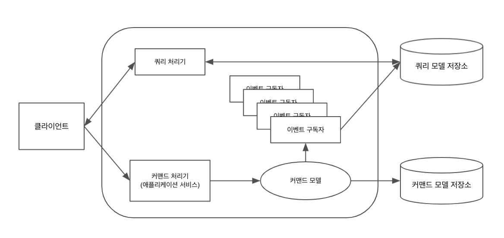
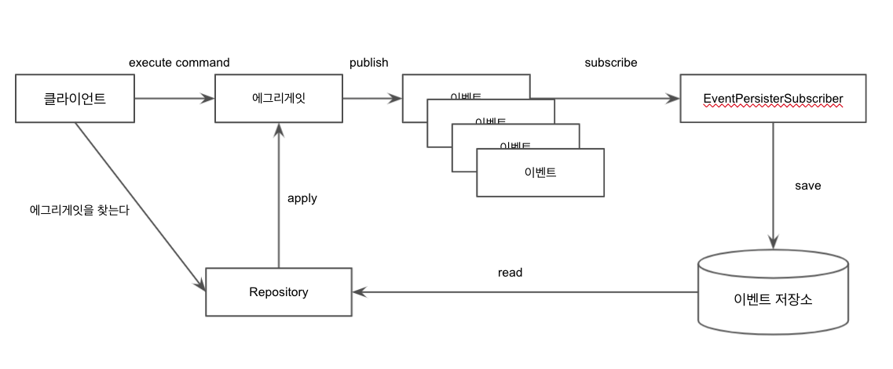

# IMPLEMENTING DOMAIN DRIVEN DESIGN (4장 - 6장)

## 4장. 아키텍처

DDD의 가장 큰 장점 중 하나는 특정 아키텍처의 사용을 요구하지 않고 내가 사용할 하나 이상의 아키텍처들의 영향력이
전체 어플리케이션이나 전체 시스템에 영향을 미칠 수 있도록 해준다는 것이다.

구체적인 소프트웨어 품질에 대한 실제 요구가 아키텍처 스타일과 패턴의 사용을 유돟해야 한다. 반드시 선택한 결과가
필요한 품질 수준을 충족시키거나 뛰어넘어야 함을 입증해야 한다. 아키텍처 스타일과 패턴의 올바른 사용만큼이나 남용하지 않는 것도 중요하다.

따라서 사용중인 모든 아키텍처의 영향을 정당화하고, 정당화할 수 없다면 시스템에서 제거해야 한다.

### 성공한 CIO와의 인터뷰

이 인터뷰에서는 한 CIO가 어떻게 DDD를 이용해 비즈니스의 치열한 변화에 대응했는지를 말해준다.

* 초기 아키텍처는 브라우저만 지원하는 단순 Client-Server 스타일의 Layered Architecture 였다.
* SaaS 구독 모델로 진행하기로 결정하는 등 소프트웨어의 복잡성이 증가하면서 테스트 도구를 도입해 품질을 관리할 필요가 생김
* DIP를 도입해서 계층 간 의존성을 역전 시킨 뒤, 애플리에키션과 도메인을 테스트 할 수 있도록 함.

    DDD의 전술적 패턴인 Aggregate과 Repository를 이용했기 때문에 인메모리로 쉽게 테스트할 수 있었음.

* 모바일과 브라우저를 동시 지원하게 됨. 구독자들이 브라우저나 모바일 상의 액션이 동기화되기를 원했고, 보안과 관련된 요구사항 도 생김
* 헥사고날 아키텍처로의 마이그레이션을 결정함. NoSQL 같은 새로운 포트 타입을 적용하고, 메시징 기능도 도입함.
* SOA(Service Oriented Architecture)도 도입하게 됨. 헥사고날 아키텍처 덕분에, 해당 로직이 서비스 경계위에서 머무를 수 있었음.
* 분산 처리를 위해, CQRS 패턴 도입
* 뒤이어, 이벤트 기반의 아키텍처를 도입하고 고전적인 파이프와 필터 패턴(pipes and filter pattern)을 활용.
  
  이벤트 기반의 아키텍처는 계속 확장되어 가는 시스템의 여러 영역을 단순화 시켜주었음.

* Saga 라는 장기 실행 프로세스 추가
* 정부의 산업규제 때문에 모든 변경을 추적하도록 요구하는 법안이 통과됨. 여기에 대처하기 위해 이벤트 소싱(event sourcing) 활용.

### 계층

Layered architecture는 모든 패턴의 할아버지쯤으로 여겨진다.

* Strict layers architecture: 바로 아래 계층에만 의존하도록 제한
* Relaxed layers architecture: 상위 계층은 하위 어떤 계층이든 의존 가능(대부분 시스템이 요걸 채택)

그리고 이 계층 구조는 전통적으로 아래 4개의 계층으로 구분된다.

* 사용자 인터페이스 계층
* 애플리케이션 계층
* 도메인 계층
* 인프라 계층

이 때 하위 계층은 사실 상위 계층과 느슨하게 연결되지만, 이는 관찰자(observer)나 중재자(mediator)와 같은 메커니즘을 사용해야만 가능하다.
예를 들어, mediator를 사용해 상위 계층이 아래 계층에서 정의한 인터페이스를 구현하고, 구현 객체를 하위 계층의 인수로 전달한다.
하위 계층은 구현 객체가 아키텍처적으로 어디에 위치하고 있는지 알지 못한 상태에서 이를 사용한다.

> 확실히 이러면 하위 계층의 구현이 변경되어도 상위 계층에 영향이 없겠네... 신기하다. 하지만 상위 계층이 하위 계층에 의존하지 않는다고 말할 수 있나?
> 하위 계층의 인터페이스가 변경되면 상위 계층의 구현이 변경되어야 하는 걸(그럴 일이 거의 없겠지만...).

UI계층은 사용자의 뷰와 요구사항 문제를 다루는 코드만 포함한다. 도메인/비즈니스 로직이 담겨선 안된다. 사용자 인터페이스가 유효성 검사를 요구하기 때문에
비즈니스 로직이 여기에 포함돼야 한다고 보는 사람도 있으나, 깊은 비즈니스 지식을 표현하는 대단위 유효성 검사는 오직 모델로만 제한하는 편이 좋다.

이 계층에서 도메인 모델의 객체를 사용하더라도, 일반적으론 데이터를 투명한 유리에 올려두는 수준으로 제한된다. 이 접근법을 사용하면 프레젠테이션 모델을 사용해
뷰 자체가 도메인 객체에 관해 알지 못하도록 막을 수 있다.

애플리케이션 서비스는 도메인 서비스와는 다르며, 도메인 로직이 전혀 없다. 다만 영속성 트랜젝션과 보안을 제어할 수 있다.
또한 이벤트 기반의 알림을 다른 시스템으로 보내거나, 사용자에게 보낼 이메일 메시지의 작성을 담당할 수도 있다.

```java
@Transactional
public void commitBacklogItemToSprint(String aTenantId, String aBacklogItemId, String aSprintId) {
  TenantId tenantId = new TenantId(aTenantId);
  
  BacklogItem backlogItem = backlogItemRepository.backlogItemOfId(tenantId, new BacklogItemId(aBacklogItemId));
  
  Sprint sprint = sprintRepository.sprintOfId(tenantId, new SprintId(aSprintId));
  
  backlogItem.commitTo(sprint);
}
```

애플리케이션 서비스가 이보다 더 심하게 복잡하다면 도메인 로직이 애플리케이션 서비스로 새어나가고 있음을 나타내는 신호일 수 있으며, 모델이 무기력해지고 있다는 뜻이다.
애플리케이션 서비스는 새로운 애그리게잇을 생성하기 위해 팩토리를 사용하거나, 애그리게잇의 생성자가 새로운 인스턴스를 생성하도록 해서
그에 맞는 리포지토리를 통해 저장시킨다. 또, 무상태 오퍼레이션으로 설계된 일부 도메인 별 테스크를 완성하기 위해 도메인 서비스를 이용할 수도 있다.

도메인 모델이 도메인 이벤트를 게시하도록 설계되었다면, 애플리케이션 계층은 이벤트에 구독자를 얼마든지 등록할 수 있다. 이렇게 함으로써,
이벤트를 저장하거나 전달하거나 하는 걸 애플리케이션이 책임지고 처리한다. 이러면 도메인 모델이 고유한 핵심 문제만 알면 되는 자유로움을 갖고,
도메인 이벤트 게시자를 경량으로 유지할 수 있도록 해주며, 메시징 인프라스트럭처 의존성으로부터 해방된다.

애플리케이션 계층은 또한, 도메인 계층에서 정의한 인터페이스의 기술적 구현을 일부 포함할 수 있다.

전통적인 계층 구조를 사용하면 도메인과 관련된 몇 가지 문제가 발생한다. 즉, 인프라가 제공하는 기술에 의존적인 인터페이스를 도메인 계층 안에서 구현해야 할 수도 있다.
이걸 해결하기 위해 DIP를 사용한다.

인프라 레이어에는 영속성이나 메시징 메커니즘과 같은 요소가 들어선다.

#### 의존성 역전 원리

DIP의 공식적인 정의는 다음과 같다.

* 상위 수준의 모듈은 하위 수준의 모듈에 의존해선 안 된다. 둘 모두는 반드시 추상화에 의존해야 한다.
* 추상화는 세부사항에 의존해선 안 된다. 세부사항은 추상화에 의존해야 한다.

DIP를 사용하여 상위 계층에서 선언한 인터페이스를 하위 계층에서 구현하도록 하면서 문제를 해결해볼 수 있다.
예를 들어, 인프라 계층을 가장 위로 올려 아래의 모든 계층을 위해 인터페이스를 구현하도록 할 수도 있다.

상위 수준의 관심사와 하위 문제 관심사 모두가 추상화에서만 의존적이어서 스택처럼 쌓여있는 형태가 무너지는 듯이 보인다.
이걸 변화시켜서 대칭성을 더한다면 어떨까?

### 헥사고날 또는 포트와 어댑터

헥사고날 아키텍처는 포트와 어댑터로 이름이 변경되긴 했지만, 커뮤니티에서는 여전히 헥사고날로 많이 불린다. 여기선 대칭성을 만들어주는 스타일이 보이는데,
다양한 이질적 클라이언트가 동등한 지위에서 시스템과 상호작용하도록 함으로써 그 목표를 달성한다. 예를 들어, 새로운 클라이언트가 필요하다면
내부 Application API가 클라이언트의 입력을 이해하도록 변환해주는 어댑터만 추가하면 된다. 이를 바탕으로 시스템이 사용하는 
그래픽, 영속성, 메시징과 같은 출력 메커니즘이 다양해지고 쉽게 대처할 수 있게 된다.


이미지 출처: https://blog.imqa.io/hexagonal-architecture/

헥사고날의 큰 장점은 테스트를 위해 어댑터를 쉽게 개발할 수 있다는 점이다.
클라이언트와 저장소 메커니즘이 없더라도, 전체 애플리케이션과 도메인 모델을 설계해서 테스트 할 수 있다.

### 서비스 지향

Service Oriented Architecture 를 설계하는 8가지 원리가 있다.

1. 서비스 계약(Service Contract): 서비스는 그 목적과 기능을 하나 이상의 설명 문서에 계약으로써 표현한다.
2. 서비스의 느슨한 결합(Service Loose Coupling): 서비스는 의존성을 최소화하고 오직 서로에 대해서만 알고 있다.
3. 서비스 추상화(Service Abstraction): 서비스는 그들의 계약만을 게시하고, 클라이언트로부터 내부 로직을 숨긴다.
4. 서비스 재사용성(Service Reusability): 서비스는 좀 더 대단위(coarse-grained)의 큰 서비스를 만들기 위해 다른 상대에게 재사용될 수 있다.
5. 서비스 자율성(Service Autonomy): 서비스는 하위 환경과 자원을 제어하며, 독립적으로 유지되고, 이로부터 서비스는 일관성과 신뢰성을 유지한다.
6. 서비스 무상태(Service Statelessness): 서비스는 상태 관리의 책임을 소비자(consumer)에게 두며, 이는 서비스 자율성을 위한 제어 과정과 충돌하지 않도록 하기 위해서다.
7. 서비스 발견성(Service Discoverability): 메타데이터로 서비스를 기술함으로써 검색이 가능해지고 서비스 계약을 이해할 수 있는데, 이를 통해 서비스는 (재)사용 가능한 자산이 된다.
8. 서비스 구성성(Service Composability): 서비스는 크기나 컴포지션의 복잡성과는 무관하게, 더 대단위의 서비스를 구성하는 일부가 될 수 있다.

하나의 헥사고날 기반 시스템이 다수의 기술적 엔드포인트를 지원한다. 이는 DDD가 SOA에서 어떻게 사용되는지와 관련있다.
기술적 엔드포인트는 RESTful 리소스, SOAP 인터페이스, 메시징 타입 등의 모습을 띌 수 있다. 그러나 이런 기술 엔드 포인트마다 바운디드 컨텍스트를 만들라는 뜻은 아니다.
위의 헥사고날 아키텍처 그림은 단 하나의 바운디드 컨텍스트에 대해 나타낸 것이다. 2장에서 언급했듯, 아키텍처가 바운디드 컨텍스트의 크기를 결정하지 않는다.

위 8가지를 머리에 담는 건 피곤하니까, 다음 2 가지 SOA 정신만 짚고 넘어가면 될 듯 하다.

1. 기술적 전략보다 비즈니스 가치
2. 프로젝트만의 이익보다는 전략적 목표

### REST: 표현 상태 전송(Representational State Transfer)

#### 아키택처 스타일로서의 REST

REST를 위해 가장 먼저 필요한 부분은 아키텍처 스타일이라는 개념에 대한 이해다. 아키텍처 스타일이란, 특정 설계를 위한 설계 패턴이
무엇인지에 관한 구조적인 큰 그림이다.

웹 프로토콜은 원래의 의도에 맞게 사용될 수도 있지만, 그 의도와는 다른 방법으로도 사용될 수 있다.

#### RESTful HTTP 서버의 주요 특징

1. 리소스가 핵심 개념이다. 일반적으로 각 리소스는 하나의 URI를 가지는데, 각 URI는 반드시 하나의 리소스를 가리켜야 한다.
2. 자술적 메시지를 사용해 무상태로 의사소통한다.
3. HTTP method의 집합이 정해져 있다. GET, PUT, POST, DELETE 등. 그리고 GET, PUT, DELETE는 멱등성을 가진다.
4. 하이퍼미디어를 통해 클라이언트가 애플리케이션에서 일어날 수 있는 상태 변경에 맞는 경로를 찾을 수 있도록 해준다.

#### RESTful HTTP 클라이언트의 주요 특징

1. 리소스 표현 내에 포함된 링크를 따라가거나, 결과로 돌아온 리소스로 리다이렉션 하면서 다른 리소스로 이동한다.

#### REST와 DDD

도메인 모델을 RESTful HTTP로 바로 노출하는 것은 좋지 않은 생각이다. 도메인 모델의 변경 하나하나가 시스템 인터페이스로 바로 반영되기 때문이다.

DDD + RESTful HTTTP 에는 2가지 접근법이 있다.

1. (고전적인 방법)시스템의 인터페이스에 별도의 바운디드 컨텍스트를 생성하고, 시스템의 인터페이스 모델에서 실제 핵심 도메인으로 액세스하기 위해 적절한 전략을 사용하는 것

2. (표준 미디어 타입을 강조하는 상황) 각 표준 미디어 타입을 표현하기 위해 도메인 모델을 생성한다. 이렇게 만들어진 도메인 모델은 클라이언트와 서버를 모두 아우르며 재사용할 수도 있다.

    DDD에서는 이 접근법을 Shared Kernel(공유된 커널) 혹은 PL(게시된 언어)이라고 부른다.

솔루션이 특화될 수록 첫 번째 방법이 유용하다.

#### 왜 REST인가

REST 원리에 맞게 설계된 시스템은 느슨한 결합의 조건을 충족한다. 작은 단위로 리소스가 나뉘어지고, 각 단위가 개별적으로 테스트 및 디버깅할 수 있는 데다
사용가능한 진입 지점을 노출하기 때문에 이해하기도 쉽다. 따라서 높은 확장성이 필요한 아키텍처에게 훌륭한 선택이 될 수 있다.

### Command - Query 책임 분리

우린 클라이언트가 여러 리포지토리를 통해 필요한 모든 애그리게잇 인스턴스를 취득한 후에 필요한 데이터만 DTO로 모아서 사용하도록 요구할 수 있다. 아니면
하나의 쿼리로 다양한 리포지토리에 흩어져 있는 데이터를 모아주는 특화된 파인더를 설계할 수도 있다. 혹은, UX와 타협해 뷰가 엄격하게 모델의 애그리게잇 경계를
준수하도록 만들수도 있다.

이 방법들 외에 도메인 데이터를 뷰에 매핑하는 완전히 다른 방법은 바로 CQRS이다.

> 모든 메소드는 작업을 수행하는 커맨드 이거나 데이터를 호출자에게 반환하는 쿼리 중 하나여야 하며, 하나의 메소드가 두 역할을 모두 할 수는 없다.
> 즉, 질문하는 행동이 대답을 바꿔선 안된다. 메소드는 오직 참조적으로 투명해서 다른 부작용을 일으키지 않을 때만 값을 반환한다.

객체 수준에서 위 문장은 다음과 같다.

1. 메소드가 객체의 상태를 수정한다면, 이 메소드는 커맨드이며 값을 반환하면 안된다. 자바 기준 void 로 선언되어져야 한다.
2. 메소드가 값을 반환한다면, 이 메소드는 쿼리이며 직접적이든 간접적이든 객체 상태의 수정을 야기해선 안된다. 자바 기준 반환 값의 타입으로 선언되어져야 한다.

그럼 여기서 드는 의문은, DDD에서 이걸 왜 쓸까?

우리는 일반적으로 커맨드와 쿼리를 모두 갖고 있는 애그리게잇을 확인하게 된다. 또한 특정 속성을 필터링하는 여러 파인더 메소드를 갖고 있는 리포지토리를 만난다.
하지만 CQRS와 함께라면, 이런 일반성은 무시하고 보여줄 데이터를 쿼리하는 방법을 다르게 설계할 것이다. 어떻게 변할까?

에그리게잇은 쿼리 메소드 없이, 오직 커맨드 메소드만을 포함하게 된다. 리포지토리는 `save()` 와 `findById()`같은 단 하나의 쿼리 메소드로 분해된다.
이 하나의 쿼리 메소드는 고유한 애그리게잇 식별자를 포함해 반환된다. 리포지토리에선 애그리게잇을 찾을 때 부가 속성의 필터링과 같은 기타 방법을 사용할 수 없다.
그러나 우리는 여전히 사용자에게 데이터를 보여줄 방법이 필요하다. 이를 위해 쿼리에 맞는 두 번째 모델을 생성한다. 이것을 쿼리 모델이라고 한다.

즉, 결과적으로 전통적 도메인 모델은 **둘로 분리**된다. 커맨드 모델과 쿼리 모델은 서로 다른 저장소에 저장된다.

#### CQRS의 영역 살펴보기



클라이언트 커맨드는 커맨드 모델로 한 방향으로만 흘러간다. 쿼리는 프레젠테이션에 최적화된 별도의 데이터 소스에 대해 실행되고 사용자 인터페이스로 전달된다.
각 영역들을 조목조목 살펴보자.

**클라이언트 ↔ 쿼리 처리기**

쿼리 처리기는 클라이언트로부터의 쿼리 요청으로부터 쿼리 모델 저장소에 어떻게 쿼리하면 되는지 정도만 알고 있는 간단한 컴포넌트이다.
물론 저장소안의 내용을 클라이언트가 바로 사용할 수 있다면 직렬화가 필요 없겠지만, 그렇더라도 직렬화를 해주는 것은 바람직하다.
여기에는 2가지 방법이 있다.

1. Wire-compatible serialization: Json이나 XML로의 변환으로, 아주 단순하게 가고자 할 때의 측면이다.
2. DTO: DTO, DTO Assembler를 섞으면 복잡성이 높아지며 정말로 필요한 상황이 아니라면 이는 돌발적인 복잡성이다.

**쿼리 모델(읽기 모델)**

쿼리 모델은 정규화되지 않은 데이터 모델이다. 도메인 행동을 전달하기 위한 목적이 아니며, 오직 표시할 데이터만을 전달한다. 
쿼리 모델을 설계할 때는 **UI 뷰 타입마다 하나의 테이블이 연결되는 패턴**을 최대한 따라야 한다. 그러나 때때로 filter를 추가하는 것이 효율적일 수 있으니
실용적으로 방향을 잘 선택해야 한다.

쿼리의 한 예로, 보통 쿼리 모델에 대해 쿼리를 날릴 때는 아래처럼 단순 ID만 전달하여 데이터를 가져오는 것이 좋다.

```sql
SELECT * FROM vw_usr_product WHERE id = ?
```

여기서 `id`는 애그리게잇의 ID에 대응하거나, 혹은 하나의 테이블로 합쳐진 애그리게잇 타입의 집합에 대응될 수 있다.

**클라이언트 ↔ 커맨드 처리기**

클라이언트는 애그리게잇의 행동을 실행시키기 위해 서버로 커맨드를 보낸다. 커맨드에 필요한 파라미터들을 얻기 위해 UI가 사용자로 하여금
적용할 수 없는 모든 옵션을 필터링하고 정확한 커맨드를 날릴 수 있도록 해야 한다.

**커맨드 처리기**

커맨드 처리기는 몇 가지 스타일 중 하나로 구현될 수 있다. 각자 장단점이 존재한다.

* 하나의 애플리케이션 서비스에서 여러 커맨드 핸들러와 함께 카테고리 스타일을 사용
  
    커맨드의 카테고리에 맞춰 애플리케이션 서비스의 interface와 implementation을 생성한다. 각 애플리케이션 서비스는 다수의 메소드를 가질 수 있고,
    커맨드의 각 타입마다 카테고리에 맞는 매개변수로 하나의 메소드를 선언한다.
  
    장점: 단순성 - 이해와 생성과 유지 관리가 쉽다.
    단점: 커맨드가 동기적으로 처리된다.
    
* 전용 핸들러 스타일
  
    각 핸들러는 하나의 메소드를 갖고 있는 하나의 클래스다.
  
    장점: 하나의 핸들러당 하나의 책임만이 있기 때문에 각 핸들러를 독립적으로 재사용할 수 있다.
    단점: 커맨드가 동기적으로 처리된다.

* 전용 핸들러 + 비동기 커맨드 메시지 스타일

    커맨드를 비동기식 메시지로 보내며, 이는 전용 핸들러에게 전달된다. 각 커맨드 처리기 컴포넌트가 특정 타입의 메시지를 받도록 할 뿐만 아니라,
    커맨드 프로세싱 부하를 처리할 수 있도록 주어진 타입의 처리기를 추가할 수 있다.
  
    장점: 커맨드를 비동기적으로 처리할 수 있다. (확장성 용이 + 일시적 분리를 제공하기 때문에 더욱 resilient(복원 가능한) 한 시스템이 된다.)
    단점: 복잡하다 - 기본으로 사용하지 말 것.
    
어떤 스타일을 선택하든, 핸들러는 다른 핸들러에 의존해선 안된다. 그래야 핸들러가 독립적으로 재사용될 수 있기 때문이다.

커맨드 처리기는 일반적으로 단 몇 가지 작업만을 수행한다.

* 생성을 해야 하는 커맨드 처리기는 새로운 애그리게잇 인스턴스를 인스턴스화해서, 이를 리파지토리에 추가한다.
* 다른 커맨드들은 리파지토리로부터 인스턴스를 받아와, 그에 관한 커맨드 행동을 실행한다.

커맨드 처리가 완료되면 단일 애그리게잇 인스턴스가 업데이트되고, 커맨드 모델에 의해 도메인 이벤트가 publish된다. 이는 쿼리 모델이 업데이트 됐음을 분명히 하기 위한
필수 과정이다. 이 이벤트가 물론 여러 애그리게잇을 수정하도록 요구할 수도 있지만, 트랜잭션이 한 번에 커밋되면서 eventual consistency를 만족한다.

**커맨드 모델**

커맨드 모델은 행동을 수행한다. 

```java
public class BacklogItem extends ConcurrencySafeEntity {
  ...
  public void commitTo(Sprint aSprint) {
    ...
    DomainEventPublisher
      .instance()
      .publish(new BacklogItemCommitted(this.tenant(), this.backlogItemId(), this.sprintId()));
  }
  ...
}
```

위 예제에서 새로 생성될 `BacklogItem` 이나 업데이트 될 `Sprint` 를 커맨드 모델에 반영하기 위해 반드시 이벤트를 사용해야 하는 것은 아니다. ORM을 써서
곧바로 DB에 저장할 수도 있다. 그러나, 어떤 경우든 쿼리 모델을 업데이트 시키기 위해선 도메인 이벤트를 publish 해야 한다.

**이벤트 구독자 → 쿼리 모델**

이벤트 구독자는 쿼리 모델을 업데이트 한다. 업데이트는 비동기적으로 수행돼야 할까, 동기적으로 수행되어야 할까?

동기적으로 업데이트 하기 위해서는 일반적으로 쿼리 모델과 커맨드 모델이 같은 데이터베이스를 공유하며, 두 모델을 같은 트랜잭션으로 업데이트 한다.
이를 통해 두 모델 사이의 consistency를 완벽히 유지한다. 그러나 여러 테이블을 업데이트 하려면 더 많은 처리 시간이 필요하므로 부하가 큰 시스템에는 부적절하다.

다만, 비동기적으로 업데이트할 때는 UI가 커맨드 모델에 일어난 가장 최근의 변경을 즉시 반영하지 못해서, 결과적으로 일관성을 갖는 데 어려움이 있을 수 있다.

#### Eventually Consist한 쿼리 모델 다루기

성공적으로 보내진 데이터를 일시적으로 사용자 인터페이스에 보여주도록 설계하는 건 일종의 속임수긴 하지만, 사용자가 쿼리 모델에 반영될 내용을 즉시 확인할 수 있다.

그러나 이 방법이 실용적이지 않다면? 어느 한 UI가 커맨드를 실행했지만, 관련된 다른 데이터를 보는 UI는 오래된 데이터를 보게되는 상황도 있다.

사용자가 현재 보고 있는 쿼리 모델의 데이터에 해당하는 시간과 날짜를 UI에서 명시적으로 보여주는 방법이 있다. 이 방법을 사용하려면 쿼리 모델의 각 기록은 최신 업데이트의
시간과 날짜를 유지해야 한다. 사용자는 자기가 오래된 데이터를 보고 있다고 판단하면 새 데이터를 요청하게 될 것이다. 그러나 혹자는 이 방법이 해킹이라고 비난하기도 한다.

이렇듯 CQRS는 지연된 뷰 문제와 복잡성이라는 단점을 가지고 있으니, CQRS를 통해 문제를 확실히 해결할 수 있을때 사용하는 것이 올바른 선택이 될 것이다.

### 이벤트 주도 아키택처(EDA, Event Driven Architecture)

> 이벤트 주도 아키텍처는 이벤트의 생산, 감지, 소비와 이벤트에 따른 응답 등을 촉진하는 소프트웨어 아키텍처다.

헥사고날 아키텍처와 EDA는 궁합이 좋다. A 시스템의 아웃바운드 포트를 통해 publish된 도메인 이벤트는 다른 시스템의 인바운드 포트를 통해 구독자에게 전달된다.
이 도메인 이벤트들은 주로 HTTP 보단 래빗MQ같은 메시지 큐를 통해 넘나든다.

도메인 이벤트가 여러 다른 도메인 이벤트들을 연쇄적으로 실행하거나 한 번에 여러 연관된 도메인 이벤트가 동시에 트리거되는 경우가 있다.
이 때, 기대했던 모든 도메인 이벤트가 도착하기 전까진 멀티태스크 프로세스가 완성됐다고 간주하지 않는다. 이와 관해선 장기 실행 프로세스에서 다룬다. 

#### 파이프와 필터

다음 명령어는 파이프와 필터로 이루어져 있다.

```bash
cat phone_numbers.txt | grep 303 | wc -l
```

이것을 EDA에 접목시켜보자면 다음과 같다.

1. `PhoneNumbersPublisher`에서 모든 텍스트 라인을 담고 있는 이벤트 메시지 `AllPhoneNumbersListed`를 발행한다.
2. `PhoneNumberFinder`라는 메시지 핸들러는 `AllPhoneNumbersListed`를 구독하도록 구성된다. 텍스트 `303`을 찾아
`PhoneNumberMatched`라는 새로운 이벤트를 생성해 매칭되는 라인을 모두 담는다.
3. `MatchPhoneNumberCounter`라는 메시지 핸들러가 `PhoneNumberMatched`를 구독하도록 구성된다. 받은 이벤트에서 전화번호의 수를 세고
`MatchedPhoneNumbersCounted` 이벤트를 생성하며 완료된다.
4. 마지막으로 `MatchedPhoneNumbersCounted`를 구독하고 있는 메시지 핸들러 `PhoneNumberExecutive`가 `count`와 수신한 날짜 및 시간을 로그로 남긴다.

실제 엔터프라이즈에선 큰 문제를 좀 더 작은 단계로 나누기 위해 이 패턴을 사용하며, 좀 더 쉽게 분산 처리를 이해하고 관리하도록 해준다. 또, 여러 시스템이
자기가 할 일만을 걱정할 수 있도록 만들어주기도 한다.

#### 장기 실행 프로세스

위 파이프와 필터 예제는 이벤트 주도의 분산된 병렬 처리 패턴(장기 실행 프로세스, saga라고도 불린다)를 나타내도록 확장할 수도 있다.

하나의 도메인 이벤트를 여러 구독자(필터)가 수신하고 그 모든 결과를 다시 하나의 구독자가 수신한다면 병렬로 처리되는 상황이라고 볼 수 있다.
그러나 이 때 맨 마지막 구독자는 이 이벤트들이 정말 자신한테 온 이벤트인지 알 수 없으므로 이벤트마다 식별자를 넣어서 알 수 있도록 해야 한다.

장기 실행 프로세스를 설계하는 데는 여러가지 방법이 있다.

* Composite task 로 프로세스를 설계하면 영속성 객체를 사용해 테스크의 단계와 완성을 기록하는 실행 컴포넌트가 이 태스크를 추적한다.
* 일련의 활동에서 서로 협력하는 파트너 Aggregate의 집합으로 프로세스를 설계한다. 하나 이상의 Aggregate 인스턴스가 실행자로서 동작하며, 프로세스 전체의 상태를 유지한다.
* 이벤트를 포함하고 있는 메시지를 수신한 메시지 핸들러가 수신한 이벤트에 태스크 진행 정보를 추가해 다음 메시지를 보내도록 무상태 프로세스를 설계한다.

여기서는 1번째 방법에 대해 자세히 다룬다.

실제 도메인에서는 이벤트의 완성을 추적하기 위해 각 장기 실행 프로세스의 최초 실행자의 인스턴스는 애그리게잇과 유사한 새로운 상태 객체를 생성한다.
상태 객체는 각각의 연관된 도메인 이벤트가 실어 옮기는 고유 프로세스 식별자와 연결된다. 완료 이벤트를 수신하게 되면, 이 실행자는 수신한 이벤트가 가져온
식별자를 사용해 상태 추적 인스턴스를 가져오고, 해당 단계가 막 완료됐음을 나타내도록 속성을 설정한다. 이 상태 객체는 주로 `isCompleted()`와 같은 메소드를
포함하고 있는데, 실행자는 상태 객체의 `isCompleted()`를 확인하여 값이 `true`라면 비즈니스적 요청에 따라 최종 도메인 이벤트를 publish 할 지 선택하게 된다.

메시징 메커니즘이 단일 전달을 보장하지 않을 수도 있다. 이 경우, 프로세스 상태 겍체를 사용해 중복을 제거할 수 있다. 실행자가 각 완료 이벤트를 수신하면,
해당하는 상태 객체를 확인해서 그 이벤트가 앞서 완료됐던 기록이 있는지 살펴본다. 만약 이미 완료된 상태로 설정돼 있다면 해당 이벤트를 반복으로 간주하며 무시하고,
그렇더라도 수신 확인(Ack)을 보내 메시지가 다시 전달되지 않아도 됨을 알린다.

장기 실행 프로세스에 타임아웃을 걸고 싶은 경우, 2가지 방법이 있다.

* 수동적 프로세스 타임아웃: 상태 객체가 `isTimeout()`을 구현하게 한다.
  
  단점: 프로세스가 타임아웃이 나더라도 여전히 활성화 상태로 남는다.
  장점: 리소스가 적게 든다.

* 능동적 프로세스 타임아웃: 외부 타이머를 사용해 리스너가 상태 객체에 접근하여 실패 이벤트를 발행한다. 완료라면 타이머를 제거한다.
  
  단점: 리소스가 많이 들어 트래픽이 많은 환경에선 부담이 되고, 타이머와 완성 이벤트의 race condition을 신경써야 한다.
  장점: 프로세스가 타임아웃 나면 비활성화 된다.

장기 실행 프로세스의 단일 인스턴스에 관여하는 모든 시스템은 실행자가 최종 완성 알림을 받기 전까지 다른 모든 참여자와의 관계에 일관성이 없다고 간주해야 한다.

[Saga패턴과 관련한 좋은 글 참고](https://blog.couchbase.com/saga-pattern-implement-business-transactions-using-microservices-part/)

#### 이벤트 소싱

때론 비즈니스 측에서 도메인 모델 내의 객체에서 일어나는 변경 추적에 대해 신경을 쓴다.



먼저 리포지토리로부터 애그리게잇을 찾아 커맨드를 수행하면 이벤트가 개시되고, 이 이벤트들은 일어난 순서대로 이벤트 저장소에 저장된다.
각 애그리게잇이 리포지토리로부터 찾아질 때, 기존에 발생했던 순서대로 이벤트를 다시 재생해서 인스턴스를 재구성한다. 최종적으로 애그리게잇은 가장 마지막 커맨드의
실행시점과 같은 상태를 갖게 된다.

그러나 이벤트를 매번 재생하는 건 심각한 부하를 유발하지 않을까? 이 병목을 피하기 위해 애그리게잇 상태의 snapshot을 적용해 최적화한다.
백그라운드에서 특정 위치의 이벤트 저장소 히스토리에 애그리게잇의 인메모리 상태에 해당하는 스냅샷을 만들어줄 프로세스를 개발한다. 스냅샷이 저장된 이후부터는
그보다 더 최신의 이벤트만 애그리게잇 상에서 재생하면 된다. 휴리스틱하게 50~100개 정도만 애그리게잇 상에서 재생되도록 스냅샷을 찍는 주기를 정할 수도 있다.

영속성 메커니즘으로써 이벤트 소싱은 ORM을 대체할 수 있다. 이벤트는 종종 바이너리 상태로 이벤트 저장소에 저장되기 때문에, 이를 쿼리할 수는 없다. 이벤트 소싱 모델을 위해
설계된 repository는 오직 단일 `findByAggregateId(id)` 오퍼레이션만 필요하다. 결과적으로 우리는 다른 방식으로 쿼리해야 하고, 이를 위해 CQRS의 쿼리 모델을
이벤트 소싱과 긴밀하게 결합해 사용한다.

엄청 복잡해 보이는데, 장점이 무엇일까?

1. 이벤트 히스토리가 쌓이기 때문에 시스템의 버그를 잡아내기 쉽다.
2. 처리량이 높은 도메인 모델로 이어져 1초 내에 엄청 많은 수의 트랜잭션을 처리하도록 확장될 수 있다.

비즈니스 적인 이점도 있다.

1. 모델의 버그 때문에 심각한 문제가 이어질 수 있는 상황이라면, 새로운 이벤트를 도입하거나 기존 이벤트를 수정해서 이벤트 저장소를 패치할 수 있다.
2. 모델 내의 변경을 취소하거나 재연할 수 있다.
3. 비즈니스 적으로 실험적인 가설을 세워 애그리게잇의 집합 상에 재생해보면서 가설에 따른 정확한 답을 얻을 수 있다.

### 데이터 패브릭과 그리드 기반 분산 컴퓨팅

빅데이터에 요구사항이 집중되며 시스템이 더욱 복잡해짐에 따라 전통적인 DB 솔루션은 성능의 병목이 될 수 있다. 이 때, 데이터 패브릭(그리드 컴퓨팅이라고도 불린다)
은 성능과 유연한 확장성을 제공한다.

패브릭의 맵 기반 캐시에 저장되는 애그리게잇은 key-value 에서 value부분이고, key는 Aggregate key로 만들어진다.

```java
String key = product.productId().id();

byte[] value = Serializer.serialize(product);

region.put(key, vlaue); // 리전이나 캐시
```

#### 데이터 복제

애그리게잇마다 캐시를 만드는 전략을 사용하는 상황에서 패브릭이 제공하는 메모리 캐시가 있다고 한다면, 패브릭은 replication을 통한 다중 노드 캐시를 지원하기 때문에
SPOF(Single Point Of Failure)를 걱정하지 않아도 되어 안정적이다.

이 때, replication은 다음과 같이 동작한다(마치 redis의 master-slave mode 를 보는 듯 하다).

1. 하나의 노드는 primary한 cache/region으로 동작하고, 그 외의 모든 다른 노드는 secondary다.
2. primary cache의 저장이 실패하면 fail-over가 일어나고, secondary 캐시 중 하나가 primary가 된다.
3. 기존의 primary cache가 복구되면 여기에 primary 캐시로 격상된 secondary 캐시가 모든 데이터를 복제하고, 다시 secondary 캐시로 돌아간다. 

위 처럼 fail-over가 일어나기 때문에 애그리게잇의 업데이트와 그에 따라 패브릭에서 발행하는 모든 이벤트는 유실되지 않는다.
비즈니스의 핵심을 이루는 도메인 모델 객체를 저장할 땐, 캐시 중복성과 복제가 필수적인 기능이다.

#### 이벤트 주도 패브릭과 도메인 이벤트

패브릭 안에서 실제로 도메인 이벤트를 사용하려면, 간단히 `DomainEventPublisher`를 사용하면 된다. 이 친구는 패브릭의 캐시에서 발행된 이벤트를
단순히 특정 cache/region으로 집어 넣는다. 그러면 캐시된 이벤트가 리스너에게 동기적/비동기적으로 전달된다.

모든 구독자들로부터 완전한 수신 확인을 받으면, cache/region에서 이벤트를 제거한다. 도메인 이벤트 리스터는 의존 관계에 있는 다른 애그리게잇과의 동기화를 위해
이벤트를 사용할 수도 있기 때문에, 아키텍처에 의해 eventual consistency가 보장된다.

#### 지속적 쿼리(Continuous Query)

클라이언트가 패브릭에 쿼리를 등록하면 캐시 내부에서 해당 쿼리를 만족시키는 변경이 발생했을 때 클라이언트에게 알림을 보내주고, 이 과정에서 패브릭은 클라이언트 측의 수신을 보장한다.
즉, 패브릭과 CQRS의 쿼리 모델은 아주 찰떡이다. 뷰가 직접 뷰 테이블 업데이트를 추적하는 대신, 등록된 Continuous Query에 에 맞춰 전달되는 알림을 통해
적시에 뷰가 업데이트 되도록 할 수 있다.

```java
CqAttributeFactory factory = new CqAttrivuteFactory();
CqListener listener = new BacklogItemWatchListener();
factory.addCqListener(listener);
String continuousQueryName = "BacklogItemWatcher";
String query = "SELECT * FROM /queryModleBacklogItem qmbli WHERE qmbli.status = 'Committed'";
CqQuery backlogItemWatcher = queryService.newCq(continuousQueryName, query, factory.create());
```

위 코드에서 데이터 패브릭은 `BacklogItemWatchListener`로 각종 메타 정보와 함께 CQRS 쿼리 모델의 업데이트를 전달한다.

#### 분산 처리

패브릭의 복제된 캐시로 분산처리해서 집계된 결과를 클라이언트로 반환할 수도 있다.

```java
public class PhoneNumberCountSaga extends FunctionAdapter {
  @Override
  public void execute(FunctionContext context) {
    Cache cache = CacheFactory.getAnyInstance();
    QueryService queryService = cache.getQueryService();
    
    String phoneNumberFilterQuery = (String) context.getArguments();
    ...
    // 여기서부터는 의사코드
    // matchedPhoneNumbersCounted = getMatchedPhoneNumbersCounted()
    // aggregator.sendResult(matchedPhoneNumbersCounted)
    // allPhoneNumbersCounted = getAllPhoneNumbersCounted()
    // aggregator.sendResult(allPhoneNumbersCounted)
    // aggregator는 각 분산 함수 호출로부터 자동으로 응답을 모아서 하나의 집계된 응답을 클라이언트에게 전달한다.
  }
}
```

다음은 분산 복제된 캐시에서 장기 실행 프로세스를 병렬로 실행하는 클라이언트 예제코드이다.

```java
PhoneNumberCountProcess phoneNumberCountProcess = new PhoneNumberCountProcess();

Srint phoneNumberFilterQuery = "SELECT phoneNumber from /phoneNumberRegion pnr WHERE pnr.areaCode = '303'";

Execution execution = FunctionService.onRegion(phoneNumberRegion)
    .withFilter(0)
    .withArgs(phoneNumberFilterQuery)
    .withCollector(new PhoneNumberCountResultCollector());

PhoneNumberCountResultCollector resultCollector = execution.execute(phoneNumberCountProcess);

List allPhoneNumberCountResults = (List) resultsCollector.getResult();
```

## 5장. 엔티티

## 6장. 값 객체


--- 

## 7장. 서비스

## 8장. 도메인 이벤트

## 9장. 모듈

## 10장. 에그리게잇

## 11장. 팩토리

## 12장. 리파지토리

## 13장. 바운디드 컨텍스트의 통합

## 14장. 애플리케이션

## 부록 A. 에그리게잇과 이벤트 소싱(A+ES)
